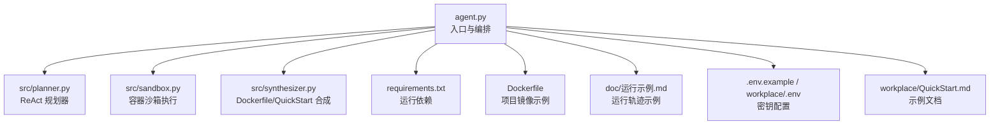
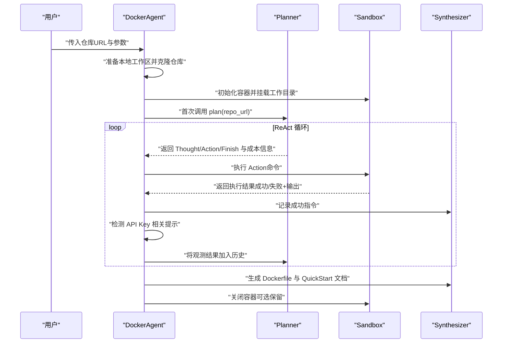
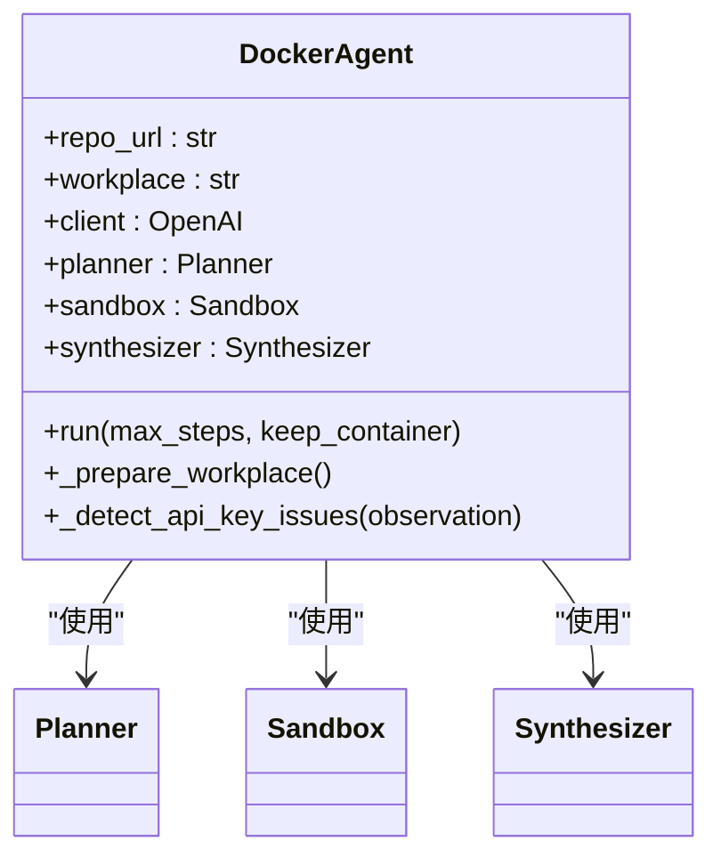
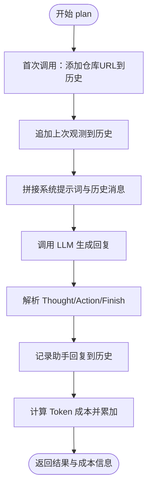
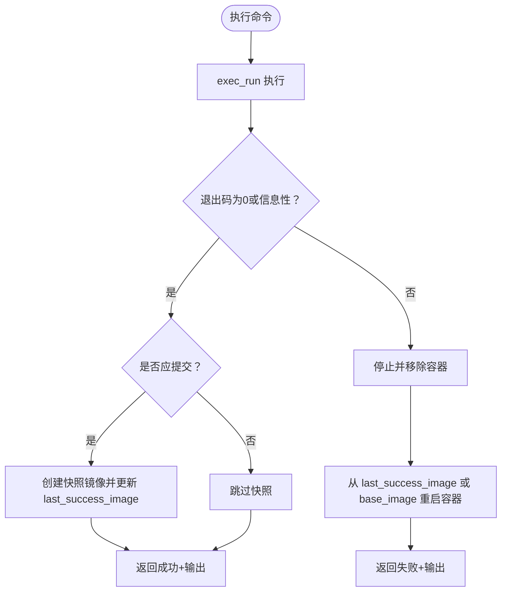
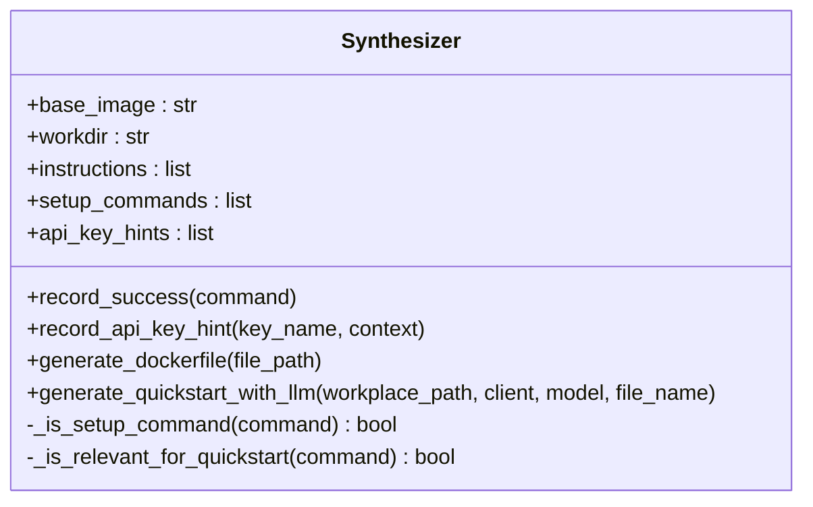
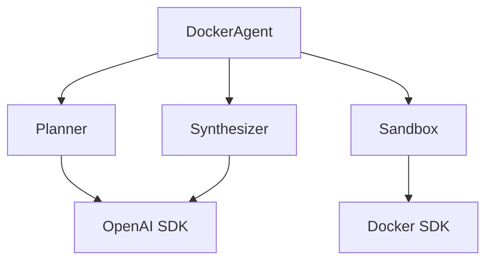

# 项目概述

<cite>
**本文引用的文件**
- [README.md](file://README.md)
- [agent.py](file://agent.py)
- [src/planner.py](file://src/planner.py)
- [src/sandbox.py](file://src/sandbox.py)
- [src/synthesizer.py](file://src/synthesizer.py)
- [requirements.txt](file://requirements.txt)
- [Dockerfile](file://Dockerfile)
- [doc/运行示例.md](file://doc/运行示例.md)
- [.env.example](file://.env.example)
- [workplace/.env](file://workplace/.env)
- [workplace/QuickStart.md](file://workplace/QuickStart.md)
- [workplace/README.md](file://workplace/README.md)
</cite>

## 目录
1. [引言](#引言)
2. [项目结构](#项目结构)
3. [核心组件](#核心组件)
4. [架构总览](#架构总览)
5. [详细组件分析](#详细组件分析)
6. [依赖关系分析](#依赖关系分析)
7. [性能考量](#性能考量)
8. [故障排查指南](#故障排查指南)
9. [结论](#结论)
10. [附录](#附录)

## 引言
Repo Dockerizer Agent 是一个基于大语言模型（LLM）的智能代理系统，目标是自动为任意 GitHub 仓库配置可执行的 Docker 环境。它通过 ReAct（思考-行动-观察）智能决策模式，结合沙箱容器化执行与成本控制机制，实现“所见即所得”的环境配置与快速启动文档生成。项目既适合初学者快速上手，也为专家提供了可扩展、可审计的架构与流程。

- 核心价值
  - 自动化环境配置：无需人工逐项排查依赖，Agent 在容器内自动识别并安装所需工具与包。
  - 提升开发效率：一键生成可复现的 Dockerfile 与 QuickStart 文档，降低新成员上手门槛。
  - 团队协作优化：统一的环境配置与最小化文档，减少“在我机子上能跑”的环境差异问题。
  - 成本可控：内置 Token 计费统计与回滚机制，避免无效尝试消耗资源。

- 应用场景
  - 新仓库接入：快速建立可运行的开发/测试环境。
  - 复现实验：将复杂依赖固化为可重复构建的 Dockerfile。
  - 快速验证：在无本地环境的情况下，验证第三方仓库的运行方式。
  - 文档自动生成：基于真实执行命令生成简洁的 QuickStart 指南。

- 技术背景与创新点
  - ReAct 决策范式：以“思考-行动-观察”循环推进，确保每一步都有明确目标与可观测结果。
  - 容器化执行与回滚：每次成功命令都会创建镜像快照，失败时自动回滚至上一稳定状态，兼顾安全性与效率。
  - 成本控制：按模型定价实时统计输入/输出 Token 成本，支持多模型切换与预算管理。
  - 最小化依赖：仅依赖 Docker SDK、OpenAI SDK 与 dotenv，易于部署与维护。

**章节来源**
- [README.md](file://README.md#L1-L47)
- [workplace/README.md](file://workplace/README.md#L1-L222)

## 项目结构
项目采用“入口脚本 + 三核心模块 + 文档与示例”的组织方式，清晰分离职责边界：

- 入口与运行
  - agent.py：命令行入口，负责准备本地工作区、初始化 LLM 客户端、装配 Planner/Sandbox/Synthesizer，并驱动 ReAct 循环。
- 核心模块
  - src/planner.py：ReAct 规划器，构造系统提示词，解析 LLM 输出，统计成本。
  - src/sandbox.py：沙箱执行器，基于 Docker SDK 在容器内执行命令，具备 commit 回滚能力。
  - src/synthesizer.py：合成器，记录成功指令，生成 Dockerfile 与 QuickStart 文档。
- 支撑文件
  - requirements.txt：运行依赖（docker、openai、python-dotenv）。
  - Dockerfile：项目自身的基础镜像构建示例。
  - doc/运行示例.md：完整运行轨迹与结果示例。
  - .env.example 与 workplace/.env：API 密钥与代理基础地址配置示例。
  - workplace/QuickStart.md：由 LLM 生成的示例 QuickStart 文档。

**图表来源**
- [agent.py](file://agent.py#L1-L160)
- [src/planner.py](file://src/planner.py#L1-L145)
- [src/sandbox.py](file://src/sandbox.py#L1-L178)
- [src/synthesizer.py](file://src/synthesizer.py#L1-L144)
- [requirements.txt](file://requirements.txt#L1-L4)
- [Dockerfile](file://Dockerfile#L1-L7)
- [doc/运行示例.md](file://doc/运行示例.md#L1-L475)
- [.env.example](file://.env.example#L1-L1)
- [workplace/.env](file://workplace/.env#L1-L2)
- [workplace/QuickStart.md](file://workplace/QuickStart.md#L1-L46)

**章节来源**
- [agent.py](file://agent.py#L1-L160)
- [requirements.txt](file://requirements.txt#L1-L4)
- [Dockerfile](file://Dockerfile#L1-L7)
- [doc/运行示例.md](file://doc/运行示例.md#L1-L475)
- [.env.example](file://.env.example#L1-L1)
- [workplace/.env](file://workplace/.env#L1-L2)
- [workplace/QuickStart.md](file://workplace/QuickStart.md#L1-L46)

## 核心组件
- DockerAgent（agent.py）
  - 职责：准备本地工作区、挂载仓库至容器、初始化 LLM 客户端、装配 Planner/Sandbox/Synthesizer、驱动 ReAct 循环、成本打印与收尾清理。
  - 关键点：支持最大步数限制、容器保留以便调试、API Key 错误检测与提示记录。
- Planner（src/planner.py）
  - 职责：构造系统提示词，限定禁止命令与环境约束，解析 LLM 输出中的 Thought/Action/Finish 标签，统计 Token 成本。
  - 关键点：内置多模型价格表，按模型动态计费；历史消息线性累积，便于调试与复现。
- Sandbox（src/sandbox.py）
  - 职责：在容器内执行命令，区分只读/信息性退出与真正失败，成功时创建镜像快照，失败时回滚至上一稳定状态。
  - 关键点：智能 commit 策略（仅对有副作用的命令 commit）、信息性退出识别、容器生命周期管理与镜像清理。
- Synthesizer（src/synthesizer.py）
  - 职责：记录成功指令为 Dockerfile 的 RUN 指令，过滤无关命令，基于 README 与真实安装步骤生成 QuickStart 文档，记录缺失的 API Key 提示。
  - 关键点：区分“安装配置类”与“信息查询类”命令；对 README 中的 API Key 变量名进行适配。

**章节来源**
- [agent.py](file://agent.py#L14-L160)
- [src/planner.py](file://src/planner.py#L3-L145)
- [src/sandbox.py](file://src/sandbox.py#L4-L178)
- [src/synthesizer.py](file://src/synthesizer.py#L1-L144)

## 架构总览
整体架构遵循“计划-执行-合成-输出”的闭环流程，ReAct 决策贯穿始终，容器沙箱提供安全可控的执行环境，成本统计保障资源消耗透明可控。

**图表来源**
- [agent.py](file://agent.py#L60-L126)
- [src/planner.py](file://src/planner.py#L69-L105)
- [src/sandbox.py](file://src/sandbox.py#L29-L91)
- [src/synthesizer.py](file://src/synthesizer.py#L9-L21)

## 详细组件分析

### DockerAgent 组件分析
- 初始化与工作区准备
  - 本地工作区清理与克隆，确保每次运行都从干净状态开始。
  - 将工作区目录以只读方式挂载到容器内的 /app，保证容器内操作不影响宿主机。
- LLM 客户端与模型选择
  - 从环境变量加载 API Key 与可选 base_url，支持代理服务。
  - 支持多模型切换，默认模型可在命令行指定。
- ReAct 循环与成本打印
  - 每步输出输入/输出 Token 数量、单步与累计成本，便于预算控制。
  - 若 LLM 输出包含“Final Answer: Success”，则认为配置成功，进入最终合成阶段。
- API Key 检测与提示记录
  - 对常见 API Key 相关错误进行关键词匹配，记录缺失的密钥类型与上下文，辅助生成 QuickStart 的密钥配置说明。
- 容器生命周期管理
  - 支持在完成或失败后保留容器以便调试；默认清理容器与中间镜像，避免磁盘占用。

**图表来源**
- [agent.py](file://agent.py#L14-L160)

**章节来源**
- [agent.py](file://agent.py#L14-L160)

### Planner 组件分析
- 系统提示词设计
  - 明确角色定位（环境配置专家）、任务目标（为仓库搭建可运行的 Docker 环境）。
  - 严格限制禁止命令（如 docker build/run/compose/systemctl 等），强调仅使用包管理器与语言运行时。
  - Mission Guidelines 包含“分析与安装—阅读 README—验证—最终化”的四步法。
- ReAct 解析与历史管理
  - 从 LLM 输出中提取 Thought 与 Action，识别 Finish 标记。
  - 历史消息线性累积，便于调试与复现。
- 成本统计
  - 基于模型定价表计算单次调用成本，累加为总成本，支持多模型切换。

**图表来源**
- [src/planner.py](file://src/planner.py#L69-L105)

**章节来源**
- [src/planner.py](file://src/planner.py#L3-L145)

### Sandbox 组件分析
- 容器初始化与工作目录
  - 从指定基础镜像启动交互式容器，设置工作目录并创建挂载卷。
- 命令执行与回滚机制
  - 执行命令后根据退出码与输出判断是否为“信息性退出”（如显示帮助）。
  - 成功且有副作用的命令才会创建镜像快照；失败时停止并移除当前容器，从上一成功镜像重启。
  - 优化策略：清理旧快照镜像，避免镜像堆积。
- 容器生命周期管理
  - 支持保留容器用于调试；默认清理容器、快照镜像与悬空镜像，保持环境整洁。

**图表来源**
- [src/sandbox.py](file://src/sandbox.py#L29-L91)

**章节来源**
- [src/sandbox.py](file://src/sandbox.py#L4-L178)

### Synthesizer 组件分析
- 指令记录与 Dockerfile 生成
  - 将成功执行的命令转化为 Dockerfile 的 RUN 指令，形成可复现的构建脚本。
- QuickStart 文档生成
  - 基于 README 与真实安装命令，生成简洁的“安装步骤 + 如何运行 + API Key 配置 + 备注”结构。
  - 对 README 中出现的 API Key 变量名进行适配，提供两种配置方法（环境变量与 .env 文件）。
- API Key 提示记录
  - 记录检测到的缺失密钥类型与上下文，辅助后续文档生成。

**图表来源**
- [src/synthesizer.py](file://src/synthesizer.py#L1-L144)

**章节来源**
- [src/synthesizer.py](file://src/synthesizer.py#L1-L144)

## 依赖关系分析
- 运行时依赖
  - docker：Docker SDK，用于容器生命周期管理与命令执行。
  - openai：OpenAI SDK，用于调用 LLM 接口与成本统计。
  - python-dotenv：加载 .env 文件中的环境变量。
- 项目内部耦合
  - DockerAgent 依赖 Planner/Sandbox/Synthesizer，形成“编排-规划-执行-合成”的弱耦合高内聚结构。
  - Planner 与 Synthesizer 与外部 LLM 解耦，仅通过消息接口交互。
  - Sandbox 与 Docker SDK 强耦合，但通过容器抽象屏蔽了宿主机差异。

**图表来源**
- [agent.py](file://agent.py#L1-L160)
- [src/planner.py](file://src/planner.py#L1-L145)
- [src/sandbox.py](file://src/sandbox.py#L1-L178)
- [src/synthesizer.py](file://src/synthesizer.py#L1-L144)
- [requirements.txt](file://requirements.txt#L1-L4)

**章节来源**
- [requirements.txt](file://requirements.txt#L1-L4)
- [agent.py](file://agent.py#L1-L160)

## 性能考量
- 计费成本控制
  - Planner 内置多模型价格表，按输入/输出 Token 实时计算成本，支持在 CLI 中调整模型与步数上限。
- 执行效率优化
  - Sandbox 仅对有副作用的命令进行 commit，避免频繁创建镜像导致的性能与存储开销。
  - 信息性退出（如 --help）不视为失败，减少不必要的回滚。
- 资源清理
  - 默认清理容器、快照镜像与悬空镜像，防止长期运行造成磁盘压力。

**章节来源**
- [src/planner.py](file://src/planner.py#L107-L129)
- [src/sandbox.py](file://src/sandbox.py#L56-L91)
- [src/sandbox.py](file://src/sandbox.py#L147-L178)

## 故障排查指南
- 常见问题与处理
  - Docker Engine 未运行：Agent 在初始化容器时会报错，需先启动 Docker Desktop 或相应服务。
  - API Key 缺失或无效：Agent 会检测常见关键词并记录缺失的密钥类型；请在 .env 或环境中正确配置。
  - 容器被回滚：若命令失败，Sandbox 会回滚至上一成功镜像；可通过保留容器参数进行调试。
  - 磁盘空间不足：频繁 commit 会产生大量中间镜像；建议在完成后清理或使用更少的步骤。
- 调试建议
  - 使用 --keep-container 参数保留容器，进入容器检查 /app 下的文件与环境。
  - 查看 doc/运行示例.md 中的完整运行轨迹，比对每一步的 Thought/Action/Observation。
  - 检查 workplace/QuickStart.md 是否生成，确认 API Key 配置段落是否正确。

**章节来源**
- [README.md](file://README.md#L43-L47)
- [agent.py](file://agent.py#L127-L147)
- [doc/运行示例.md](file://doc/运行示例.md#L1-L475)

## 结论
Repo Dockerizer Agent 以 ReAct 决策为核心，结合容器化沙箱与成本控制，实现了从“仓库到可运行环境”的自动化闭环。其最小化依赖、可审计的历史记录与可复现的 Dockerfile，使其既能满足初学者快速上手，也能为专家提供灵活扩展的空间。通过持续优化命令提交策略与文档生成质量，项目将持续提升开发效率与团队协作体验。

## 附录
- 快速开始
  - 准备 .env 文件并填入 OPENAI_API_KEY。
  - 安装依赖：pip install -r requirements.txt。
  - 运行：python agent.py <GITHUB_REPO_URL>。
- 示例参考
  - doc/运行示例.md 展示了完整的 ReAct 步骤与最终输出。
  - workplace/QuickStart.md 提供了由 LLM 生成的示例文档模板。

**章节来源**
- [README.md](file://README.md#L11-L41)
- [doc/运行示例.md](file://doc/运行示例.md#L1-L475)
- [workplace/QuickStart.md](file://workplace/QuickStart.md#L1-L46)