# DockerAgent 的核心方法（Method / Approach）

本文基于对仓库主执行代码 `agent.py`、`src/*.py`、`multi_docker_eval_adapter.py`、`run_verified_regression.py` 与 `tests/*.py` 的通读整理而成。仓库中的 `Multi-Docker-Eval/`、`others_work/RepoLaunch/`、`workplace/`、`eval_output/`、`outputs/` 等目录主要提供 benchmark 副本、参考实现或实验产物；下文聚焦本仓库真正实现的核心方法，即一个面向多语言 GitHub 仓库的自动化 Docker 环境构建与评测适配系统。

## 1. Problem Formulation

给定一个目标代码仓库，系统的输入可以写成：

$x = (r, c, p, \Delta_{test}, \ell)$

其中，`r` 表示仓库 URL，`c` 表示可选的基线 commit，`p` 表示问题描述或 benchmark 元信息，$\Delta_{test}$ 表示测试补丁，$\ell$ 表示语言标签（若有）。系统的目标不是直接生成补丁，而是构造一个**可执行、可回放、可验证**的容器环境，使得仓库的测试或基准评测命令能够在该环境中被成功执行。

系统输出为：

$y = (b, D, E, S)$

其中，`b` 为基础镜像选择结果，`D` 为由成功配置轨迹压缩得到的 Dockerfile，`E` 为评测脚本（eval script），`S` 为结构化运行摘要，包括最终有效测试命令、测试命令序列及失败原因等。

与“一次性让 LLM 直接写完整 Dockerfile”不同，本仓库的方法将问题拆成四个受约束的子任务：

1. 识别仓库语言、版本和系统依赖，选择合适的基础镜像。
2. 在可回滚容器中执行逐步环境配置。
3. 显式判定哪些测试命令真正完成了有效验证。
4. 将成功轨迹重新编译为 benchmark 可消费的 Dockerfile 与 eval script。

## 2. System Overview

系统总体可表示为如下流水线：

```mermaid
flowchart LR
    A["Repository / Benchmark Instance"] --> B["Repository-Aware Image Selector"]
    B --> C["Rollback-Constrained ReAct Planner"]
    C --> D["Sandbox Executor with Snapshots"]
    D --> E["Verification Aggregator"]
    E --> F["Synthesizer"]
    F --> G["Dockerfile + QuickStart + Run Summary"]
    G --> H["Multi-Docker-Eval Adapter"]
    H --> I["docker_res.json / eval_script"]
```



核心模块职责如下：

- `ImageSelector`：从仓库结构和关键配置中推断语言、版本与镜像候选集，并用 LLM 在候选集中做最终选择。
- `Planner`：在 ReAct 提示下逐步生成 `Thought` 与单条 `Action`。
- `Sandbox`：在 Docker 容器中执行命令，并以快照回滚保障失败动作不污染环境状态。
- `DockerAgent`：负责串联镜像选择、规划执行、测试验证聚合和结果落盘。
- `Synthesizer`：从成功动作中提取“应当进入 Dockerfile 的配置部分”，同时剔除测试命令与纯运行时命令。
- `MultiDockerEvalAdapter`：把 Agent 产物转换为 Multi-Docker-Eval 所要求的 `docker_res.json`、`eval_script`、`setup_scripts`。

## 3. Repository-Aware Base Image Selection

### 3.1 仓库结构建模

系统不会直接把整个仓库内容一次性喂给模型，而是先在本地生成一个裁剪过的树状结构表示。`ImageSelector` 会跳过明显无关的目录，例如 `.git`、`node_modules`、`target`、`dist`、`.venv` 等，从而得到一个适合送入模型的仓库结构摘要。该阶段的目标不是理解源码语义，而是提取“环境构建所需的证据分布”。

### 3.2 两阶段相关文件筛选

基础镜像选择采用两阶段文件检索策略：

1. 先让 LLM 仅根据目录树定位潜在关键文件，例如 `README`、`requirements.txt`、`Cargo.toml`、`pom.xml`、CI 配置、版本文件和 lockfile。
2. 再对每个候选文件逐个进行“是否与环境搭建相关”的二分类判断，只保留真正影响语言版本、依赖安装或测试执行的文件。

这种设计比“简单按文件名硬编码读取”更鲁棒，因为它允许系统在多模块仓库、嵌套子工程和非标准命名下仍能发现关键信息。

### 3.3 语言识别与候选镜像生成

在读取相关文件内容后，系统首先尝试使用 LLM 识别项目主语言；若 LLM 失败，再回退到 `language_handlers.py` 中的规则检测器。这里的语言判定不是按文件后缀计数，而是按**真正支配构建与测试流程的包管理器/清单文件**来判断。例如：

- Python + Rust 扩展仍归为 Python；
- JavaScript/TypeScript 项目优先依据 `package.json` 与 `tsconfig.json`；
- C/C++ 项目优先依据 `CMakeLists.txt`、`configure.ac`、`Makefile` 等构建证据。

每种语言都绑定一个 `LanguageHandler`，它定义：

- 候选基础镜像集合；
- 语言检测规则；
- 注入到 Planner 中的语言专属 setup 指令。

因此，镜像选择并不是自由生成，而是在**语言约束出的离散候选集**中进行受限决策。

### 3.4 LLM 受限选择与平台覆盖

在候选镜像集确定后，系统再调用 LLM 从候选集中选择一个最合适的镜像，并要求模型显式输出 `<image>...</image>` 标签。若模型返回的镜像不在候选列表中，系统会自动追问并重试。与此同时，提示中还显式要求模型识别架构不兼容风险，例如：

- Java 嵌入式数据库缺失 ARM64 二进制；
- 原生扩展或 test dependency 仅支持 `amd64`。

若检测到此类风险，系统会记录 `platform_override = linux/amd64`，从而使后续 Docker 执行与 benchmark 构建都能切换到兼容平台。

## 4. Rollback-Constrained ReAct Environment Construction

### 4.1 初始化与工作区种子

`DockerAgent` 在执行前会：

1. 克隆目标仓库到本地 `workplace`；
2. 若 benchmark 指定 `base_commit`，先 checkout 到该提交；
3. 调用 `ImageSelector` 选择基础镜像；
4. 用该镜像创建 `Sandbox`；
5. 把本地工作区整体复制进容器 `/app`；
6. 对初始化后的容器状态执行一次 `commit`，形成**基线快照**。

因此，容器中的状态不是“空白镜像”，而是“基础镜像 + 指定版本仓库内容”的组合状态。这使得后续失败动作可以回滚到最近一次成功环境，而不是回到完全未初始化的镜像。

### 4.2 带结构先验的 ReAct Planner

`Planner` 的 system prompt 中注入了三类信息：

- 仓库结构摘要和关键配置文件；
- 语言专属环境配置建议；
- 非常强的测试验证约束。

规划器一次只生成一个 `Thought` 和一个 `Action`，并通过 `stop=["Observation:"]` 把响应截断在单步动作层面。该设计避免模型在一步里同时生成多个不可控命令，也使环境状态始终与动作历史一一对应。

为了限制上下文膨胀，`Planner` 维护一个最多 24 条消息的滑动窗口，但始终保留最初的仓库 URL 种子消息。这相当于在长轨迹中保留任务身份，同时只保留近期可操作上下文。

### 4.3 失败不持久化的 Sandbox 转移

`Sandbox.execute` 的状态转移可形式化为：

$s_{t+1} =
\begin{cases}
T(s_t, a_t), & \text{if } a_t \text{ executes successfully} \\
s_t, & \text{if } a_t \text{ fails and rollback is triggered}
\end{cases}$

其中，失败动作不会留下持久副作用，因为系统会：

1. 停止当前容器；
2. 从最近一次成功快照重新启动新容器；
3. 将失败输出作为 observation 返回给 Planner。

此外，命令执行还带有两个关键约束：

- **超时包装**：若容器内存在 GNU `timeout`，则自动为每条命令套上超时控制。
- **选择性快照**：只有被判定为会改变环境的成功命令才会触发新的镜像快照；`ls`、`cat`、`grep` 等只读命令不会引入额外镜像层。

这使得系统在保证可回滚性的同时，避免每条观测命令都产生沉重的镜像开销。

### 4.4 测试失败显式注入

系统没有把“测试是否失败”完全交给模型理解，而是在 `Sandbox` 中直接对输出做失败模式匹配。一旦发现：

- `N failed`
- `FAILED`
- `not ok`
- `Failed: N`

等典型信号，系统会在 observation 前面注入强制警告，明确禁止模型输出 `Final Answer: Success`。这相当于把“测试必须通过”从提示层约束升级为**执行器层约束**，减少模型自我合理化地跳过失败测试。

## 5. Verification-Aware Trajectory Aggregation

### 5.1 为什么不能把“运行过测试”直接当作成功

本仓库的一个关键改进是：并非所有看起来像测试命令的动作都能作为最终验证依据。典型伪阳性包括：

- `pytest --help`
- 没有实际执行测试的空跑；
- 只打印 TAP 头部但未真正完成测试；
- 环境在成功测试后又被安装命令修改。

因此，系统把“测试命令检测”和“有效验证判定”拆成两个层次。

### 5.2 测试命令识别

`Synthesizer.is_test_command` 使用跨语言模式匹配识别测试命令，包括但不限于：

- Python：`pytest`、`python -m pytest`、`tox`
- JavaScript：`npm test`、`jest`、`mocha`
- Rust/Go/Java/Ruby/PHP：`cargo test`、`go test`、`mvn test`、`bundle exec rspec`、`phpunit`
- C/C++：`ctest`、`cmake --build ... --target test`、`make test`

同时它还能识别直接执行的测试二进制，例如 `./FooTests`。

### 5.3 有效测试信号判定

`analyze_test_run` 不仅看命令名，还解析 observation 中是否存在可靠的测试执行信号，例如：

- `collected 12 items`
- `3 passed`
- `OK (94 tests, 185 assertions)`
- `test result: ok`
- TAP/Go test 的有效进度输出

相反，若 observation 呈现的是帮助文本、零测试执行或纯信息输出，则该命令不会被认定为有效验证。

### 5.4 最终连续验证块

`DockerAgent` 并不只保存“最后一条测试命令”，而是维护一个**最终连续验证块**：

$
V^* = [v_1, v_2, \dots, v_k]
$

其中每个 $v_i$ 都是成功且有效的测试命令，并且它们之后没有新的环境变更破坏其证明力。该验证块在以下情况下会被清空：

- 之后又执行了会改变环境的成功命令；
- 测试命令实际上没有执行有效测试；
- 成功动作改变了验证上下文。

因此，系统成功的充分条件不是“模型说成功”，而是：

1. LLM 输出 `Final Answer: Success`；
2. 运行期确实存在非空的最终连续验证块。

这将“成功”从语言层主观声明转换成了运行期客观证据。

## 6. Artifact Synthesis from Successful Trajectories

### 6.1 从混合命令中抽取可复用 setup 前缀

实际轨迹中经常出现如下混合命令：

```bash
pip install -e . && pytest tests
```

若直接写入 Dockerfile，会把测试步骤也固化进去，这既冗余又不符合“配置环境”和“执行评测”的职责分离。为此，`Synthesizer` 会把成功命令拆成 shell segment，并执行以下过滤：

- 去掉纯导航段（如仅 `cd build`）；
- 去掉只读信息段；
- 去掉运行时服务启动和健康检查；
- 若命令中含测试，只保留测试前的 setup/build 前缀。

于是上例最终只会被记录成：

```dockerfile
RUN pip install -e .
```

这一步本质上把在线探索轨迹压缩成离线可复用的构建配方。

### 6.2 Dockerfile 与 QuickStart 生成

当配置被判定为成功后，系统生成两个工件：

- `Dockerfile`：由 `FROM <base_image>`、`WORKDIR` 和去重后的 `RUN` 指令组成；
- `QuickStart.md`：利用 README 与真实成功安装命令生成简洁使用说明。

其中，Dockerfile 完全来自已验证成功的配置动作，而不是让模型重新“想象”一次 Dockerfile，因此具有更强的可追溯性。

## 7. Benchmark-Oriented Adaptation

### 7.1 从 Agent 产物到 Multi-Docker-Eval 格式

`MultiDockerEvalAdapter` 负责把通用 Agent 结果翻译为 benchmark 需要的格式。对每个实例，它执行如下流程：

1. 检查该实例是否明显依赖 Windows/macOS/嵌入式专用工具链。
2. 运行 `DockerAgent` 完成环境配置。
3. 读取 Agent 生成的 Dockerfile，并把工作目录从 `/app` 规范化为 benchmark 要求的 `/testbed`。
4. 恢复最终有效测试命令序列，生成 `eval_script`。
5. 若存在 `test_patch`，则把测试补丁与补丁应用脚本打包进镜像构建上下文。

这一层把“在线构建环境”转换成“离线 benchmark 可评测工件”。

### 7.2 测试命令恢复的优先级

适配器不会盲目猜测测试命令，而是按以下优先级恢复：

1. 运行期直接传入的 `verified_test_commands`
2. `agent_run_summary.json` 中的结构化验证命令
3. 历史 `setup_logs` 中提取的最终测试命令
4. 基于语言的默认测试命令

这种优先级设计体现出一个重要原则：**优先相信运行时显式记录的验证证据，而不是事后从日志文本推断。**

### 7.3 补丁注入后的重新构建

benchmark 会在环境构建完成后再应用 `test_patch`。这意味着某些语言需要在评测前重新 build，否则新增测试不会被编译进产物。适配器因此会根据语言和已有 Dockerfile 自动推断重建命令，例如：

- C/C++：重新执行 `cmake` / `make` / `ninja`
- Java/Kotlin/Scala：重新执行 `mvn package -DskipTests -DskipITs` 或等价 Gradle 命令
- Rust：必要时改写为 `cargo test --no-run`
- Go：把 `go test` 类构建前缀改写为 `go build`

这里的核心思想是：**把 patch 后的重建移动到 eval 阶段，而不是污染原始 Dockerfile 语义。**

### 7.4 运行时服务恢复

有些测试依赖短生命周期服务，例如 Redis。`MultiDockerEvalAdapter` 会检查：

- 测试命令是否依赖 `redis-cli` 或 `redis-server`
- Dockerfile 中是否已经安装了 Redis
- 测试命令本身是否已经启动过服务

若满足条件，则在 `eval_script` 前添加服务拉起与健康检查逻辑。这使得环境不仅“静态可构建”，而且“动态可运行”。

## 8. Regression Harness

`run_verified_regression.py` 在方法上承担的是实验编排器角色。它会：

1. 从 `verified.jsonl` 逐条读取实例；
2. 为每个实例单独生成数据文件与输出目录；
3. 调用 `multi_docker_eval_adapter.py` 生成 `docker_res.json`；
4. 调用官方 `Multi-Docker-Eval/evaluation/main.py` 执行评测；
5. 汇总 adapter 结果、official evaluation 结果和最终 `combined_report.json`；
6. 以 `passed / failed / adapter_skipped / evaluation_command_failed` 等状态输出逐实例 JSON。

因此，这一脚本不是核心算法的一部分，但它构成了方法验证的标准实验协议。

## 9. Design Rationale

综合来看，本仓库的核心方法可以概括为：

> 使用仓库感知的镜像选择初始化环境先验，在可回滚容器中进行单步 ReAct 配置，通过运行期有效测试信号聚合“最终连续验证块”，再把成功轨迹压缩为 Dockerfile 与 benchmark 评测工件。

该方法有三点关键优势：

1. **状态安全**：失败动作不会污染后续环境搜索。
2. **验证严格**：成功必须由最终有效测试块支撑，而不是由 LLM 主观宣告。
3. **工件可复现**：Dockerfile 和 eval script 来自成功轨迹重放，而不是事后自由生成。

## 10. Limitations

从代码实现看，该方法仍有几个明确边界：

- 适配器当前主要面向 Linux 容器评测，遇到明显的 Windows/macOS/嵌入式实例会选择跳过。
- LLM 仍参与文件定位、语言识别和镜像选择，因此上游模型质量会影响搜索效率。
- 快照式回滚能提升稳定性，但也会带来额外镜像存储成本。
- 测试有效性判定依赖一组跨语言启发式规则，虽比简单字符串匹配更稳健，但仍不是完整语义解析。

尽管如此，这套实现已经形成了一个较完整的“自动环境构建 agent”方法闭环：它不仅能探索环境配置步骤，还能以结构化方式证明自身配置确实支撑了后续测试与 benchmark 评估。
