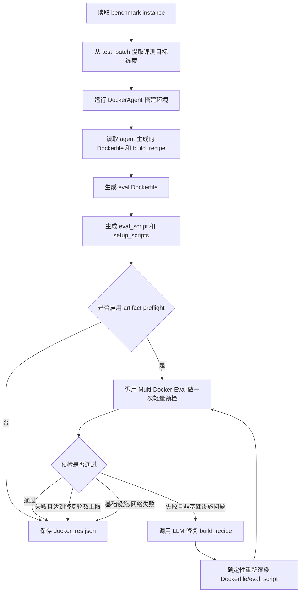

# Adapter 逻辑说明

本文档说明 `multi_docker_eval_adapter.py` 的核心职责和当前实现逻辑。这里的 adapter 指的是 DockerAgent 与 Multi-Docker-Eval 官方评估框架之间的转换层。

## 1. 目标

DockerAgent 在交互式容器里完成环境配置后，得到的是“当前容器中可运行”的状态；Multi-Docker-Eval 需要的是可在新镜像中复现的 `docker_res.json`，其中必须包含：

```json
{
  "instance_id": "...",
  "dockerfile": "...",
  "eval_script": "...",
  "setup_scripts": {}
}
```

因此 adapter 的目标不是简单复制 setup 容器，而是把 agent 的配置过程转换成可复现的评估 artifact，并尽量在进入最终评估前提前发现和修复 artifact 问题。

## 2. 总体流程

当前 adapter 的主入口是 `MultiDockerEvalAdapter.process_single_instance()`，单条数据的处理流程如下：



## 3. Benchmark 评测目标提取

adapter 会先从 `test_patch` 中提取一些只用于指导评估命令选择的元信息，记录在 `benchmark_evaluation_target` 中。

主要字段包括：

- `changed_test_files`：`test_patch` 修改过的测试文件。
- `changed_test_targets`：从 Python 测试 patch 中提取的 pytest target，例如 `tests/test_x.py::TestClass::test_case`。
- `test_framework_clues`：从 patch 中识别到的测试框架线索，例如 `pytest`、`unittest`、`phpunit`、`go test`、`cmake/ctest` 等。

这些信息不会让 setup agent 看到 `test_patch` 的完整答案，也不会应用 benchmark patch。它的作用是告诉 agent 和 adapter：“最终评测大概率关注哪些测试文件、哪些测试框架、哪些测试入口”。

## 4. DockerAgent setup 阶段

adapter 会创建工作目录：

```text
workplace/multi_docker_eval_<instance_id>/
```

然后启动 `DockerAgent`。agent 的职责是：

- 克隆目标仓库并 checkout 到 `base_commit`。
- 选择或确认基础镜像。
- 通过交互式命令安装依赖、构建项目、启动必要服务。
- 最后输出 `Verification Bundle`，包括最终测试命令、运行时准备命令、补丁后重建命令等。
- 生成结构化 `build_recipe`，供 adapter 后续渲染评估 artifact。

adapter 只在 agent 明确输出成功报告且存在可用 Verification Bundle 时继续生成评估 artifact；否则该实例会被标记为不可评估。

## 5. Eval Dockerfile 生成

adapter 会读取 agent 在 workplace 中生成的 `Dockerfile`，提取：

- `FROM ...` 基础镜像行。
- agent setup 过程中累积的 `RUN` 指令。

然后生成面向 Multi-Docker-Eval 的 eval Dockerfile。该 Dockerfile 的结构大致是：

```dockerfile
FROM <base-image>
WORKDIR /testbed

# Configure apt reliability for eval image builds
<apt reliability bootstrap>

# Install git for cloning
RUN command -v git >/dev/null 2>&1 || (apt-get update && apt-get install -y git)

# Dependency-manager helpers inferred from verified setup
<dependency helper>

# Clone repository and checkout base commit
RUN git clone <repo_url> /testbed
RUN cd /testbed && git checkout <base_commit>

# Agent's verified setup instructions
<agent setup RUN instructions>

# Post-setup compatibility helpers inferred from verified setup
<compatibility helper>
```

这里有几个重要处理：

- 路径会从 agent 的 `/app` 语义归一到评估环境的 `/testbed`。
- 如果 Dockerfile 中有 heredoc，会自动加 `# syntax=docker/dockerfile:1`。
- apt 会注入重试和超时配置，减少 Ubuntu 包仓库偶发失败。
- `git` 是条件安装，避免基础镜像没有 git 时无法 clone。
- 如果检测到 Composer 安装流程需要解压能力，会补充 `unzip`。
- 如果老版本 pytest 与新插件存在兼容风险，会加入轻量 cleanup helper。

## 6. Eval Script 生成

Multi-Docker-Eval 会在镜像构建完成后运行 `eval_script`。adapter 生成的脚本主要做三件事：

1. 进入 `/testbed`。
2. 执行 agent 验证过的 `runtime_preparation_commands`，例如启动数据库、启动后台服务、设置运行时目录等。
3. 执行最终测试命令，并把退出码传给评估框架。

生成出的脚本形式大致是：

```bash
#!/bin/bash

cd /testbed

<runtime_preparation_commands>

cd /testbed

set +e
(
<test command 1>
)
TEST_EXIT_CODE=$?
set -e

echo "echo OMNIGRIL_EXIT_CODE=$TEST_EXIT_CODE"
exit $TEST_EXIT_CODE
```

测试命令来源优先级是：

- agent 运行时结构化输出的 `build_recipe.test_commands`。
- agent report 中的结构化 `verified_test_commands`。
- 旧日志兼容路径中提取的测试命令。

如果没有任何被 agent 接受的最终测试命令，adapter 不再硬猜一条测试命令，而是跳过该实例的评估 artifact 生成。

## 7. Test Patch 注入

Multi-Docker-Eval 的判定方式通常是：

1. 先在原始代码上运行测试，确认 patch 前失败。
2. 应用 benchmark 的 source patch。
3. 再运行测试，确认 patch 后通过。

adapter 会把 `test_patch` 注入 Dockerfile：

```dockerfile
COPY test.patch /tmp/test.patch
COPY apply_test_patch.sh /tmp/apply_test_patch.sh
RUN chmod +x /tmp/apply_test_patch.sh && /bin/bash /tmp/apply_test_patch.sh
```

也就是说，测试 patch 会被烘焙进镜像，用来让评估环境拥有 benchmark 需要的测试用例；source patch 仍由 Multi-Docker-Eval 在评估阶段控制。

如果 agent 输出了 `post_test_patch_commands`，adapter 会区分两类命令：

- 非重建类命令：可以在 Docker build 阶段、应用 `test_patch` 后执行。
- 重建类命令：会推迟到 eval runtime 中，在 Multi-Docker-Eval 应用 source patch 后执行，避免提前基于旧源码构建出错误产物。

## 8. 测试命令筛选与改写

adapter 不会完全原样相信所有测试命令。它会做一些泛化处理，避免本地 smoke test 被错误当作最终评测命令。

主要处理包括：

- 去掉和 `test_patch` 明确冲突的 inline env，例如 patch 删除或 unset 的环境变量。
- 对 pytest 命令尝试收窄到 `test_patch` 修改过的测试文件或测试函数。
- 如果存在能覆盖 changed test file 的窄命令，会丢弃明显更宽泛、但不一定覆盖目标的 fallback 命令。
- 将命令中的 `/app`、`/workspace` 等路径统一到 `/testbed`。
- 如果 source patch 修改了需要重建的文件，而测试命令本身不包含重建步骤，会尝试把 agent 给出的重建命令插入 eval runtime。

这一层逻辑的目的不是替代 agent 判断，而是把 agent 给出的 Verification Bundle 转换成更符合 Multi-Docker-Eval 评测语义的命令。

## 9. Build Recipe

`build_recipe` 是 agent 输出的结构化环境配置摘要，也是 artifact repair 的主要操作对象。它通常包含：

```json
{
  "build_commands": [],
  "runtime_preparation_commands": [],
  "post_test_patch_commands": [],
  "test_commands": [],
  "excluded_commands": [],
  "rationale": "...",
  "confidence": "high|medium|low"
}
```

字段含义：

- `build_commands`：应该进入 Dockerfile 的构建期命令，例如安装依赖、编译项目、准备静态文件。
- `runtime_preparation_commands`：每次 eval 运行前要执行的命令，例如启动数据库、启动 Redis、初始化临时目录。
- `post_test_patch_commands`：应用 `test_patch` 后需要执行的命令；其中重建类命令可能会被延迟到 source patch 应用之后。
- `test_commands`：最终评估命令。
- `excluded_commands`：明确不应该进入最终 artifact 的命令，例如错误尝试、只读排查命令、临时 smoke test。
- `rationale`：LLM 给出的选择理由。
- `confidence`：该 recipe 的可信度。

adapter 修复 artifact 时，不要求 LLM 直接写 Dockerfile，而是让 LLM 修改 `build_recipe`，再由代码确定性渲染 Dockerfile 和 eval script。

## 10. Artifact Preflight

为了解决“setup 阶段成功，但最终评估失败”的问题，adapter 默认启用 artifact preflight。

preflight 会在正式输出前，使用刚生成的 `docker_res` 临时调用一次 Multi-Docker-Eval：

```text
workplace/multi_docker_eval_<instance_id>/logs/artifact_preflight/attempt_<n>/
```

每次 preflight 会写入：

- `dataset.jsonl`：当前单条 benchmark 数据。
- `docker_res.json`：当前生成的 artifact。
- `eval_output/`：Multi-Docker-Eval 的运行结果。

adapter 会读取：

- `combined_report.json`
- `final_report.json`
- stdout/stderr tail
- 关键 eval log excerpt

然后判断：

- `resolved=true`：artifact 可用，直接保存。
- 基础设施/网络问题：不调用 LLM 修复，避免把外部故障误当作 recipe 错误。
- 非基础设施失败：进入 recipe repair。

## 11. Recipe Repair

如果 preflight 失败且还有修复预算，adapter 会调用 LLM 修复 `build_recipe`。

LLM 输入包括：

- instance 基本信息。
- problem statement 的截断版本。
- `benchmark_evaluation_target`。
- 当前 `build_recipe`。
- 当前 `eval_script`。
- agent 的验证命令。
- preflight 的报告、stdout/stderr tail、eval log excerpt。

Prompt:

```markdown
You are a build-artifact repair module for an environment setup agent.

The setup agent already found a working interactive container state. Your job is to repair the structured build recipe so a fresh Docker image can reproduce that state and pass the benchmark evaluation.

Return JSON only. Do not write Markdown.

Rules:
1. Repair the recipe fields, not the source patch or benchmark test patch.
2. Keep commands reproducible from a clean Docker build after the repository is cloned and checked out.
3. Put persistent setup in `build_commands`.
4. Put commands that must run after the evaluator's test patch is baked into the image in `post_test_patch_commands`.
5. Put daemon starts, database/service initialization, and commands that must run immediately before tests in `runtime_preparation_commands`.
6. Put final benchmark-facing commands in `test_commands`.
7. Do not include read-only diagnostics, failed commands, or broad fallback test commands that are not needed once a target-covering command exists.
8. If the failure is caused by an incomplete recipe, add the missing setup command rather than weakening the test.
9. If the failure is caused by stale/wrong test selection, adjust `test_commands` to the benchmark changed test target or native wrapper that definitely runs it.
10. Preserve commands from the current recipe that are still necessary.

Required JSON keys:
`build_commands`, `post_test_patch_commands`, `runtime_preparation_commands`, `test_commands`, `excluded_commands`, `rationale`, `confidence`.

`confidence` must be one of: "high", "medium", "low".
```


LLM 输出只能是 JSON recipe。adapter 会解析并归一化这些字段：

```json
{
  "build_commands": [],
  "runtime_preparation_commands": [],
  "post_test_patch_commands": [],
  "test_commands": [],
  "excluded_commands": [],
  "rationale": "...",
  "confidence": "high|medium|low"
}
```

修复日志会写入：

```text
workplace/multi_docker_eval_<instance_id>/logs/recipe_repair_logs/<round>.md
```

日志包含：

- `LLM INPUT`
- `LLM OUTPUT`
- `PARSED RESULT`

修复后的 recipe 不会被当作 Dockerfile 文本直接拼接，而是重新走 deterministic renderer：

```text
repaired build_recipe -> eval Dockerfile -> eval_script -> artifact preflight
```

默认修复轮数是 1，可以通过命令行参数调整。

## 12. 日志位置

单个实例的主要日志都在：

```text
workplace/multi_docker_eval_<instance_id>/logs/
```

重要子目录包括：

- `setup_logs/`：DockerAgent 每一步的 Thought、Action、Observation，以及 setup 结束后的 summary。
- `compression_logs/`：Observation 压缩模块每次 LLM 调用的输入输出。
- `memory_relation_logs/`：长期记忆连接/去重时的 LLM 调用日志。
- `artifact_preflight/attempt_<n>/`：adapter 生成 artifact 后调用 Multi-Docker-Eval 预检的结果。
- `recipe_repair_logs/`：artifact preflight 失败后，LLM 修复 build recipe 的输入输出。

最终 adapter 输出通常位于：

```text
outputs/<run_name>/<timestamp>/adapter_output/docker_res.json
```

或直接运行 adapter 时的：

```text
multi_docker_eval_output/docker_res.json
```

## 13. 常用运行方式

通过 `run_verified_regression.py` 运行压缩和长期记忆版本：

```bash
.venv/bin/python run_verified_regression.py \
  --dataset single.jsonl \
  --output-root outputs/verified_regression_memory \
  --enable-observation-compression \
  --enable-long-term-memory \
  --python .venv/bin/python \
  --max-steps 300
```

artifact preflight 默认开启。关闭方式：

```bash
.venv/bin/python run_verified_regression.py \
  --dataset single.jsonl \
  --output-root outputs/verified_regression_memory \
  --enable-observation-compression \
  --enable-long-term-memory \
  --python .venv/bin/python \
  --disable-artifact-preflight
```

调整 recipe repair 轮数：

```bash
.venv/bin/python run_verified_regression.py \
  --dataset single.jsonl \
  --output-root outputs/verified_regression_memory \
  --enable-observation-compression \
  --enable-long-term-memory \
  --python .venv/bin/python \
  --artifact-repair-rounds 2
```

## 14. 设计原则

当前 adapter 的核心原则是：

- 不让 adapter 硬编码替代 agent 的环境理解；adapter 只做评估语义转换和 artifact 闭环验证。
- 不让 LLM 直接自由生成 Dockerfile；LLM 修改结构化 `build_recipe`，Dockerfile 由确定性代码渲染。
- 不把交互式容器成功等价为评估 artifact 成功；必须通过 artifact preflight 检查 fresh Dockerfile 是否可复现。
- 不把网络、镜像源、Docker daemon 等基础设施问题交给 recipe repair 处理。
- 不针对单条 benchmark 写特殊分支，尽量把规则设计成跨语言、跨项目可泛化。

## 15. 局限性

adapter 只能降低 setup 成功到 eval 成功之间的转换损耗，不能保证所有失败都能被修复。

主要局限包括：

- artifact preflight 会显著增加运行时间，因为它会提前构建并评估一次镜像。
- 如果 Docker 构建、apt、网络、镜像源本身不稳定，preflight 可能失败但不适合 LLM 修复。
- 如果 agent 的 Verification Bundle 本身遗漏关键服务或依赖，adapter 只能从日志和失败信号中尝试修复，不能保证推断完整。
- 如果 benchmark 的测试目标需要 setup agent 看不到的隐藏信息，adapter 只能利用 `test_patch` 元信息做泛化引导，不能泄露完整答案。

