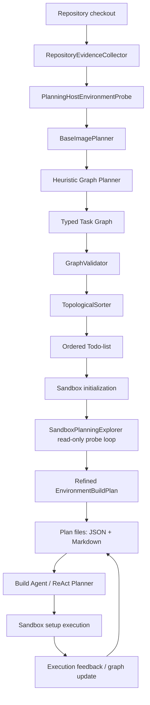

# Planning Agent 

## 摘要

本次新增的 Planning Agent 模块，目标是解决 Repo2Run 环境构建过程中“Build Agent 直接在 sandbox 里盲目试错”的问题。它在真正执行安装、构建、测试之前，先用只读方式理解仓库结构、依赖配置、运行平台和潜在风险，把环境构建需求整理成 Typed Task Graph，再编译成 Build Agent 可执行的 ordered todo-list。

Planning Agent 给 Build Agent 提供一个可查看、可更新、可记录的环境构建地图。它的核心作用如下：

1. 让依赖安装从“pytest 报一个错装一个包”转向“先从 manifest、lockfile、CI、pytest 配置、platform marker 推导依赖解法”。
2. 把计划物化成文件，Build Agent 可以通过 `Action: __VIEW_PLAN__` 查看当前 plan，系统也会在执行成功或失败后更新 plan 状态。

当前实现已经完成 Planning Agent 的主体接入，包括 base image 选择融合、host/sandbox 环境探测、read-only sandbox probe loop、Typed Task Graph、todo-list、plan 文件物化、Build Agent prompt 集成、执行反馈更新和 planning logs。初步实验显示，在 52 个历史失败样本重跑中，当前 planning-enabled pipeline 使 11 个实例达到 EBSR 成功，但还不能把提升严格归因于 Planning Agent；后续需要做 ablation 和规划质量指标分析。

---

## 1. 背景：为什么需要 Planning Agent

原始流程里，Build Agent 通常直接进入 sandbox，执行 `pip install .`、`pytest`、`poetry install` 等命令，根据报错不断试错。这种方式在简单仓库上可行，但在复杂仓库上容易出现问题：

### 无规划的错误驱动安装

Build Agent 经常根据最新 traceback 逐个安装包。例如：

```text
pytest -> ModuleNotFoundError: A -> pip install A
pytest -> ModuleNotFoundError: B -> pip install B
pytest -> version conflict -> pip install C
```

这种策略忽略了仓库里已有的依赖证据，例如：

- `pyproject.toml`
- `poetry.lock`
- `requirements*.txt`
- `setup.cfg` / `setup.py`
- CI workflow
- pytest 配置
- platform marker

结果是依赖集合越来越随机，版本冲突不断累积，Build Agent 在 sandbox 里反复试错，浪费 step。

---

## 2. 总体设计

Planning Agent 的核心设计是：在 Build Agent 修改 sandbox 前，先做只读探索，生成 Typed Task Graph。



Planning Agent 的输出是一个 `EnvironmentBuildPlan`，包含：

- `repo_summary`
- `typed_task_graph.nodes`
- `typed_task_graph.edges`
- `ordered_todo_list`
- `risk_notes`
- `fallback_plan`
- `unresolved_questions`
- `validator_warnings`
- `plan_source`

---

## 3. Typed Task Graph

Typed Task Graph 用类型化节点和边描述仓库环境构建任务。相比自然语言计划，它的优势是可校验、可排序、可更新、可度量。

### 3.1 节点类型

当前实现支持以下节点类型：

| 节点类型 | 含义 |
| --- | --- |
| `runtime` | Python 版本、OS、CPU 架构、base image 等运行时要求 |
| `system_package` | apt/native library 等系统依赖 |
| `package_manager` | pip、poetry、conda、npm 等包管理器 |
| `install_strategy` | targeted deps、editable install、extras、lockfile-constrained install 等安装策略 |
| `language_dependency` | Python 或其他语言级依赖 |
| `project_build` | editable install、build step、asset generation |
| `service` | Redis、数据库、daemon 等服务依赖 |
| `env_var` | 环境变量 |
| `asset` | 数据文件、模型文件、生成资源 |
| `runtime_command` | 测试前需要执行的 runtime preparation |
| `verification` | pytest collection / test execution |

每个节点包含 evidence、confidence、scope、metadata 和可选的 `command_hint`。其中 `command_hint` 只是建议，不会直接进入 Dockerfile。最终 Dockerfile 只能来自 Build Agent 在 sandbox 中真实执行成功的 setup trajectory。

### 3.2 边类型

边用于表达任务顺序和依赖关系，例如：

- runtime 必须先于 package manager
- package manager 必须先于 dependency installation
- dependency 必须先于 build
- build 必须先于 verification
- runtime preparation 必须先于 verification

边有 `hard` 和 `soft` 两种强度。`hard` edge 会参与拓扑排序，`soft` edge 表示弱偏好或 fallback 关系。执行反馈可以把某些 fallback 关系提升为新的 hard constraint。

---

## 4. Planning Loop：只读探索

Planning Agent 内部有一个 bounded read-only probe loop。它和 Build Agent 的真实 setup 不同：probe 只能读取信息，不能安装依赖、修改文件、启动服务或运行完整测试。

当前 Python repo 的 probe 主要包括：

1. runtime probe：检查 Python 版本、平台、`poetry`、`pytest` 等工具可用性。
2. pyproject probe：读取 `pyproject.toml` 的依赖、extras、tool 配置。
3. poetry lock probe：读取 lockfile 中的依赖和 platform marker。
4. import scan：扫描测试和源码中的 import candidate。
5. focused import scan：根据 pytest 配置和依赖信息做更聚焦的 import 分析。
6. dependency strategy probe：针对 Poetry / platform-specific dependency 生成更稳的安装策略。

这些 probe 的结果会写入 plan 的 `repo_summary`、`risk_notes`、`fallback_plan` 和 graph 节点里。

---

## 5. 与 Build Agent 的融合方式

Planning Agent 接入后，Build Agent 不再只看到一段初始 prompt，而是有一个可持续查看和更新的 plan。

### 5.1 Prompt 级融合

`src/planner.py` 的系统提示中加入了 Planning Agent 上下文，要求 Build Agent：

- 先参考 typed task graph 和 ordered todo-list。
- 优先执行 manifest-driven dependency resolution plan。
- 使用 pytest 报错验证或补充 fallback，而不是一直堆包。
- 成功完成一个 planned step 后，优先查看 Planning Update 或使用 `Action: __VIEW_PLAN__` 查看下一步。
- 避免使用 `head` / `tail` 等输出截断命令隐藏真实错误。

### 5.2 文件级融合

当前 plan 会被记录到以下文件：

| 位置 | 文件 |
| --- | --- |
| host logs | `logs/planning/current_environment_plan.json` |
| host logs | `logs/planning/current_environment_plan.md` |
| sandbox | `/tmp/repo2run_environment_plan.json` |
| sandbox | `/tmp/repo2run_environment_plan.md` |

Build Agent 可以执行：

```text
Action: __VIEW_PLAN__
```

系统会返回当前 plan 的 Markdown 视图，包括 next todo、已完成节点、失败节点、risk notes 和 fallback plan。

### 5.3 半强制 Plan Digest

只靠 prompt 要求 Build Agent 主动 `__VIEW_PLAN__` 并不稳定，因此主控层还会自动向下一轮 Observation 注入 compact plan digest：

- 每隔固定步数触发一次 periodic plan check。
- 每次失败步骤后触发一次 plan digest，提醒当前 next todo 和 fallback 方向。
- 成功匹配 planned step 后返回 Planning Update，提示新的 next todo。
- `agent_run_summary.json` 记录 `planning_consultation_stats`，包括 explicit view、automatic digest 和 planning update 次数。

自动 digest 是 host-side 控制信息，不修改 sandbox，也不会进入 Dockerfile replay 或 Verification Bundle。

### 5.4 执行反馈更新

Build Agent 每执行一步后，系统会根据 action 和 observation 更新 plan 状态：

- 成功命中某个 planned node：标记该节点完成或部分完成。
- 失败命中某个 fallback 条件：调用 `GraphUpdateManager`，提升 fallback 边，重新计算 todo-list。
- plan 更新后：重新写入 host/sandbox plan 文件，并在 observation 中追加 planning feedback。

这使 plan 是一个随执行动态变化的状态文件。

---

## 6. Image Selector 的融合

原先项目中有独立的 Image Selector。现在它被融合进 Planning Agent，拆成两个职责：

| 原职责 | 新模块 |
| --- | --- |
| repo 结构扫描、相关文件读取 | `RepositoryEvidenceCollector` |
| 语言识别、base image 选择、platform override | `BaseImagePlanner` |

这样做的原因是：base image 不是一个孤立选择，它应该成为环境计划的一部分。Planning Agent 会把推荐 base image、runtime、target platform、host environment 写入 `repo_summary` 和 `runtime` 节点。

如果用户显式指定 base image，则用户配置优先，Planning Agent 会把 override 写进 `validator_warnings`，方便后续分析。

---

## 7. 日志与可观测性

Planning Agent 的日志已经像 setup logs 一样记录下来，便于后续分析 plan 到底有没有影响执行。

主要日志包括：

- initial plan log：初始 plan、repo evidence、base image decision、host environment、validator result。
- sandbox refinement log：sandbox 只读 probe 结果、refined plan。
- plan update log：失败 action、observation、更新前后 plan 差异。
- current plan files：当前 JSON/Markdown 版本。

这些日志的价值是：后续不仅能看最终是否成功，还能分析 Build Agent 是否真的遵循了 plan，例如：

- 有没有频繁查看 `__VIEW_PLAN__`
- 成功命令是否对应 planned node
- 依赖安装是否来自 manifest/lock/CI
- pytest import error 是否只是 fallback validation
- plan 是否在失败后及时修正

---

## 8. 当前实现文件

| 文件 | 作用 |
| --- | --- |
| `src/planning/planning_agent.py` | Planning Agent 总入口，负责创建初始 plan、sandbox refine、执行反馈更新 |
| `src/planning/schemas.py` | `EnvironmentBuildPlan`、`TaskNode`、`TaskEdge` schema |
| `src/planning/repository_evidence.py` | 仓库静态 evidence 收集 |
| `src/planning/base_image_planner.py` | base image / runtime / platform 选择 |
| `src/planning/host_environment.py` | host OS / arch / Python / Docker platform 探测 |
| `src/planning/sandbox_explorer.py` | sandbox read-only probe loop |
| `src/planning/graph_validator.py` | graph schema 和 edge 校验 |
| `src/planning/topo_sorter.py` | hard-edge 拓扑排序 |
| `src/planning/todo_generator.py` | graph node 到 todo-list 的转换 |
| `src/planning/graph_update.py` | 根据执行反馈更新 plan / fallback |
| `agent.py` | Planning Agent 与 DockerAgent 主流程集成、plan 文件物化、`__VIEW_PLAN__` |
| `src/planner.py` | Build Agent prompt 集成 Planning Agent 上下文 |

---

## 9. 初步实验观察

基于 `outputs/repo2run_benchmark/failed_instances.json`：

| 指标 | 数值 |
| --- | ---: |
| 总 result files | 420 |
| 通过数 | 382 |
| 失败数 | 38 |
| 总通过率 | 90.95% |

这个结果说明当前 pipeline 能修复一部分历史失败样本，但剩余失败里 `dockerfile_missing` 仍然占比很高。这意味着很多 case 仍然失败在 sandbox setup 或 agent 未能产出有效 Dockerfile 之前，下一步重点应该继续强化 planning loop 和 Build Agent 对 plan 的执行约束，而不是只优化 Dockerfile repair。

---
