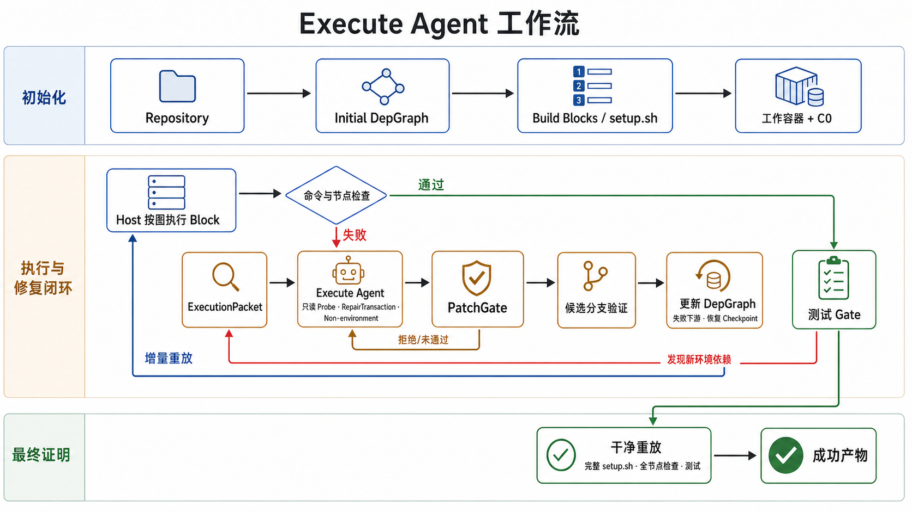

# Graph-based Execute Agent



当前方法分为初始化、增量执行与事务式修复、最终可复现性证明三个阶段。Agent
只负责诊断和提出结构化补丁；checkpoint 选择、候选容器、图提交、Block 执行和
节点认证全部由 Host 确定性控制。

## 1. 生成初始输入

入口首先选择并固定 base image。当 `--base-image auto` 时，镜像选择会使用 LLM。
随后在独立 scratch container 中构建初始 DepGraph：

```text
Repository
  -> static import scan
  -> resolver roots + uv closure
  -> install/import/ldd probe
  -> host certification
  -> optional LLM construction classification
  -> Initial DepGraph
```

DepGraph 不会直接展平为脚本。Host 先按执行 Layer 排序，再在每个 Layer 内进行
topological sort，生成结构化 Build Plan：

```json
{
  "block_id": "pip.tesserocr",
  "wave": "pip",
  "commands": ["python -m pip install tesserocr"],
  "target_node_ids": ["pkg:tesserocr"],
  "provider_ids": ["pip:tesserocr"],
  "check_commands": ["python -c 'import tesserocr'"]
}
```

最终 `setup.sh` 是同一 DepGraph 和 governed manual blocks 的可复现文本投影，不是
Agent 自由编辑的源文件。

## 2. 创建工作容器和 checkpoint

Sandbox 从固定 base image 创建 working container，完成基础 apt bootstrap 并复制
repository，然后保存名为 `base` 的初始 snapshot。增量执行器执行完整结构化 Build
Plan，并在以下位置保存语义 checkpoint：

- Layer/wave 边界；
- 每 8 个 Block；
- 单个 Block 执行时间超过阈值；
- Build Plan 末尾。

checkpoint 使用 `exec-<prefix_len>-<prefix_hash>` 命名。已有 recipe 的节点由增量
执行计划自动处理；`scheduler_frontier` 主要选择依赖已经满足、具有 Host check、但
尚无可直接执行 recipe 的 MISSING obligation。

## 3. 按 Block 执行 Build Plan

Host 按顺序执行结构化 Block，而不是重新解析 `setup.sh`。一个 Block 可以包含一条
或多条 command。command 返回成功后，Host 仍必须运行目标节点的 `check_command`：

```bash
python -c "import tesserocr"
```

结果分为：

- command 失败：返回 `failed_block_id`、`failed_node_id` 和 stderr；
- command 成功但节点 check 失败：仍进入修复；
- command 和 check 都成功：只有 Host 可以将节点认证为 `SATISFIED`。

Agent 的补丁结构中不存在可写的节点 `state` 字段。

## 4. 构造失败上下文

增量路径通过 `Block.target_node_ids` 直接得到 Block 到 DepGraph Node 的映射，不需要
从 shell 文本猜测。只有最终完整重放失败时，Host 才使用 `#@node`、`#@block` 和
`#@check` 注释作为定位 fallback。

Agent 接收的实际结构是 `RepairScope`，包含：

- target node 和局部 requirement slice；
- failed Block 的 id、wave、commands、targets、providers 和 checks；
- failing command、stderr 和 evidence ids；
- 已失败命令 `known_invalid`；
- 当前约束。

checkpoint 列表不会交给 Agent。checkpoint 的选择属于 Host 控制面。

## 5. Execute Agent 的结构化动作

Canonical `GraphExecuteAgent` 每轮必须返回且只能返回一个 JSON 对象。

只读诊断：

```json
{
  "type": "probe",
  "target_node": "pkg:tesserocr",
  "purpose": "check whether Tesseract headers are discoverable",
  "command": "pkg-config --cflags tesseract"
}
```

Host 在执行前调用统一的 `validate_probe_command()`。它允许 `apt-cache`、
`pkg-config`、`ldd`、`find`、`cat`、受约束的 `python -c` 和由只读命令组成的管道；
安装、删除、文件写入、写重定向、权限修改、服务启动以及动态 shell 执行会被拒绝。
拒绝结果以结构化 Observation 返回 Agent，命令不会进入 Sandbox。

提交完整 PatchProposal：

```json
{
  "type": "propose_patch",
  "target_node": "pkg:tesserocr",
  "rationale": {
    "why": "tesserocr requires Tesseract development headers"
  },
  "patch": {
    "add_requirements": [],
    "add_providers": [],
    "add_edges": [],
    "script_patches": []
  }
}
```

建议放弃环境修复：

```json
{
  "type": "abstain",
  "classification": "non_environment",
  "reason": "the failure is caused by repository source code",
  "evidence_refs": ["ev-17"]
}
```

`abstain` 只是建议。Host 会使用现有 diagnosis router 独立复核；Agent 不能自行终止
运行。历史 `V3BuildAgent` 仍保留旧 `Action:/Final Patch:` 协议用于兼容，canonical
incremental arm 使用新的 JSON action 协议。

## 6. CandidateTransaction 候选验证

`PatchGate` 只执行纯函数式 `validate -> apply -> recompose`。通过后的结果明确是
`candidate_graph` 和 `candidate_manual_blocks`，不会立即替换正式状态。

Host 随后创建 CandidateTransaction：

1. 比较正式 Build Plan 与候选 Build Plan 的 `block_signature`；
2. 计算最长公共前缀，并选择不超过已执行前缀的最近有效 checkpoint；
3. 从该 checkpoint image 创建独立 candidate container；
4. 不重新执行 checkpoint 之前的 command；
5. 执行失效后缀，直到原失败 Block/目标节点得到验证；
6. 运行目标 check，以及可能受影响的已满足节点 check。

candidate container 不共享 working container 的可写 bind/cache volumes。

候选失败时：

- 删除 candidate container；
- 丢弃 candidate graph 和 candidate manual blocks；
- 保持正式 DepGraph、manual blocks、working container 和执行前缀不变；
- 将候选 stderr 和 check failure 作为新 evidence 返回 Agent。

候选成功时：

- Host 提升 candidate container 为新的 working container；
- 原子提交 candidate graph 和 candidate manual blocks；
- 在已验证前缀创建新 checkpoint；
- 从已验证 Block 后继续执行，不在旧容器中重复修复。

## 7. 更新计划并继续增量执行

checkpoint 失效不是通过固定的 `C1/C2/C3` 层编号或显式遍历全部下游节点完成的。
实际算法以 Block 的 id、wave、commands、targets、providers 和 checks 计算稳定签名：

```text
old Build Plan + candidate Build Plan
  -> longest common signature prefix
  -> retain checkpoints whose prefix hash still matches
  -> drop stale suffix checkpoints
  -> restore the longest retained prefix
```

因此，如果前序 System Block 改变，会自动回退到更早 checkpoint 或 `base`；如果只
修改后部 PIP Block，则可复用前面的 System/Toolchain 前缀。提交候选事务后，普通
增量执行器继续执行剩余 Blocks。

## 8. 测试 Gate 和运行时依赖写回

当没有可执行 frontier 时，Host 运行带 anti-hollow 检查的测试 Gate。测试失败先写入
ActionLedger，在下一 cycle 的 `_runtime_ingest_phase` 中由确定性诊断器分类；确定性
分类失败时可以使用有上限的 LLM classifier fallback。

对于 `ModuleNotFoundError: redis` 一类环境失败，Host 会新增或注释对应节点，并添加
culprit/Test 到该节点的 runtime `requires` 边，再进入执行循环。repository-local
import、断言失败和 residual source failure 不会被无限转换成新依赖。

## 9. 最终干净重放和产物

搜索 checkpoint 只能用于搜索，不能作为成功证明。成功出口必须：

1. 调用 `reset_to_base()` 从固定 base image 创建新容器；
2. 重新完成基础 bootstrap 并复制 repository；
3. 执行最终完整 `setup.sh`；
4. 重新认证所有 reciped 节点；
5. 运行 anti-hollow 测试 Gate。

最终重放失败时最多允许有限次结构化反馈修复；无法复现则诚实返回失败。搜索
checkpoint images 在 Sandbox 关闭时统一清理。

当前 E2E/RAT 产物为：

```text
setup.sh
v3_trace.json        # 启用 --trace-out 时
v3_run.log           # RAT adapter
v3_llm.jsonl         # RAT adapter 的 LLM exchange log
```

`v3_trace.json` 包含 Agent action、probe validation/rejection、PatchGate、
CandidateTransaction、执行 Blocks、checks、checkpoint 复用、committed/aborted 状态和
最终 fresh replay certificate。当前没有单独的 `final_depgraph.json`、
`repair_transactions.json` 或 `checkpoint_statistics.json`。

完整流程为：初始 DepGraph 编译为结构化 Build Plan 和 `setup.sh`；Host 增量执行并
确定性定位失败；Agent 进行受 Host 校验的只读诊断并提交完整 PatchProposal；
PatchGate 生成候选状态，CandidateTransaction 在独立 checkpoint fork 中验证；成功
后同时提交图并提升候选容器，失败则完全回滚；测试反馈继续写回图；最后通过干净
完整重放证明最终 Build Script 可复现。
