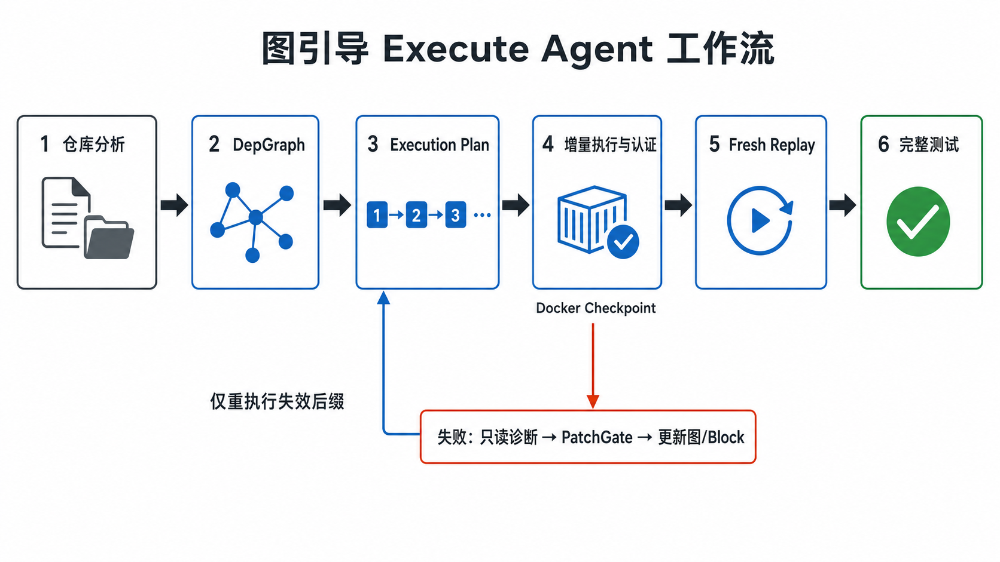

# 图引导 Execute Agent：完整工作流

本文档描述当前 v3 中已经实现的 Graph-Guided Execute Agent 方法。重点不是单独解释
DepGraph 或 `setup.sh`，而是说明二者如何与 Execute Agent、PatchGate、Docker
checkpoint 和终局 fresh replay 组成一个闭环。

对应的默认入口是：

```bash
python scripts/run_v3_e2e.py REPO \
  --execution-mode incremental \
  --max-cycles 30
```

RATBench 通过 `rat_v3_adapter.py` 调用同一条 v3 路径。

## 1. 方法概述

该方法可以概括为：

> 先将仓库的环境需求表示为 DepGraph，再把 DepGraph 编译成带有图关联信息的
> Execution Plan；主机按 block 增量执行该计划并认证结果。发生失败时，LLM Agent
> 只能基于失败 block 和局部图上下文提出结构化 PatchProposal，不能直接修改环境。
> PatchGate 接纳补丁后重新编译计划，系统恢复最长仍然有效的 Docker checkpoint，
> 只重执行失效后缀。搜索成功后，再从原始基础镜像完整重放 `setup.sh` 和测试，作为
> 最终可复现性证明。

它同时解决了两类问题：

1. 传统 repair loop 每次从头运行完整 `setup.sh`，会重复执行大量已经成功的安装步骤。
2. 普通 ReAct Agent 可以随意修改容器，导致修复过程不可审计、状态不可复现，也无法
   明确说明一次修复改变了哪个依赖关系。

## 2. 核心对象与权限边界

| 组件 | 负责什么 | 不允许做什么 |
| --- | --- | --- |
| DepGraph | 表示环境中必须成立的依赖义务、provider、依赖边和检查命令 | 不能把命令执行成功直接等同于节点满足 |
| Execution Plan | 将图节点和受控手工 block 编译成有序执行单元 | 不能自行改变图 |
| IncrementalPlanExecutor | 执行 block、认证目标、管理 checkpoint 和恢复前缀 | 不能调用 LLM 判断真值 |
| GraphExecuteAgent | 阅读失败包、执行只读诊断、提出 PatchProposal | 不能安装、删改文件、认证节点或宣布成功 |
| PatchGate | 确定性校验并应用图、provider、edge 和 block 补丁 | 不能执行安装，也不能写入 `SATISFIED` |
| Host Certifier | 执行只读 `check_command`，更新节点满足状态 | 不接受 Agent 的自然语言成功声明 |
| `setup.sh` renderer | 从当前图和受控 block 生成完整可重放脚本 | 不是搜索阶段的状态源 |
| Fresh Replay | 从初始运行基线重放完整脚本并运行测试 | 不能使用搜索 checkpoint 作为成功证明 |

最重要的不变量是：

> LLM 只有“提案权”，PatchGate 只有“结构变更接纳权”，Host Certifier 才有“事实认证权”。

## 3. 总体工作流



图中的主路径只保留六个关键阶段。增量执行中的命令失败或认证失败会进入下方修复
回路；PatchGate 接纳图或 block 更新后，系统返回 Execution Plan，并从最长有效
checkpoint 开始，仅重执行失效后缀。

## 4. 阶段一：构建初始 DepGraph

### 4.1 输入信息

初始图的证据来自仓库本身，包括：

- Python manifest 和 lock/requirements 文件；
- 源码中的 import；
- 测试配置和测试入口；
- Dockerfile、CI、README 等环境线索；
- 目标 Python 版本和目标平台。

基础镜像由 ImageSelector 选择并固定，例如 `python:3.11-slim`。固定后的 Python
版本和平台会进入后续解析与执行上下文。

当前入口会把确定性扫描结果交给 construction classifier，对模糊发现做类型化分类。
这个阶段可以调用 LLM 辅助分类，但它不进入容器执行安装，也不能直接认证节点。

### 4.2 图中表达的内容

典型节点包括：

- `import:requests`：源码要求该 import 可用；
- `pkg:requests`：某个精确版本的 Python distribution；
- `syslib:libpq.so`：运行期系统库；
- `tool:gcc`：构建工具；
- `service:postgres`：外部服务义务；
- `config:DATABASE_URL`：配置义务；
- `test:repo_tests_pass`：最终测试义务。

边表示因果关系。例如：

```text
import:psycopg2 --requires--> pkg:psycopg2
pkg:psycopg2    --requires--> syslib:libpq.so
pkg:psycopg2    --requires--> tool:gcc
```

每个可认证节点应带有只读 `check_command`。例如：

```bash
python -m pip show requests
ldconfig -p | grep -q libpq
command -v gcc
```

## 5. 阶段二：从图编译结构化 Execution Plan

搜索阶段不会把 `setup.sh` 当作普通字符串重新解析。系统直接把 DepGraph 和
`manual_blocks` 投影为结构化 `Block` 序列。

每个 block 至少包含：

```text
block_id
wave
commands
target_node_ids
provider_ids
check_commands
evidence_refs
```

其中：

- 图原生 Package/SystemLib/Tool 节点编译为 graph-derived block；
- 无法用标准图 recipe 表达的兼容性修改，可以由 PatchGate 接纳为 governed manual
  block；
- `manual_blocks` 仍然必须关联目标节点、检查命令和证据，不能成为游离 shell 历史。

执行顺序与最终 `setup.sh` 使用相同的 layer 顺序和图拓扑顺序。这样可以保证：

1. 搜索阶段执行的计划与最终产物来自同一语义来源；
2. checkpoint 的 block 边界稳定且可解释；
3. 不需要依赖脆弱的 shell 文本切分来定位失败。

## 6. 阶段三：增量执行与主机认证

### 6.1 逐 block 执行

`IncrementalPlanExecutor` 从当前已执行前缀之后开始执行 block。每个 block 的执行过程是：

1. 将该 block 编译为带 `set -Eeuo pipefail` 的小脚本；
2. 在当前 Docker 容器中运行；
3. 命令返回 0 后，由主机执行该 block 目标节点的 `check_command`；
4. 再执行不与节点检查重复的 block-level checks；
5. 只有检查通过，节点才可被 Host Certifier 标记为 `SATISFIED`。

因此，“pip 命令返回 0”不等于“import 已可用”。如果安装成功但 import 检查失败，
该 block 仍被视为失败。

### 6.2 checkpoint 创建条件

当前实现会在以下位置创建 named Docker checkpoint：

- 当前 block 是计划最后一个 block；
- 下一个 block 进入新的 wave；
- 已执行 block 数达到周期性间隔，默认每 8 个；
- 单个 block 耗时达到 expensive threshold，默认 30 秒。

创建 checkpoint 前，主机会重新认证整个已执行前缀。如果前缀中的旧节点因后续安装
发生撤销，例如包版本覆盖导致 import 失效，则不会把该前缀当作可复用状态。

checkpoint 名称形如：

```text
exec-8-62399908e3f0
```

其中包含前缀长度和语义前缀哈希。

## 7. 阶段四：失败定位与 Execution Failure Packet

当 block 命令失败或目标认证失败时，系统不会把整段历史直接塞给 LLM，而是构造一个
局部、结构化、可引用的 RepairScope，也可称为 Execution Failure Packet。

它包含：

- 当前失败的图义务；
- 该节点附近的 RequirementSlice；
- 失败 block 的 id、wave、commands、targets、providers 和 checks；
- 失败命令、返回码和截断后的关键输出；
- 证据 ID；
- 已失败、禁止再次提出的命令或 provider；
- Python、平台、基础镜像等约束。

证据必须带 ID，例如：

```text
install.6.pip.redis
check.15.import:urlparse
```

后续 PatchProposal 必须引用当前 packet 中存在的 evidence ID，不能凭空构造证据。

## 8. 阶段五：GraphExecuteAgent 的行为协议

GraphExecuteAgent 是一个受限的诊断 Agent，而不是拥有 shell 写权限的 ReAct Agent。

它每轮只能选择一种输出：

```text
Action: <一个只读诊断命令>
```

或者：

```text
Final Patch: <一个 fenced JSON PatchProposal>
```

允许的诊断包括 `pip show`、`apt-cache`、`pkg-config`、`ldconfig`、`ls`、`cat` 等。
Agent 不允许安装、修改、删除、认证节点或用自然语言宣布完成。

当前单次 proposal 最多处理 5 个 Agent 回合，协议期望最多 4 次只读诊断后输出最终
PatchProposal。默认 LLM 输出上限为 2200 tokens，可通过
`GRAPH_AGENT_MAX_OUTPUT_TOKENS` 调整。

### 8.1 PatchProposal

Agent 的唯一变更接口是：

```json
{
  "patch": {
    "add_requirements": [],
    "add_providers": [],
    "add_edges": [],
    "script_patches": []
  }
}
```

四类操作分别表示：

- `add_requirements`：新增图节点；
- `add_providers`：给图节点增加或替换安装 provider；
- `add_edges`：显式补充依赖因果边；
- `script_patches`：新增或替换受控手工 block。

### 8.2 修复不是追加 shell 历史

一个义务在计划中只能有一个当前有效的修复策略：

- graph-derived block 失败时，Agent 应使用 provider `override=true` 修正 provider；
- governed manual block 失败时，Agent 必须使用 `op="replace_block"` 和相同 block id；
- 不能把新命令不断追加在已经失败的命令之后，因为执行永远到不了后面的 fallback。

provider 被 override 时，PatchGate 会清除该节点旧的 `setup_commands` 编译缓存，确保下次
编译真正使用新 provider。

对于 `Queue`、`urlparse` 等 Python 2 到 Python 3 的标准库重命名，当前协议要求优先创建
Python 3 compatibility shim 或源码适配 block，而不是仅为旧 import 名安装 Python 2。

## 9. 阶段六：PatchGate 确定性接纳

LLM 输出不会直接作用于图或容器。PatchGate 依次执行 `validate -> apply -> recompose`。

主要校验包括：

- 节点 ID 是否使用合法前缀；
- node type、layer 和 edge relation 是否合法；
- 引用的 evidence ID 是否真实存在；
- `check_command` 是否只读且能检测缺失；
- Package 是否使用一个精确的 PEP-440 版本；
- provider 命令是否符合声明的 action class；
- edge 两端节点和类型是否满足图 schema；
- script block 是否具有 commands、targets、checks 和 evidence；
- `add_block` 是否重复已有 block；
- `replace_block` 是否确实替换一个已有 block；
- 是否同时为同一 graph-native target 创建重复的图 recipe 和脚本 recipe。

补丁被拒绝时，结构化错误会返回给 Agent，允许其重新输出一次修正提案。补丁被接纳时：

- 新节点初始仍是 `MISSING`，Agent 无权直接写入 `SATISFIED`；
- provider、edge 和 manual block 被加入当前状态；
- 计划从更新后的图重新编译；
- 是否满足仍由后续真实执行和 Host Certifier 决定。

## 10. 阶段七：语义失效与最长有效前缀恢复

每个 block 都有一个语义签名，包含：

- block id；
- wave；
- commands；
- targets；
- providers；
- checks；
- 是否修改环境。

动态 evidence 不进入签名。原因是错误输出变化不代表环境构建语义发生变化，不应仅因
日志变化使 checkpoint 失效。

补丁接纳后，新旧计划逐 block 比较签名，计算最长公共前缀：

```text
old = [B1, B2, B3, B4, B5]
new = [B1, B2, B3', B4, B5, B6]
                  ^ first semantic change
```

如果存在经过认证的 `checkpoint(B1..B2)`，系统将：

1. 删除从 B3 开始的失效 checkpoint；
2. 恢复 `checkpoint(B1..B2)`；
3. 重新认证恢复后的状态；
4. 只执行 `[B3', B4, B5, B6]`。

如果补丁只是向计划尾部追加 B6，且当前状态干净，则 B1..B5 全部直接复用，不发生恢复。

如果没有任何有效 checkpoint，系统才回到 base checkpoint，从头执行当前计划。

## 11. 阶段八：调度收敛与预算

外层 v3 loop 持续执行：

```text
certify -> compile -> incremental execute -> diagnose -> patch -> recompile
```

主要预算是：

- `--max-cycles`：外层图/修复周期，RAT 实验中通常设为 30；
- 全局 repair proposal 预算与 `max_cycles` 对齐；
- 单个失败 block 最多进行 5 次 structured repair 尝试；
- 终局阶段最多进行 3 轮 fresh replay/失败反馈处理。

可能的停止原因包括 `planner_done`、`planner_giveup`、`max_cycles` 和 replay failure。
只有满足终局成功条件的路径才能产生成功证书。

## 12. 阶段九：终局 Fresh Replay

Docker checkpoint 只是一种搜索缓存，不是最终证明。即使搜索容器中的所有节点和测试都
通过，系统仍必须回到初始运行基线。该基线由所选基础镜像初始化并注入原始仓库，但不含
搜索阶段安装的依赖。随后执行：

1. 从初始 base checkpoint 重置容器；
2. 从当前 DepGraph 和 manual blocks 重新渲染完整 `setup.sh`；
3. 一次性运行完整 `setup.sh`；
4. 重新认证所有 reciped 节点；
5. 运行完整 pytest gate；
6. 把 setup rc、认证节点、未满足节点、test rc 和摘要写入 replay trace。

只有以下条件同时成立才报告成功：

```text
fresh setup rc == 0
all reciped node checks pass
test rc == 0
tests are actually collected and executed
```

如果 fresh replay 暴露搜索容器中没有出现的问题，该失败会重新进入同一个
Execution Failure Packet -> Agent -> PatchGate 流程，而不是直接修改最终脚本。

## 13. `setup.sh` 的角色

`setup.sh` 是 DepGraph 与 governed manual blocks 的编译产物：

```text
DepGraph + manual_blocks --render--> setup.sh
```

它包含：

- layer section；
- `#@node`、`#@block`、`#@check` 和 evidence 注释；
- graph hash；
- 精确版本和 provider 信息；
- 经过 PatchGate 管理的兼容性命令。

它不是 Agent 的自由编辑文件。正确的修复方向是：

```text
修改图/provider/block -> 重新编译 setup.sh
```

而不是：

```text
直接让 LLM 修改 setup.sh 文本
```

## 14. RATBench 评测路径

RATBench 中的执行链为：

```text
run_rat_benchmark.py
  -> DockerAgentModel.predict()
  -> RATV3Adapter.process_repo()
  -> scripts/run_v3_e2e.py --execution-mode incremental
  -> setup.sh + v3_trace.json
  -> RAT eval Dockerfile
  -> docker build
  -> pytest collect/run
  -> _result_row.json
```

`rat_v3_adapter.py` 还会：

- 将 LLM 原始交互写入 `v3_llm.jsonl`；
- 将 v3 日志写入 `v3_run.log`；
- 将最终 `setup.sh` 放入独立 Docker build context；
- 根据本地基础镜像架构设置 Docker build platform；
- 复用本地已匹配平台的基础镜像，避免每个 worker 重复 registry pull。

## 15. 输出与可审计指标

每个 RAT 仓库的主要产物包括：

| 文件 | 内容 |
| --- | --- |
| `setup.sh` | 最终构建脚本 |
| `v3_trace.json` | PatchGate、增量执行、checkpoint 和 fresh replay 记录 |
| `v3_llm.jsonl` | Execute Agent 的原始 LLM 交互 |
| `v3_run.log` | v3 驱动与 Docker 搜索日志 |
| `_result_row.json` | RAT 单仓库最终评分 |
| `run_pytest_results.json` | pytest 详细结果，成功执行时生成 |

`v3_trace.json` 中的增量记录包含：

- `plan_hash`；
- `total_blocks`；
- `reused_blocks`；
- `executed_block_ids`；
- `restored_checkpoint`；
- `created_checkpoints`；
- `failed_block_id`；
- `setup_rc`。

核心效率指标定义为：

```text
reuse_ratio = sum(reused_blocks) / sum(total_blocks)
```

论文实验还应报告：

- 与 fresh-per-cycle baseline 相比减少的 block 执行数；
- 总 wall-clock time；
- LLM proposal/API call 数；
- checkpoint 创建、恢复、失效数量及存储开销；
- terminal fresh replay 成功率；
- RATBench `pytest_pass_rate` 和 ESSR；
- `total_tests=0` 的失败类型分布。

## 16. 已完成 smoke 的示例

在 `jhao104/proxy_pool` smoke 中：

- v3 停止原因为 `planner_done`；
- terminal fresh replay 的 setup rc 为 0；
- terminal test rc 为 0；
- RATBench 运行 248 个测试，248 个全部通过；
- `pytest_pass_rate = 1.0`；
- 搜索期间 `sum(reused_blocks) = 183`；
- `sum(total_blocks) = 286`；
- `reuse_ratio = 63.99%`；
- 共发生 14 次语义 checkpoint 恢复。

这说明成功结果不是来自搜索容器的偶然状态：相同 `setup.sh` 已经在新的评测 Docker
镜像中再次执行，并通过 RAT 的完整测试。

## 17. 与两种基线的区别

### 17.1 对比“每轮完整重跑 setup.sh”

| 维度 | Fresh-per-cycle | Graph-guided incremental |
| --- | --- | --- |
| 已成功前缀 | 每轮重跑 | 从最长有效 checkpoint 复用 |
| 失败定位 | shell 行/命令 | block + graph target + evidence |
| 补丁影响范围 | 难以计算 | 由 block semantic signature 决定 |
| 最终证明 | 完整重放 | 同样要求完整重放 |
| 搜索效率 | 低 | 只重执行失效后缀 |

### 17.2 对比普通 ReAct Execute Agent

| 维度 | 普通 ReAct | 当前方法 |
| --- | --- | --- |
| Agent shell 权限 | 通常可直接修改环境 | 只读诊断 |
| 状态变更 | 自由命令历史 | typed PatchProposal |
| 变更审查 | 主要依赖 LLM 自律 | deterministic PatchGate |
| 成功判断 | Agent 可能自行判断 | Host Certifier + fresh replay |
| 与 DepGraph 结合 | 弱或没有 | 失败 packet、target、edge、provider 全部图关联 |
| 修复复现 | 依赖完整轨迹 | 编译为独立 `setup.sh` |

## 18. 实验命令

单仓库 smoke：

```bash
python run_rat_benchmark.py \
  --model dockeragent \
  --arm v3 \
  --only jhao104/proxy_pool \
  --repos-json datasets/rat_python_hard_subset.json \
  --root-path outputs/rat_v3_execute_smoke \
  --llm MiniMax-M3 \
  --num-turn 30 \
  --timeout 7800 \
  --repair-mode off
```

50 条完整数据：

```bash
python run_rat_benchmark.py \
  --model dockeragent \
  --arm v3 \
  --repos-json datasets/rat_python_hard_subset.json \
  --root-path outputs/rat_v3_execute_minimax_m3_full_run \
  --llm MiniMax-M3 \
  --num-turn 30 \
  --timeout 7800 \
  --concurrency 4 \
  --repair-mode off
```

fresh-per-cycle 消融：

```bash
python scripts/run_v3_e2e.py REPO \
  --execution-mode fresh \
  --max-cycles 30
```

## 19. 代码位置

| 功能 | 文件 |
| --- | --- |
| v3 入口与组件装配 | `scripts/run_v3_e2e.py` |
| 主控制流与终局 replay | `src/envstate/orchestrator.py` |
| GraphExecuteAgent | `src/envstate/v3_build_agent.py` |
| Execution Failure Packet | `src/envstate/repair_scope.py` |
| typed repair loop | `src/envstate/repair_loop.py` |
| PatchProposal schema | `src/python_deps/depgraph/patch.py` |
| PatchGate | `src/python_deps/depgraph/patch_gate.py` |
| Execution Plan 编译 | `src/python_deps/depgraph/execution_plan.py` |
| 增量执行与前缀恢复 | `src/envstate/incremental_executor.py` |
| Docker named checkpoint | `src/sandbox.py` |
| `setup.sh` 渲染 | `src/python_deps/depgraph/build_script.py` |
| trace schema | `src/envstate/run_trace.py` |
| RAT 适配 | `rat_v3_adapter.py` |

## 20. 方法的核心结论

该方法不是“让 Agent 在 Docker 里自由尝试直到成功”，也不是“每次修改图后从头执行完整
脚本”。它将环境构建拆成三个彼此约束的平面：

1. **图平面**：DepGraph 记录必须满足的环境事实和因果关系；
2. **提案平面**：Execute Agent 只做诊断并提出可校验的结构化修复；
3. **执行与证明平面**：主机增量执行、认证、缓存前缀，并用 clean-baseline fresh replay
   证明最终脚本可复现。

创新点不只是增加一个 Agent，而是让 Agent 的每次修复都能回答四个问题：

```text
修复的是哪个图义务？
修改了哪个 provider、edge 或 block？
哪些已执行步骤仍然有效，哪些后缀必须重跑？
最终结果能否脱离搜索状态，从原始镜像完整复现？
```

这四个问题分别由 DepGraph、PatchGate、semantic checkpoint invalidation 和 fresh replay
给出确定性答案。
