# 面向 Polyglot Repository 的图驱动可执行环境构建 Agent 方案书

> 文档状态：设计提案  
> 适用代码库：`Jayint-repo-3-core`  
> 建议方法名：**PolyGraph Agent**  
> 核心产物：Polyglot DepGraph、可重放 Build Plan、`setup.sh`、事务轨迹与 Clean Replay Certificate

## 1. 摘要

本方案将当前以 Python 依赖为中心的 GraphExecuteAgent 扩展为一个能够为真正的多语言（polyglot）仓库自动构建可执行环境的 Agent。这里的“多语言”不是指仓库中同时出现若干种源文件，而是指：为了完成给定测试或运行目标，必须同时满足两个及以上语言生态、编译工具链或跨语言 ABI 的环境义务。例如：

- Python 包通过 `maturin` 构建 Rust 扩展；
- Node.js 包通过 `node-gyp` 调用 Python、Make 和 C/C++ 编译器；
- Java/Gradle 项目通过 Node 插件构建前端资源；
- Go 项目通过 cgo 链接系统 C 库；
- Rust 项目通过 `wasm-pack` 生成由 Node 测试消费的 WebAssembly 产物。

本方案不把系统改造成一个自由执行任意命令的通用 ReAct Agent，而是保留当前代码中已经形成的控制边界：

1. **Graph 表示环境义务和因果关系**；
2. **Build Plan 是 Graph 的确定性投影**；
3. **Host 负责调度、执行、checkpoint、验证和提交**；
4. **LLM Agent 只负责开放式只读诊断和结构化候选修复**；
5. **所有修复必须先在候选容器中事务式验证**；
6. **最终必须从固定 digest 的干净基础镜像完整重放**。

主要改进是把当前的“单一 Python 依赖前端”替换为：

> 多生态适配器 + 目标相关依赖闭包 + 跨生态集成图 + 图约束基础镜像求解 + 图定位事务修复。

论文层面最值得主张的创新并非“支持多种语言”，而是：**面向目标的跨生态环境义务建模，以及利用该图联合完成基础镜像选择、增量执行、局部修复和可复现性认证。**

---

## 2. 问题定义

### 2.1 输入

系统输入为：

- 仓库快照 `R`，必须固定到 commit SHA；
- 目标任务 `T`，例如测试命令、测试目录、需要运行的入口或 benchmark 给出的测试协议；
- 平台约束 `P`，包括 OS、CPU 架构、可选 GPU/网络策略；
- 可选用户约束 `U`，例如禁止某类镜像、指定 Python/JDK 版本或离线构建要求。

### 2.2 输出

系统输出为：

- 基础镜像决定 `B`，最好固定为 OCI digest；
- 最终 Polyglot DepGraph `G*`；
- 结构化 Build Plan `P*`；
- 可读、可重放的 `setup.sh` 或 Dockerfile；
- 测试命令与测试结果；
- 完整事务轨迹；
- Clean Replay Certificate。

### 2.3 成功条件

不能把“某个工作容器中的测试通过”直接定义为成功。正式成功条件应为：

1. 从未经修改的基础镜像 digest 创建新容器；
2. 只执行最终 Build Plan 编译得到的脚本，不使用搜索过程中的工作容器状态；
3. 所有强制节点的 Host check 通过；
4. 目标测试成功收集并达到 benchmark 定义的通过标准；
5. 重放过程没有读取候选容器中的未声明状态；
6. 产物记录 Graph hash、Plan hash、base digest、仓库 commit 和测试证据。

可写成：

```text
Success(R, T) := CleanReplay(B.digest, setup.sh, R.commit)
                 AND AllRequiredChecks(G*)
                 AND TestOracle(T)
```

### 2.4 “真正的 Polyglot”判定

建议为 benchmark 和系统内部都采用严格定义：

```text
TruePolyglot(R, T) :=
    |RelevantEcosystems(Closure(T))| >= 2
    AND 至少存在一条跨生态因果边
```

以下情况不自动算作真正的 polyglot：

- Python 仓库中仅存在少量 shell 脚本；
- JavaScript 与 TypeScript 共存，但都由同一个 Node 包管理生态处理；
- 文档示例目录包含另一种语言，但目标测试不会访问它；
- vendored 代码、生成代码或静态资源被语言统计工具计入；
- 仓库是 monorepo，但本次目标只涉及一个独立子项目。

这一约束很重要，否则实验容易退化成“多语言文件检测”，无法证明方法真的解决了跨生态环境构建问题。

---

## 3. 当前项目能力与关键缺口

### 3.1 当前已经具备、应当保留的能力

当前 v3 路径已经提供了很好的控制面基础：

- `src/python_deps/depgraph/build.py` 按 scan、resolve、probe、certify 构建 Python DepGraph；
- `src/python_deps/depgraph/execution_plan.py` 将 Graph 和 manual blocks 确定性编译为结构化 Build Plan；
- `src/envstate/incremental_executor.py` 使用 block signature 最长公共前缀选择 checkpoint；
- `src/sandbox.py` 支持隔离的 candidate container、promote 和 abort；
- `src/envstate/v3_build_agent.py` 的 `GraphExecuteAgent` 只输出结构化 action；
- `src/envstate/agent_action.py` 对只读 probe 做 Host 端验证；
- `src/python_deps/depgraph/patch_gate.py` 验证并应用完整 `PatchProposal`；
- `src/envstate/orchestrator.py` 保持 Host 对执行、验证和状态提交的控制；
- `src/envstate/run_trace.py` 记录候选事务和最终 clean replay；
- `scripts/run_v3_e2e.py` 串联 base image、图构建、增量执行、修复和最终产物。

这些机制应被泛化，而不是推倒重写。

### 3.2 当前实现为什么还不是 Polyglot Agent

| 当前模块 | 当前行为 | Polyglot 缺口 |
|---|---|---|
| `src/language_handlers.py` | 能检测多个语言，但最终按优先级返回一个 primary language | 丢失次要但目标相关的语言生态 |
| `src/image_selector.py` | 根据一个语言 handler 选择候选镜像 | 无法联合满足多个运行时和工具链约束 |
| `src/envstate/base_image_selection.py` | 返回一个 `BaseImageChoice`，默认回退 `python:X.Y-slim` | 决策模型绑定 Python，且发生在完整图构建之前 |
| `src/envstate/runtime_base.py` | 只解析 `requires-python` 并固定 Python minor | 不支持 Node、Rust、JDK、Go、ABI、target triple 的联合约束 |
| `src/python_deps/depgraph/build.py` | Python import、Python manifest、uv、pip、import、ldd | 缺少 npm/Cargo/Maven/Gradle/Go/CMake 等生态解析器 |
| `schema.py` | Package ID 主要是 `pkg:<name>`，manifest 字段采用 PEP 440 语义 | 不同 registry 可能同名，版本语义也不同 |
| `block.py` / `populate.py` | Package 默认编译成 pip install | 无法按生态选择 provider compiler |
| `patch_gate.py` | Package version 统一用 `packaging.Version` 验证 | npm semver、Cargo semver、Maven version 无法合法表示 |
| `incremental_executor.py` | 受影响节点主要沿 `REQUIRES` 传播 | 新增跨生态因果关系后检查传播不完整 |
| `repair_scope.py` | 主要携带 Python manifest 和 Python runtime 上下文 | 缺少 ecosystem、toolchain、ABI 和 bridge 上下文 |

### 3.3 为什么仅使用 Ubuntu + apt-get 不够

Ubuntu/Debian 是重要候选，但不能作为无条件答案：

1. `apt-get` 不能替代 npm、Cargo、Maven、pip、Go modules 等原生 resolver；
2. OS 仓库版本通常无法严格满足 lockfile 或工具链版本；
3. 相同库在不同层的名称不同，例如 PyPI distribution、Python import、Debian package 和 ELF soname 不是同一命名空间；
4. C/C++ 扩展受 glibc、libstdc++、OpenSSL、架构和编译器 ABI 影响；
5. 某些官方语言镜像已经包含严格版本运行时，使用纯 Ubuntu 反而增加安装成本和失败面；
6. 多语言仓库的问题通常不是“能否安装多个语言”，而是“哪些版本、以何顺序、由谁需要、产生什么构建产物、失败后如何局部修复”。

因此正确抽象不是“选择语言镜像还是 Ubuntu”，而是：

> 在多个候选基础镜像上，求解满足目标相关图约束的最低风险 provisioning plan。

---

## 4. 总体架构

```mermaid
flowchart LR
    R["Repository + Target"] --> E["Evidence Index"]
    E --> A["Ecosystem Adapters"]
    A --> G0["Abstract Polyglot DepGraph"]
    G0 --> BS["Base Environment Solver"]
    BS --> B["Base Image + Initial Capabilities"]
    B --> C["Graph Concretization and Probe"]
    G0 --> C
    C --> G["Concrete Polyglot DepGraph"]
    G --> P["Topological Build Plan"]
    P --> H["Host Incremental Executor"]
    H -->|failure| L["Graph-localized Execute Agent"]
    L --> Q["Structured PatchProposal"]
    Q --> TX["Candidate Transaction from Checkpoint"]
    TX -->|abort| L
    TX -->|commit| G
    H -->|plan complete| T["Target Tests"]
    T -->|new dependency evidence| G
    T -->|pass| CR["Clean Replay from Base Digest"]
    CR --> O["Certified setup.sh + Trace"]
```



### 4.1 控制面原则

系统始终分为两类组件：

**Host-owned components**

- repository evidence collection；
- adapter 调度；
- resolver 调用；
- Graph merge；
- base image 约束求解；
- Build Plan 编译；
- probe 安全检查；
- checkpoint 选择；
- candidate container 生命周期；
- check 执行；
- Graph commit/rollback；
- clean replay 和最终成功判定。

**Agent-owned reasoning**

- 根据失败节点和有限上下文提出诊断假设；
- 选择合法只读 probe；
- 根据证据提交结构化 `PatchProposal`；
- 对非环境错误提出 `abstain` 建议。

Agent 不得直接决定 checkpoint、提交 Graph、提升容器、标记 SATISFIED 或宣布最终成功。

---

## 5. 核心创新：目标相关的跨生态 DepGraph

### 5.1 从“语言列表”转为“环境义务闭包”

语言检测只能回答仓库里“有什么”，不能回答目标“需要什么”。新流程先确定目标，再计算目标相关闭包：

```text
Repository Evidence
    -> Candidate Targets
    -> Selected Test/Run Target
    -> Relevant Projects and Manifests
    -> Ecosystem-local Dependency Closures
    -> Cross-ecosystem Closure
```

例如，一个仓库同时有 Python backend、React frontend 和 Rust CLI：

- 若目标为 Python 单元测试，并且测试不构建前端、不加载 Rust 扩展，则不应安装 Node 和 Rust；
- 若 Python 包的 `pyproject.toml` 使用 `maturin`，则 Rust 是目标闭包的一部分；
- 若测试先运行 `npm run build` 生成后端读取的静态资源，则 Node 也是闭包的一部分。

这既降低环境复杂度，也使“polyglot”判定具有可验证语义。

### 5.2 建议的节点模型

在兼容当前 `Node` 的前提下，增加以下通用字段：

```python
@dataclass(frozen=True)
class Node:
    id: str
    type: NodeType
    name: str
    layer: Layer
    state: State

    ecosystem: str | None = None
    namespace: str | None = None
    package_manager: str | None = None
    version_scheme: str | None = None
    declared_constraint: str | None = None
    resolved_version: str | None = None
    source_manifest: str | None = None

    phase: str | None = None
    platform_os: str | None = None
    platform_arch: str | None = None
    target_triple: str | None = None
    abi: str | None = None

    check_command: str | None = None
    chosen_fix: str | None = None
    evidence: str | None = None
    data: Mapping[str, object] = ...
```

建议新增或明确以下节点类型：

| NodeType | 作用 | 示例 |
|---|---|---|
| `TARGET` | 本次需要执行的目标 | `target:pytest-tests-api` |
| `PROJECT` | 仓库内子项目或 workspace member | `project:python-core` |
| `MANIFEST` | 结构化依赖声明来源 | `manifest:python:pyproject.toml` |
| `PACKAGE` | registry 中的包 | `pkg:pypi:numpy` |
| `RUNTIME` | 语言运行时 | `runtime:python:3.11` |
| `TOOLCHAIN` | 编译工具链 | `toolchain:rust:stable` |
| `TOOL` | 构建或测试工具 | `tool:node-gyp` |
| `SYSTEM_LIB` | OS 包或 ABI 库 | `syslib:debian:libssl-dev` |
| `CAPABILITY` | 抽象能力，不绑定 provider | `capability:cxx-compiler` |
| `ARTIFACT` | 构建产生并被其他生态消费的产物 | `artifact:frontend-dist` |
| `SERVICE` | 测试需要的服务 | `service:postgresql` |
| `CONFIG` | 配置义务 | `config:pkg-config-path` |

第一阶段可以不立即增加所有枚举。最小可行改造应先加入 `TARGET`、`CAPABILITY`、`ARTIFACT`，`MANIFEST` 信息暂存于 `Node.data`，以减小迁移风险。

### 5.3 全局唯一、生态隔离的节点 ID

当前 `pkg:<name>` 对多生态不够。建议统一采用：

```text
pkg:pypi:requests
pkg:npm:@babel/core
pkg:cargo:pyo3
pkg:maven:org.junit.jupiter:junit-jupiter
pkg:gomod:golang.org/x/sys

runtime:python:3.11
runtime:node:20
runtime:jvm:17

syslib:debian:libssl-dev
syslib:soname:libssl.so.3
```

稳定 ID 不嵌入解析后的具体版本。版本写入 `resolved_version`，原始声明写入 `declared_constraint`。这样 resolver 更新节点时不会产生 unresolved/resolved 两个节点，也延续当前 manifest-root 稳定 ID 的正确做法。

### 5.4 版本语义必须由生态适配器管理

不能再在 `PatchGate` 中对所有 Package 使用 PEP 440。建议增加：

```python
class VersionPolicy(Protocol):
    def validate_constraint(self, text: str) -> ValidationResult: ...
    def validate_resolved(self, text: str) -> ValidationResult: ...
    def satisfies(self, version: str, constraint: str) -> bool: ...
```

实现至少包括：

- `Pep440Policy`；
- `NpmSemverPolicy`；
- `CargoSemverPolicy`；
- `MavenVersionPolicy`；
- `GoModuleVersionPolicy`；
- `OpaqueVersionPolicy`，仅用于无法安全解释的工具版本。

`PatchGate` 根据 `node.ecosystem` 选择 policy。若无法解释版本，应拒绝声称精确满足，而不是错误套用 PEP 440。

### 5.5 建议的边模型

当前 `REQUIRES`、`ALTERNATIVE_TO`、`CONFLICTS_WITH` 可保留，但需要扩展因果语义：

| EdgeType | 语义 | 示例 |
|---|---|---|
| `REQUIRES` | 通用强依赖 | 测试要求项目可导入 |
| `BUILD_REQUIRES` | 仅构建阶段需要 | Python wheel 构建要求 Rust toolchain |
| `RUNTIME_REQUIRES` | 运行阶段需要 | JavaScript 测试要求 Node runtime |
| `INVOKES` | 一个工具调用另一个工具 | npm script 调用 `node-gyp` |
| `GENERATES` | 节点生成构建产物 | `npm run build` 生成 `dist/` |
| `CONSUMES` | 节点消费构建产物 | Python package 消费 frontend dist |
| `LOADS` | 动态链接或 FFI 加载 | Python extension 加载 `libssl.so` |
| `PROVIDES` | provider 提供抽象能力 | `g++` 提供 `cxx-compiler` |
| `ALTERNATIVE_TO` | 可替代 provider | clang 与 gcc |
| `CONFLICTS_WITH` | 不可共存约束 | 不兼容 ABI 或 runtime 版本 |

为了兼容现有 API，也可以先将细分关系写入 `Edge.data["phase"]` 和 `Edge.data["kind"]`，待执行器支持后再升级为正式枚举。

### 5.6 强边、软边与证据等级

每条跨生态边必须有证据来源和置信度：

```text
evidence_origin = manifest | lockfile | ci | build_script | source | runtime_error | agent
confidence      = confirmed | high | medium | hypothesis
hardness        = hard | conditional | soft
```

调度只对 `hard` 边实施严格前序约束。`conditional` 边在 marker、target 或 platform 条件成立时激活。`soft` 边只进入 RepairScope，不能直接导致安装。

Host probe 或 successful candidate validation 可以提升证据等级；LLM 单独提出的边最多为 `hypothesis`，在提交前必须通过候选事务验证。

### 5.7 跨生态桥接规则

先用高精度规则覆盖常见桥接模式：

| 证据 | 生成的跨生态义务 |
|---|---|
| `pyproject.toml` 的 build backend 为 `maturin` | Python project `BUILD_REQUIRES` Cargo、rustc |
| `setuptools-rust`、`rust-cpython`、`pyo3` | Python build `BUILD_REQUIRES` Rust toolchain |
| `package.json` 含 `node-gyp` 或 native addon | Node package `BUILD_REQUIRES` Python、Make、C/C++ compiler |
| Gradle Node plugin / frontend plugin | JVM target `BUILD_REQUIRES` Node/npm |
| `build.rs` 调用 `pkg-config` | Cargo project `BUILD_REQUIRES` pkg-config 与对应 syslib |
| Go source 使用 `import "C"` | Go project `BUILD_REQUIRES` C compiler，且可能 `LOADS` syslib |
| CMake/Meson 生成 Python extension | Python project `CONSUMES` native artifact |
| `wasm-pack` / wasm-bindgen | Node test `CONSUMES` Rust/WASM artifact |
| CI 中先执行 A 后执行 B，且 B 读取 A 输出目录 | 建立带证据的 `GENERATES/CONSUMES` 边 |

规则命中只是候选结构。对于 CI 顺序等弱信号，应结合文件读写、命令参数或运行时证据，避免把普通顺序误判为依赖。

### 5.8 循环依赖处理

跨生态图不一定天然为 DAG。不能简单对原始 Graph 全量 topological sort。建议：

1. 只取激活的硬执行依赖边；
2. 使用 Tarjan/Kosaraju 计算 strongly connected components；
3. 将 SCC 压缩为 condensation DAG；
4. 对可由原生包管理器整体解决的 SCC 生成一个批处理 Block；
5. 若 SCC 跨越多个生态且无法形成合法批次，标记为 structural conflict，交给诊断而不是任意打断边。

这使 topological sort 仍然成立，但对象是 SCC 压缩后的执行图。

---

## 6. Ecosystem Adapter 架构

### 6.1 统一接口

建议新增 `src/polyglot/adapters/base.py`：

```python
class EcosystemAdapter(Protocol):
    name: str

    def detect(self, evidence: RepoEvidence) -> tuple[Detection, ...]: ...

    def collect_roots(
        self,
        repo: Path,
        target: TargetIntent,
        evidence: RepoEvidence,
    ) -> tuple[GraphFragment, ...]: ...

    def resolve(
        self,
        roots: tuple[Node, ...],
        target_env: TargetEnvironment,
        resolver_sandbox: ResolverSandbox,
    ) -> GraphFragment: ...

    def infer_bridges(
        self,
        fragment: GraphFragment,
        evidence: RepoEvidence,
    ) -> tuple[BridgeCandidate, ...]: ...

    def compile_provider(
        self,
        node: Node,
        env: TargetEnvironment,
    ) -> ProviderRecipe | None: ...

    def checks_for(self, node: Node) -> tuple[str, ...]: ...

    def classify_failure(self, failure: FailureBundle) -> FailureHint | None: ...
```

每个 adapter 使用原生 resolver，而不是在项目中重新实现完整依赖求解器。Graph 负责统一表示和跨生态协调，生态内部版本求解仍交给 uv/pip、npm/pnpm/yarn、Cargo、Maven/Gradle、Go 等成熟工具。

### 6.2 Python Adapter

第一步是把当前 `src/python_deps/depgraph/build.py` 中的能力包装成 `PythonAdapter`，保持行为不变：

- import scan；
- `pyproject.toml`、requirements、setup metadata roots；
- `uv` closure；
- pip install probe；
- import check；
- `ldd` native dependency probe；
- manifest 原始约束保留。

迁移时不要立即移动全部代码。先增加 facade，使现有 Python 单元测试继续调用旧入口，而 polyglot orchestrator 调用 adapter。

### 6.3 Node Adapter

首版支持：

- `package.json`；
- `package-lock.json`、`npm-shrinkwrap.json`；
- `pnpm-lock.yaml`；
- `yarn.lock`；
- npm/pnpm/yarn workspace；
- `engines.node`、`packageManager` 和 Corepack；
- scripts 中的 build/test/native tool 调用。

解析策略：

1. lockfile 存在时优先使用 lockfile；
2. package manager 版本来自 `packageManager` 或 lockfile；
3. workspace roots 根据 target closure 过滤；
4. 原生依赖通过 `binding.gyp`、`node-gyp`、`prebuild-install`、安装日志推断；
5. provider 命令优先 `npm ci`、`pnpm install --frozen-lockfile` 或 `yarn --immutable`；
6. check 使用 `node -e`、包管理器查询和目标 build/test 的只读验证。

### 6.4 Rust Adapter

首版支持：

- `Cargo.toml`、`Cargo.lock`；
- Cargo workspace；
- `rust-toolchain.toml`；
- target triple；
- build dependencies 和 `build.rs`；
- feature flags；
- `cargo metadata --locked`；
- `cargo check/test --no-run`。

对 `build.rs` 不做任意静态解释，优先读取 manifest、`cargo metadata`、`pkg-config` 调用和失败日志。Rust Adapter 还要输出可能的 system capability，例如 C compiler、cmake、pkg-config、OpenSSL headers。

### 6.5 Native Build Adapter

C/C++ 更适合作为构建系统和工具链 adapter，而不是 registry package adapter。首版覆盖：

- CMake；
- Meson；
- Autotools；
- Make；
- `pkg-config`；
- GCC/Clang；
- `ldd`、`readelf`、`objdump` 或 macOS 对应工具的只读分析。

输出的主要是 `CAPABILITY`、`TOOLCHAIN`、`SYSTEM_LIB` 和 `ARTIFACT` 节点。

### 6.6 后续 Adapter

第二阶段再加入：

- JVM：Maven、Gradle、wrapper、JDK toolchain；
- Go：`go.mod`、`go.sum`、workspace、cgo；
- .NET：NuGet、SDK；
- Ruby/PHP 等生态。

不建议首版同时支持十几个语言。首篇论文更需要对三类高价值跨生态组合做扎实建模和消融，而不是只做浅层语言覆盖。

---

## 7. Polyglot DepGraph 的构建流程

### Stage A：Repository Evidence Index

Host 一次性扫描并结构化保存：

- manifest 和 lockfile；
- workspace/monorepo 布局；
- Dockerfile、Compose、devcontainer；
- GitHub Actions、GitLab CI 等 CI 文件；
- build/test scripts；
- README 中的命令只作为低优先级提示；
- 文件类型和语言分布；
- 目标测试文件及其导入/调用关系。

输出 `RepoEvidenceIndex`，每条证据包含文件路径、行号或 JSON/YAML key path、内容 hash 和可信等级。后续 Agent 只接收与失败节点相关的 evidence slice，避免把整个仓库塞入 prompt。

### Stage B：Target Intent

将 benchmark 或仓库线索归一化为：

```python
@dataclass(frozen=True)
class TargetIntent:
    commands: tuple[str, ...]
    working_directories: tuple[str, ...]
    test_files: tuple[str, ...]
    selected_projects: tuple[str, ...]
    required_artifacts: tuple[str, ...]
    environment: Mapping[str, str]
```

目标发现优先级建议为：

1. benchmark 明确给出的测试协议；
2. CI 中与本仓库默认分支一致的测试 job；
3. manifest 标准 test script；
4. 文档提示；
5. LLM 建议，但必须由 Host 验证命令存在且安全。

### Stage C：并行生成生态内 Graph Fragment

每个被激活 adapter 独立生成 fragment：

```text
roots -> native resolution -> package/toolchain closure -> local checks
```

不同 adapter 可以并行运行，但必须使用同一个 `TargetEnvironment` 约束对象。解析失败时不能删除 root，必须像当前 Python 改造一样保留 unresolved/failed 节点和错误证据。

### Stage D：跨生态合并

`GraphIntegrator` 完成：

- ID canonicalization；
- manifest root 去重；
- capability/provider 对齐；
- bridge rule 推断；
- CI/build-script evidence 合并；
- 冲突和条件边生成；
- SCC 检测；
- target closure 裁剪。

合并不是简单拼接语言子图。论文的关键对象是由 bridge edges 连接后的一个集成 Graph。

### Stage E：基础镜像选择与图具体化

在选择镜像前构建的是 `AbstractGraph`：它知道需要 Python 3.11、Node 20、C++ compiler 和 OpenSSL headers，但尚未决定这些能力由基础镜像还是安装 Block 提供。

选出 base image 后：

1. 启动只读 probe container；
2. 探测已存在 runtime/toolchain/syslib capability；
3. 将已由 base 提供的节点标注为 base-provided candidate；
4. 对缺失能力选择 provider；
5. 生成 `ConcreteGraph`；
6. Host check 后才能标记 SATISFIED。

### Stage F：静态认证与 Build Plan 编译

所有 installable 节点获得：

- provider；
- setup commands；
- check commands；
- evidence；
- phase 和 wave；
- timeout/cache policy。

然后由确定性编译器生成 Build Plan。

---

## 8. 基于 Graph 的 Base Image 选择

### 8.1 两阶段决策

当前流程先选择 Python 镜像，再构建 Python Graph。Polyglot 版本应改为：

```text
Abstract Graph -> Base Candidate Generation -> Constraint Screening
               -> Candidate Cost Estimation -> Select <Base, Provision Plan>
               -> Probe -> Concrete Graph
```

这样避免因为初始镜像选择错误而让 resolver、ABI 和工具链全部建立在错误假设上。

### 8.2 候选镜像来源

按证据优先级产生候选：

1. 仓库自带且可审计的 Dockerfile/devcontainer/CI image；
2. 最严格、最高代价 runtime 的官方镜像；
3. 与目标闭包主导生态匹配的官方镜像；
4. Debian/Ubuntu 等中性 OS 镜像；
5. 已验证的组合 builder 或历史环境；
6. LLM 补充的候选，只能进入 Host screening，不能直接采用。

所谓“主导生态”不按代码行数决定，而按以下因素决定：

- 是否是目标测试运行时；
- runtime 版本约束是否严格；
- 安装该 runtime 的成本和 ABI 风险；
- 是否存在官方、稳定、可固定 digest 的镜像；
- 其他生态能否低风险地增量安装。

### 8.3 Capability-based 表示

把镜像表示为它提供的 capability 集合：

```text
python:3.11-slim@sha256:...
  provides: os=debian, glibc, python=3.11, pip

node:20-bookworm@sha256:...
  provides: os=debian, glibc, node=20, npm

ubuntu:24.04@sha256:...
  provides: os=ubuntu, glibc, apt
```

Graph 中的抽象能力通过 base 或 install provider 满足。选择结果不是只有镜像，而是 `<base, residual provisioning plan>`。

### 8.4 硬约束筛选

候选镜像首先必须满足：

- OS/architecture；
- glibc/musl 与预编译产物兼容性；
- 不可替代 runtime/ABI 约束；
- benchmark 禁止项；
- 基础包管理器和网络策略；
- 目标平台或 target triple。

不满足硬约束的候选直接淘汰，不能靠评分弥补。

### 8.5 评分函数

对可行候选计算：

```text
Cost(B, G) =
    w1 * MissingCapabilityInstallCost
  + w2 * ExpectedBuildTime
  + w3 * ABICompatibilityRisk
  + w4 * ResolverUncertainty
  + w5 * ImagePullCost
  + w6 * PrivilegedOperationPenalty
  - w7 * RepositoryEvidenceSupport
  - w8 * VerifiedHistoryReuse
```

其中安装成本来自 adapter 的 provider estimates，ABI 风险来自 platform/lockfile/native artifact，证据支持来自 CI/Dockerfile。首版不必训练学习模型，可以采用可解释的规则分数；论文后续可将历史执行数据用于校准权重。

### 8.6 选择示例

**Python + Rust extension**

- Python 版本通常是最终 wheel/import 的硬约束；
- 建议从 `python:X.Y-slim` 出发，再安装固定 rustup/Cargo 和 native headers；
- 若仓库自带已验证 manylinux builder，则将其作为高优先级候选。

**Java + Node frontend**

- 若 JDK 版本严格且 Node 可通过官方仓库稳定安装，优先 JDK 官方 Debian 镜像；
- 若 Node 与 JDK 都严格且项目 CI 使用 Ubuntu setup actions，可优先 Ubuntu，再分别安装固定版本；
- 不应仅因 Java 文件更多就忽略 Node build。

**Node + C++ native addon**

- 优先 `node:<version>-bookworm`，再安装 Python、Make、G++；
- 避免 Alpine，除非 lockfile/prebuild 明确支持 musl。

**多个生态约束都较弱**

- Debian/Ubuntu 是合理中性候选；
- 但仍应由评分结果决定，而不是全局固定。

### 8.7 与 Cloud Native Buildpacks 的关系

Buildpacks 已证明一个 builder 可以按 detection 结果组合多个 buildpack。可以借鉴其“detect -> provide/require -> ordered build”的思想，但本项目仍有三个不同点：

- 本项目构建目标是测试可执行环境，不只是应用镜像；
- 本项目需要跨生态因果 Graph，而不是只检测多个 buildpack；
- 本项目需要失败节点定位、候选事务修复和 clean replay 证书。

---

## 9. Build Plan 与调度

### 9.1 扩展 Block schema

建议将当前 `Block` 扩展为：

```python
@dataclass(frozen=True)
class Block:
    block_id: str
    wave: str
    adapter: str
    commands: tuple[str, ...]
    target_node_ids: tuple[str, ...]
    provider_ids: tuple[str, ...]
    check_commands: tuple[str, ...]

    working_directory: str = "/app"
    environment: Mapping[str, str] = ...
    cache_mounts: tuple[CacheMount, ...] = ()
    timeout_seconds: int = 600
    platform: str | None = None
    mutates_env: bool = True
```

`block_signature()` 必须把 `adapter`、cwd、env、cache policy、platform、commands、targets 和 checks 纳入 hash。否则 checkpoint 可能错误复用。

### 9.2 建议 wave

```text
platform
system
runtime
toolchain
ecosystem
project-build
artifact-integration
config
service
test-prepare
```

wave 只是稳定的粗粒度顺序，真正前序关系由 Graph hard edges 和 SCC condensation DAG 决定。不能依赖固定 wave 解决所有跨生态关系。

### 9.3 Provider Compiler Registry

将当前 `PACKAGE -> pip install` 改成 registry：

```python
PROVIDER_COMPILERS = {
    "pypi": PythonProviderCompiler(),
    "npm": NodeProviderCompiler(),
    "cargo": CargoProviderCompiler(),
    "maven": MavenProviderCompiler(),
    "gomod": GoProviderCompiler(),
    "apt": AptProviderCompiler(),
    "rustup": RustupProviderCompiler(),
}
```

编译器只消费已经验证的 provider，不负责猜依赖。它必须生成确定性命令、check 和必要 cache key。

### 9.4 Topological compilation

建议算法：

```text
1. 计算目标激活子图；
2. 移除 soft 和条件不成立的边；
3. 对硬执行边做 SCC condensation；
4. 对 condensation DAG 做稳定 topological sort；
5. 同一 frontier 内按 phase、adapter、canonical ID 稳定排序；
6. 将可由同一原生 resolver 原子处理的节点批成一个 Block；
7. 插入每个 Block 的 Host checks；
8. 生成 plan hash 和 setup.sh。
```

稳定排序保证相同 Graph 总能生成相同 Plan。

### 9.5 缓存

区分三类缓存：

- **checkpoint image**：环境状态证明，仅由 Host 管理；
- **下载缓存**：pip/npm/Cargo/Maven 等内容寻址缓存，可跨事务只读共享；
- **构建缓存**：可能包含环境相关中间产物，默认按 base digest、arch、runtime、lock hash、adapter version 隔离。

候选事务不得把 writable cache 中的未声明状态泄漏到正式工作容器。最稳妥的首版策略是：共享只读下载缓存，候选构建缓存按 transaction ID 隔离，提交后才提升对应缓存 namespace。

---

## 10. Graph-aware Execute Agent

### 10.1 失败定位

Build Plan 中每条命令必须属于一个 Block，而每个 Block 必须关联 `target_node_ids` 和 `provider_ids`。失败时 Host 直接得到：

- failing command；
- failing block；
- target node；
- upstream requirements；
- downstream affected nodes；
- ecosystem adapter；
- base capabilities；
- manifest/lock evidence；
- previous failed proposals。

这比让 Agent 从完整 shell 日志自行猜测上下文更稳定。

### 10.2 Polyglot RepairScope

`RepairScope` 建议增加：

```text
target_node
target_ecosystem
target_phase
declared_constraint
resolved_version
source_manifest
base_image_digest
base_capabilities
cross_ecosystem_predecessors
cross_ecosystem_consumers
required_artifacts
platform_and_abi
failing_block
failure_bundle
allowed_probe_families
previous_transactions
```

只提供以失败节点为中心的 k-hop slice，默认 `k=1`，必要时 Host 扩展到 `k=2`。不要把整个 Graph 和所有日志反复发送给 LLM。

### 10.3 保持三类 JSON action

继续使用当前结构化协议：

```json
{
  "type": "probe",
  "target_node": "toolchain:cxx",
  "purpose": "confirm whether a C++ compiler is available",
  "command": "command -v g++ && g++ --version"
}
```

```json
{
  "type": "propose_patch",
  "target_node": "toolchain:cxx",
  "rationale": "node-gyp failed because no C++ compiler is present",
  "patch": {
    "add_requirements": [],
    "add_providers": [],
    "add_edges": [],
    "script_patches": []
  }
}
```

```json
{
  "type": "abstain",
  "classification": "non_environment",
  "reason": "assertion failure after successful import and collection",
  "evidence_refs": ["ev:test:42"]
}
```

### 10.4 Probe validation 扩展

增加 adapter-aware 只读命令 allowlist，例如：

- Python：`python -c` 的受限 AST、`pip show/list`；
- Node：`node -p/-e` 的受限表达式、`npm ls/view` 的无写模式；
- Rust：`rustc --version`、`cargo metadata --locked`、`cargo tree`；
- JVM：`java -version`、`mvn dependency:tree`、Gradle 的只读任务；
- Native：`pkg-config`、`ldd`、`readelf`、`find`、`cat`、`cmake --version`。

带生命周期脚本、下载、生成 lockfile 或写 target 目录的命令不应伪装成 probe。Host 必须在执行前检查；被拒绝的命令不能到达 Sandbox。

### 10.5 PatchProposal 扩展

保留当前四种完整修改能力：

- `add_requirements`；
- `add_providers`；
- `add_edges`；
- `script_patches`。

但 NodeSpec/ProviderSpec 需要增加：

```text
ecosystem
package_manager
version_scheme
declared_constraint
phase
platform
working_directory
environment
```

Agent 不能直接设置 `state=SATISFIED`。新增跨生态边时，必须引用已有 evidence ID，并通过 PatchGate 的 type/phase/cycle/version 检查。

### 10.6 Host diagnosis router

在进入 LLM repair 前，Host 先按 adapter router 分类：

| 错误模式 | 初步路由 |
|---|---|
| `command not found` | Runtime/Tool/Toolchain 缺失 |
| Python `ModuleNotFoundError` | local import guard 后映射 PyPI/import node |
| Node `ERR_MODULE_NOT_FOUND` | workspace/local package/registry package |
| Java `ClassNotFoundException` | Maven/Gradle dependency 或 classpath |
| linker `cannot find -lX` | SystemLib/ABI node |
| `GLIBCXX_* not found` | ABI conflict，不是普通 package missing |
| `pkg-config ... not found` | capability 或 `-dev` syslib |
| test assertion failure | 倾向 non-environment，Host 独立复核 |

只有 environment 或 uncertainty 类错误进入 Graph repair；明确代码错误不能通过 Agent `abstain` 单方面终止，仍由 Host router 决定。

---

## 11. Checkpoint 事务与候选修复

### 11.1 沿用当前事务语义

每个修复产生独立状态：

```text
CandidateTransaction {
  transaction_id,
  official_graph_hash,
  candidate_graph,
  candidate_manual_blocks,
  old_plan_hash,
  candidate_plan_hash,
  base_checkpoint,
  invalidated_suffix,
  executed_blocks,
  check_results,
  status: committed | aborted
}
```

PatchGate 接受 proposal 只表示“结构合法”，不表示正式状态已更新。

### 11.2 Checkpoint 选择

继续使用新旧 Build Plan block signature 的最长公共前缀：

```text
lcp = LongestCommonPrefix(old_signatures, candidate_signatures)
checkpoint = latest_verified_checkpoint_at_or_before(lcp)
```

若 base image digest、platform 或早期 runtime 发生变化，signature 必须使前缀失效并回退到 base。不得为了节约时间复用语义上不再有效的 checkpoint。

### 11.3 候选执行

候选容器从 checkpoint image 直接创建：

1. 不重新执行 checkpoint 之前的命令；
2. 执行失效的 Build Plan 后缀；
3. 执行原失败 Block；
4. 执行目标节点 checks；
5. 执行可能受影响的已满足节点 checks；
6. 必要时执行 target smoke check。

### 11.4 受影响检查传播

当前实现主要沿 `REQUIRES` 关系查找 affected satisfied nodes。Polyglot 版本必须把以下因果边纳入传播：

```text
REQUIRES
BUILD_REQUIRES
RUNTIME_REQUIRES
INVOKES
GENERATES -> CONSUMES
LOADS
PROVIDES
```

`ALTERNATIVE_TO` 和未激活 soft edge 不进入默认传播。

### 11.5 Commit / Abort

**验证失败**

- 删除 candidate container；
- 丢弃 candidate graph/manual blocks；
- 丢弃 transaction build cache；
- official graph、working container、checkpoint index 完全不变；
- 结构化失败证据返回 Agent。

**验证成功**

- 原子替换 official graph/manual blocks；
- 直接提升已经验证的 candidate container 为 working container；
- 提升对应 cache namespace；
- 创建新 checkpoint；
- 从下一 Block 继续，不在旧容器重复修复命令。

### 11.6 最终 replay 仍不可省略

checkpoint 证明搜索过程中的某个前缀有效，不证明最终脚本可复现。无论中间候选事务成功多少次，最终都必须从 raw base digest 完整 replay。

---

## 12. Runtime Feedback 写回 Graph

测试阶段发现的新依赖不能只追加 shell 命令。建议流程：

```text
Test Failure
  -> Host Router
  -> Evidence Node/Edge Candidate
  -> Agent Diagnosis if needed
  -> PatchGate
  -> CandidateTransaction
  -> Graph Commit
  -> Recompile Plan
  -> Continue/Retest
```

动态写回的典型信息包括：

- 测试实际加载的动态库；
- 只有特定测试 extra 才需要的 package；
- build script 隐式调用的 toolchain；
- 生成产物目录与消费方；
- runtime/ABI 不兼容；
- workspace 中实际被目标访问的子项目；
- service readiness 义务。

所有 runtime evidence 都应带执行命令、exit code、stdout/stderr digest、container/base identity 和时间戳。

---

## 13. Clean Replay Certificate

建议新增 `replay_certificate.json`：

```json
{
  "repository_commit": "...",
  "base_image": "python:3.11-slim@sha256:...",
  "platform": "linux/amd64",
  "depgraph_hash": "sha256:...",
  "build_plan_hash": "sha256:...",
  "setup_script_hash": "sha256:...",
  "adapter_versions": {
    "python": "1",
    "rust": "1"
  },
  "clean_replay": {
    "exit_code": 0,
    "executed_blocks": [],
    "checks": []
  },
  "tests": {
    "command": "...",
    "collected": 120,
    "passed": 120,
    "failed": 0
  }
}
```

建议最终目录包含：

```text
artifacts/
  repo_evidence.json
  target_intent.json
  base_image_decision.json
  initial_depgraph.json
  final_depgraph.json
  build_plan.json
  setup.sh
  repair_transactions.jsonl
  run_trace.json
  replay_certificate.json
```

镜像 tag 可能漂移，论文评测和最终证书应记录 digest。若 package registry 仍可能漂移，应同时记录 lockfile、resolved versions 和下载 artifact hashes。

---

## 14. 代码改造方案

### 14.1 总体迁移原则

不建议一次性把 `src/python_deps/depgraph` 重命名或移动。应先增加 polyglot facade 和 adapter，保证当前 Python RAT 路径不退化，再逐步抽取通用内核。

建议目录：

```text
src/
  polyglot/
    model.py
    evidence.py
    detector.py
    target_intent.py
    graph_integrator.py
    bridge_rules.py
    base_solver.py
    versioning.py
    provider_registry.py
    failure_router.py
    artifacts.py
    adapters/
      base.py
      python.py
      node.py
      rust.py
      native.py
      jvm.py
      go.py
```

### 14.2 现有文件的具体修改

| 文件 | 修改内容 |
|---|---|
| `src/language_handlers.py` | 新增 `detect_languages()` 返回全部检测结果和证据；保留 `detect_language()` 兼容旧路径 |
| `src/image_selector.py` | 降级为候选生成器，不再直接成为最终决策者 |
| `src/envstate/base_image_selection.py` | 新增 `choose_polyglot_base(abstract_graph, candidates)`，返回 base digest、capabilities、residual plan、score breakdown |
| `src/envstate/runtime_base.py` | 保留 Python policy；通用约束迁移到 `polyglot/base_solver.py` 和 adapter runtime policies |
| `src/python_deps/depgraph/schema.py` | 增加 ecosystem-scoped metadata、节点类型、边类型和证据字段 |
| `src/python_deps/depgraph/ids.py` | 支持 registry namespace ID，并提供旧 `pkg:` ID 迁移函数 |
| `src/python_deps/depgraph/build.py` | 保持 Python builder；由 `PythonAdapter` 调用，不再承担全局 graph 构建 |
| `src/python_deps/depgraph/block.py` | 增加 adapter/cwd/env/cache/platform/timeout 字段；删除全局 Package=pip 假设 |
| `src/python_deps/depgraph/populate.py` | 改为调用 `ProviderCompilerRegistry` |
| `src/python_deps/depgraph/execution_plan.py` | 支持多关系因果图、SCC condensation、稳定跨生态拓扑编译和扩展 signature |
| `src/python_deps/depgraph/patch.py` | 扩展 NodeSpec/ProviderSpec 的 ecosystem、phase、version scheme、cwd/env |
| `src/python_deps/depgraph/patch_gate.py` | 使用生态 version policy；验证跨生态 edge、cycle、provider 与 platform；返回 candidate state |
| `src/envstate/repair_scope.py` | 增加 adapter、bridge、base capability、ABI、manifest/lock slice |
| `src/envstate/agent_action.py` | 增加 adapter-aware read-only probe validator |
| `src/envstate/incremental_executor.py` | affected checks 遍历全部因果边；signature 绑定 base digest 和扩展 Block 语义 |
| `src/sandbox.py` | 增加 adapter cache namespace、base capability probe、candidate cache isolation |
| `src/envstate/orchestrator.py` | 在现有 GraphExecuteAgent 路径前加入 polyglot graph construction/base concretization；保留 Host 决策 |
| `src/envstate/run_trace.py` | 记录 ecosystem、bridge evidence、base candidate scores、adapter calls、cache/checkpoint reuse |
| `scripts/run_v3_e2e.py` | 增加 `--polyglot`、`--target-command`、`--ecosystems`、`--base-policy`，写出新 artifacts |
| `rat_v3_adapter.py` | 将 target/language 信息传入 polyglot driver，保持 RAT 结果协议 |

### 14.3 建议的新公共入口

```python
def build_polyglot_environment(
    repo_path: str,
    target: TargetIntent,
    platform: PlatformConstraint,
    *,
    adapters: AdapterRegistry,
    agent: GraphExecuteAgent,
    sandbox_factory: SandboxFactory,
) -> EnvironmentBuildResult:
    evidence = index_repository(repo_path)
    abstract_graph = build_abstract_graph(repo_path, target, evidence, adapters)
    base = choose_polyglot_base(abstract_graph, evidence, platform)
    graph = concretize_graph(abstract_graph, base, sandbox_factory)
    plan = compile_execution_plan(graph)
    return execute_repair_and_certify(graph, plan, base, target, agent)
```

### 14.4 兼容性策略

- 默认不开启 `--polyglot` 时保持现有 Python v3 行为；
- Python-only 仓库在 polyglot 模式下也应通过 `PythonAdapter` 得到等价 Graph/Plan；
- 保留旧 `pkg:<name>` 反序列化，在写新 artifact 时升级为 `pkg:pypi:<name>`；
- trace schema 增加 `schema_version`；
- 所有新 adapter 通过 feature flag 启用，方便消融和回滚。

---

## 15. 关键算法伪代码

### 15.1 初始 Graph 构建

```text
BUILD_ABSTRACT_GRAPH(repo, target):
    evidence <- INDEX_REPOSITORY(repo)
    detections <- DETECT_ALL_ECOSYSTEMS(evidence)
    active <- TARGET_RELEVANT_ECOSYSTEMS(target, detections, evidence)

    fragments <- parallel for adapter in active:
        roots <- adapter.COLLECT_ROOTS(repo, target, evidence)
        fragment <- adapter.RESOLVE(roots, abstract_target_env)
        fragment <- fragment + adapter.INFER_BRIDGES(fragment, evidence)

    graph <- MERGE_FRAGMENTS(fragments)
    graph <- APPLY_GLOBAL_BRIDGE_RULES(graph, evidence)
    graph <- ACTIVATE_CONDITIONS(graph, target, platform)
    graph <- TARGET_CLOSURE(graph, target)
    return graph
```

### 15.2 Base image 求解

```text
SELECT_BASE(graph, evidence, platform):
    candidates <- REPO_NATIVE_IMAGES(evidence)
                + OFFICIAL_RUNTIME_IMAGES(graph)
                + NEUTRAL_OS_IMAGES(platform)
                + VERIFIED_HISTORY(graph)

    feasible <- []
    for image in candidates:
        caps <- INSPECT_IMAGE_METADATA(image)
        if VIOLATES_HARD_CONSTRAINT(graph, caps, platform):
            continue
        residual <- MINIMUM_PROVIDER_PLAN(graph - caps)
        score <- ESTIMATE_COST_AND_RISK(image, residual, evidence)
        feasible.append((image, caps, residual, score))

    return ARGMIN(feasible, key=score)
```

### 15.3 事务式修复

```text
REPAIR_FAILURE(official, failure):
    scope <- GRAPH_LOCALIZE(official.graph, failure.block)

    loop until budget exhausted:
        action <- AGENT(scope, observations)

        if action.type == probe:
            validation <- VALIDATE_READONLY(action.command, scope.adapter)
            observation <- EXECUTE_OR_REJECT(validation)
            continue

        if action.type == abstain:
            return HOST_ROUTER_REVIEW(action, failure)

        candidate <- PATCH_GATE(official.graph, official.blocks, action.patch)
        if rejected(candidate):
            observations += candidate.errors
            continue

        old_plan <- COMPILE(official)
        new_plan <- COMPILE(candidate)
        cp <- CHECKPOINT_AT_LONGEST_VALID_PREFIX(old_plan, new_plan)
        tx <- FORK_CANDIDATE(cp, candidate)
        result <- EXECUTE_INVALIDATED_SUFFIX_AND_CHECKS(tx)

        if result.failed:
            ABORT(tx)
            observations += result.evidence
            continue

        ATOMIC_COMMIT(tx)
        return committed official state
```

---

## 16. 测试方案

### 16.1 单元测试

新增测试目录：

```text
tests/polyglot/
  test_detection.py
  test_target_closure.py
  test_ids.py
  test_version_policies.py
  test_graph_merge.py
  test_bridge_rules.py
  test_scc_schedule.py
  test_provider_registry.py
  test_base_solver.py
  test_polyglot_patch_gate.py
  test_polyglot_repair_scope.py
```

必须覆盖：

- 同名 PyPI/npm/Cargo 包不会冲突；
- PEP 440、npm semver、Cargo、Maven 版本分别验证；
- 目标无关语言被裁剪；
- `maturin`、`node-gyp`、Gradle Node、cgo bridge 正确生成；
- soft edge 不阻塞调度；
- SCC 被压缩而不是导致拓扑排序崩溃；
- provider compiler 不会把 npm/Cargo 包编译为 pip；
- base solver 对硬约束先筛选、再评分；
- base digest 变化使 checkpoint 全部失效；
- PatchGate 拒绝无证据跨生态边和不兼容版本。

### 16.2 事务测试

在现有 `tests/envstate/test_candidate_transaction.py` 上扩展：

- Python+Rust 候选失败不污染正式 Graph/container；
- Node toolchain 修复成功后直接提升 candidate；
- 跨生态前序 Block 改变时回退更早 checkpoint；
- 只改变末端 npm Block 时不重跑前序 apt/runtime；
- affected checks 穿过 `GENERATES/CONSUMES` 和 `LOADS`；
- candidate cache 不向 abort 后的 working container 泄漏；
- 最终 clean replay 仍通过。

### 16.3 Integration fixtures

至少维护以下小型、完全可控 fixture repos：

1. Python + Rust (`maturin`)；
2. Python + C/C++ (`pybind11` 或 Cython extension)；
3. Node + C++ (`node-gyp`)；
4. Java + Node（Gradle frontend build）；
5. Go + C (`cgo`)；
6. Rust + Node/WASM。

每个 fixture 都应有：

- 已知正确 base/provision plan；
- 故意缺失依赖的失败版本；
- 预期 Graph nodes/edges；
- 预期 checkpoint 行为；
- clean replay oracle。

### 16.4 回归测试

- 当前 Python DepGraph tests 必须全部通过；
- 当前 GraphExecuteAgent JSON action tests 必须全部通过；
- 当前 candidate transaction tests 必须全部通过；
- Python-only RAT smoke 的 ESSR 不应显著下降；
- legacy `V3BuildAgent` 路径保持可运行。

---

## 17. Benchmark 与实验设计

### 17.1 为什么不能直接把 RATBench 全部称为 Polyglot benchmark

RATBench 是多语言 benchmark，但“覆盖多种主语言”不等于“每个仓库都具有目标相关跨生态依赖”。论文必须单独构建或标注一个 true-polyglot subset。

### 17.2 Polyglot benchmark 构建

候选仓库筛选：

1. 至少两个受支持生态的 manifest/build-system 文件；
2. 目标测试可以被明确定位；
3. 静态规则发现至少一条 bridge candidate；
4. 在已知正确环境中动态验证第二生态确实被调用或其产物被消费；
5. 固定 commit，排除需要私有凭证、专有硬件或不可获得数据的项目；
6. 人工抽样复核 Graph ground truth。

建议类别与首版目标数量：

| 类别 | 建议数量 |
|---|---:|
| Python + Rust | 30 |
| Python + C/C++ | 30 |
| Node + C/C++ | 30 |
| Java + Node | 20 |
| Go + C/C++ | 20 |
| Rust + Node/WASM | 20 |
| 其他组合 | 20 |
| 合计 | 170 |

AAAI 初稿可先完成 80-120 个高质量仓库，但必须保证动态验证和失败分类质量。

### 17.3 Baselines

至少比较：

1. 当前 v3：只使用 primary language/Python-centric DepGraph；
2. Neutral Base：固定 Ubuntu/Debian + 通用 Agent；
3. Dominant Runtime Base：按主语言选择官方镜像；
4. Free-form ReAct Execute Agent；
5. Graph without cross-ecosystem edges；
6. ExecutionAgent 类通用命令 Agent；
7. RAT 原始多语言配置路径；
8. MEnvAgent 或可获得的等价复现；
9. Cloud Native Buildpacks，仅在可适用仓库上作为工程基线。

### 17.4 指标

**有效性**

- Environment Setup Success Rate；
- test collection success；
- full test pass rate / ESSR；
- clean replay success rate；
- 各 polyglot 类别成功率。

**效率**

- wall-clock time；
- executed command count；
- repeated prefix commands；
- checkpoint reuse ratio；
- candidate transaction count；
- image pull/build time；
- LLM turns、tokens 和费用。

**Graph 质量**

- target-relevant node precision/recall；
- cross-ecosystem edge precision/recall；
- failure localization accuracy；
- provider selection accuracy；
- base capability coverage；
- Graph repair acceptance/commit rate。

**可复现性**

- 相同 commit 重放成功率；
- 24h/7d 后重放成功率；
- tag 与 digest 对照下的漂移率；
- 工作容器成功但 clean replay 失败的比例。

### 17.5 Research Questions

- **RQ1**：PolyGraph Agent 是否比主语言选择和自由 ReAct Agent 更能成功构建 true-polyglot 仓库？
- **RQ2**：跨生态 Graph edges 对环境成功率和失败定位精度有多大贡献？
- **RQ3**：Graph-conditioned base selection 是否优于固定 Ubuntu 和 dominant-language official image？
- **RQ4**：checkpoint 事务是否在不降低 clean replay 成功率的情况下减少重复执行时间？
- **RQ5**：runtime feedback 写回 Graph 是否能提高后续修复成功率和最终脚本完整性？
- **RQ6**：Graph-localized structured repair 是否降低 LLM token、无效命令和状态污染？

### 17.6 Ablations

```text
A0 Full system
A1 - target conditioning
A2 - cross-ecosystem bridge edges
A3 - graph-conditioned base solver
A4 always Ubuntu
A5 dominant official image
A6 - checkpoint reuse
A7 - candidate transaction isolation
A8 - runtime feedback writeback
A9 free-form actions instead of structured PatchProposal
A10 no clean replay gate
```

其中 `A7` 和 `A10` 不能只比较成功率，还要比较“假成功”和环境污染率。

### 17.7 统计分析

- 对二元成功使用配对 McNemar 检验；
- 对时间、token、命令数使用配对 bootstrap CI 或 Wilcoxon signed-rank；
- 报告 effect size，而不只报 p-value；
- 多组消融使用 Holm 校正；
- 按语言组合、native dependency、仓库规模分层报告；
- 对超时和无测试收集单独分类，不能都记为普通 0 分。

---

## 18. 与已有工作的关系和论文定位

已有工作已经覆盖“多种编程语言仓库的自动环境配置”，因此以下表述不够新：

- “第一个支持多语言的环境构建 Agent”；
- “自动识别语言并 apt-get 安装运行时”；
- “使用 LLM 根据报错不断运行命令”；
- “使用历史环境或 Docker cache 加速”。

ExecutionAgent 已经面向多种语言和构建工具，以自由命令反馈循环生成构建与测试脚本；RAT 提供了跨语言的模块化自动环境配置和大规模 multilingual benchmark；MEnvAgent 也明确研究 polyglot environment construction，并通过历史环境复用降低成本。因此本项目应把贡献聚焦在它们没有系统解决的结构化问题上：

1. **Target-conditioned Cross-Ecosystem Obligation Graph**：不是按主语言配置，而是为具体测试目标构建跨生态因果闭包；
2. **Graph-conditioned Base Environment Synthesis**：联合选择 base image 与 residual provisioning plan；
3. **Graph-localized Transactional Repair**：修复只作用于失败节点相关子图，并在 checkpoint 分支中验证后原子提交；
4. **Graph-to-Script Reproducibility Certificate**：动态发现必须写回 Graph，并通过从 base digest 的 clean replay 证明脚本完整。

更稳妥的论文主张是：

> 我们提出一种面向目标的跨生态环境义务图，它将 polyglot 仓库的语言运行时、包管理器、工具链、系统库、构建产物和测试目标统一到可执行因果图中；该图同时约束基础环境选择、Build Plan 编译、失败定位、事务式修复和最终可复现性认证。

而不是笼统声称“我们做了一个更强的多语言 Agent”。

### 18.1 与 Buildpacks 的区别

Buildpacks 可以检测 Python 和 Node 等多个 buildpack 并按顺序执行，说明多生态组合本身不是新概念。本项目的研究点应放在：目标闭包、跨生态因果边、失败修复事务和 test-level clean replay。

### 18.2 与 Bazel/Nix/Spack 的关系

- Bazel 提供显式依赖图、可复现 action 和缓存思想；
- Nix 强调声明式、隔离和可复现环境；
- Spack 擅长复杂版本、编译器和 ABI 约束；
- 本项目不应重新实现这些完整系统，而应借鉴它们的约束和哈希思想，处理缺少规范构建描述的普通 GitHub 仓库。

---

## 19. 实施路线图

### Phase 0：建立兼容性基线（1 周）

目标：冻结当前 Python 行为和 benchmark。

- 记录 Python-only smoke 和前 20 RAT 数据；
- 保存关键 Graph/Plan/trace golden artifacts；
- 为新 schema 增加 `schema_version`；
- 建立 feature flags。

验收：不开启 polyglot 时结果与当前代码等价。

### Phase 1：抽取通用 Graph 内核（2 周）

- 增加 ecosystem-scoped ID；
- 增加通用 version policy；
- 扩展 Block 和 signature；
- 引入 provider compiler registry；
- 将 Python 逻辑包装为 `PythonAdapter`。

验收：Python-only 全套测试和 clean replay 通过。

### Phase 2：目标建模与多生态检测（1-2 周）

- `RepoEvidenceIndex`；
- `TargetIntent`；
- `detect_languages()`；
- target closure；
- target irrelevant pruning。

验收：monorepo fixture 不安装与目标无关生态。

### Phase 3：首批 Adapter 与 bridge rules（3 周）

- Node Adapter；
- Rust Adapter；
- Native Adapter；
- maturin、node-gyp、CMake/pybind11 bridge；
- SCC schedule。

验收：Python+Rust、Python+C++、Node+C++ fixtures 全部 clean replay。

### Phase 4：Base Environment Solver（2 周）

- abstract/concrete Graph；
- base capability inventory；
- hard constraint screening；
- score breakdown；
- digest pinning。

验收：三个 fixture 类别均选择合理 base，且 always-Ubuntu/dominant-image 消融可运行。

### Phase 5：Polyglot Repair 与事务验证（2 周）

- RepairScope 扩展；
- adapter-aware probes；
- PatchGate 跨生态验证；
- affected checks 扩展；
- cache isolation；
- trace artifacts。

验收：故意制造的跨生态缺失依赖能被局部修复，失败候选不污染正式状态。

### Phase 6：真实仓库与论文实验（4-6 周）

- 构建 true-polyglot benchmark；
- baseline、ablation、统计分析；
- 错误 taxonomy；
- 复现包和方法章节。

验收：至少 80 个动态验证的 true-polyglot 实例，所有主要结论有配对实验支持。

---

## 20. MVP 范围

为了在可控周期内形成可靠论文结果，首版建议明确限制：

**支持**

- 单容器；
- Linux amd64/arm64；
- Debian/Ubuntu 及其官方语言镜像；
- Python、Node、Rust、C/C++；
- Python+Rust、Python+C/C++、Node+C/C++ 三类核心组合；
- manifest/lockfile/CI/build-script/runtime error 证据；
- checkpoint candidate transaction；
- clean replay。

**暂不支持**

- Docker Compose 多服务拓扑；
- GPU/CUDA 驱动；
- 私有 registry 和凭证；
- Windows container；
- 分布式构建；
- 任意语言任意构建系统；
- 自动修复项目源码；
- 完整通用 SAT/SMT 包管理器替代品。

把范围限制清楚会增强论文可信度，不会削弱创新性。

---

## 21. 风险与缓解

| 风险 | 影响 | 缓解措施 |
|---|---|---|
| Graph 过大 | prompt、调度和检查成本高 | target closure、k-hop RepairScope、workspace pruning |
| 版本语义不一致 | PatchGate 错拒绝或错接受 | adapter-specific VersionPolicy |
| 包名跨层映射错误 | 安装了错误 provider | registry/import/soname/apt 分命名空间，保留映射证据 |
| 跨生态边误报 | 安装无关工具链 | hard/soft edge、证据等级、candidate validation |
| 原生 build script 任意执行 | 静态分析不完整 | 只提取高精度规则，运行时反馈补图 |
| Graph 存在环 | topological sort 失败 | SCC condensation 和原生 resolver 批处理 |
| base image 误选 | 后续全部 resolver/ABI 偏离 | abstract graph 后选择、硬约束筛选、候选 probe |
| 候选缓存泄漏 | abort 后正式状态被污染 | transaction cache namespace、只读下载 cache |
| tag 漂移 | setup.sh 后续不可复现 | 固定 digest 和 artifact hash |
| 测试失败被误判为环境问题 | Agent 试图改依赖掩盖代码 bug | Host diagnosis router、abstain 复核、错误 taxonomy |
| benchmark 伪 polyglot | 结论不支持方法创新 | 目标相关跨生态边 + 动态调用/产物证据 |

---

## 22. Definition of Done

项目可以被称为“能够为 polyglot repository 构建可执行环境的 Agent”，至少应满足：

1. 检测并保留全部目标相关生态，而不是只返回 primary language；
2. 初始 Graph 至少由两个生态 fragment 和一条可引用证据的跨生态边组成；
3. package ID、版本和 provider 具有生态隔离语义；
4. base image 是由 Graph 约束求解得到，而不是固定 Python 或固定 Ubuntu；
5. Build Plan 对跨生态硬依赖做确定性拓扑调度；
6. 每个失败命令可定位到 Graph node 和 adapter；
7. Agent 只能 probe、propose patch 或 abstain；
8. 修复在 checkpoint candidate container 中验证；
9. abort 不污染 Graph、working container 和 cache；
10. commit 原子提升 candidate，并从下一 Block 继续；
11. 测试中新依赖写回 Graph，而不是只修改 shell history；
12. 最终从 base digest clean replay 成功；
13. 至少三类真实跨生态仓库组合通过 integration 和 benchmark；
14. 与 primary-language、always-Ubuntu、free-form ReAct 等基线完成配对比较。

---

## 23. 推荐的第一步开发任务

不要先写一个支持十几种语言的新 Agent。第一步应完成一个纵向闭环：

> **Python + Rust/maturin：TargetIntent -> 两个 Adapter -> bridge edge -> base solver -> Build Plan -> transaction repair -> clean replay。**

原因是这一组合同时覆盖：

- 两套 manifest/lockfile；
- Python runtime 与 Rust toolchain；
- native compilation；
- artifact 被另一生态消费；
- 可能的 system library/ABI；
- 很适合验证 Graph 对 base 选择、顺序、修复和重放的价值。

完成该闭环后，再复制架构到 Node+node-gyp，而不是在一开始做大量浅层 detector。

---

## 24. 参考工作

- [ExecutionAgent: You Name It, I Run It](https://arxiv.org/html/2412.10133)：面向不同语言、构建系统和测试框架，以 LLM 命令反馈循环生成环境与测试脚本。
- [RAT: RunAnyThing via Fully Automated Environment Configuration](https://arxiv.org/html/2604.23190v2)：跨语言模块化环境配置框架和 RATBench。
- [MEnvAgent: Scalable Polyglot Environment Construction for Verifiable Software Engineering](https://arxiv.org/html/2601.22859v3)：Planning-Execution-Verification 多 Agent 和历史环境复用。
- [Cloud Native Buildpacks: What is a builder?](https://buildpacks.io/docs/for-app-developers/concepts/builder/)：多 buildpack detection、ordered build 和 base/build image 组合。
- [Bazel](https://bazel.build/)：显式 action graph、可复现构建和缓存。
- [Nix](https://nixos.org/why-nix/)：声明式、隔离与可复现环境。
- [Spack](https://spack.io/about/)：复杂软件栈、编译器、版本和 ABI 约束。

---

## 25. 最终建议

该项目最合理的演进方向不是“让 Agent 在 Ubuntu 里自由安装所有语言”，而是把现有 DepGraph 和事务执行优势推广到跨生态场景：

```text
目标决定闭包
Graph 统一表示义务
Adapter 保留生态原生语义
Base Solver 决定起点
Topological Build Plan 决定执行顺序
Agent 只诊断并提结构化修复
CandidateTransaction 保证修复不污染正式状态
Clean Replay 证明最终脚本可复现
```

如果实现和实验都围绕这一条主线展开，论文贡献会比“增加多语言 handler”或“改用 Ubuntu 基础镜像”更清晰，也更容易通过消融实验说明每个组件为何必要。
