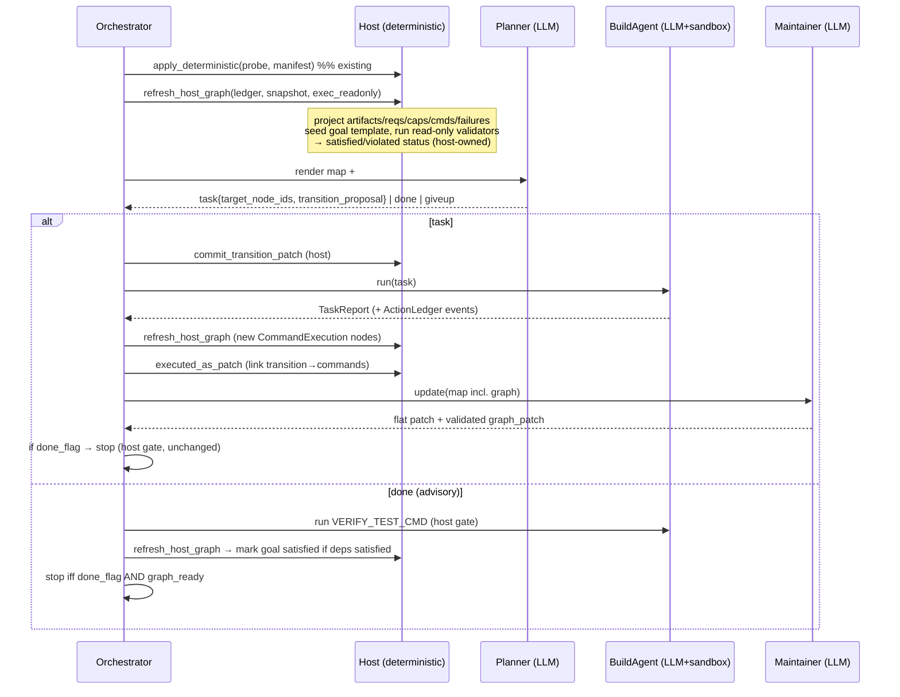
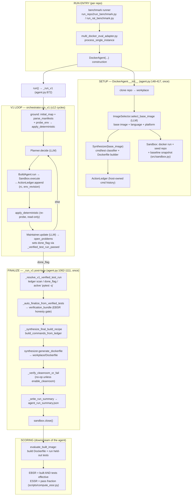
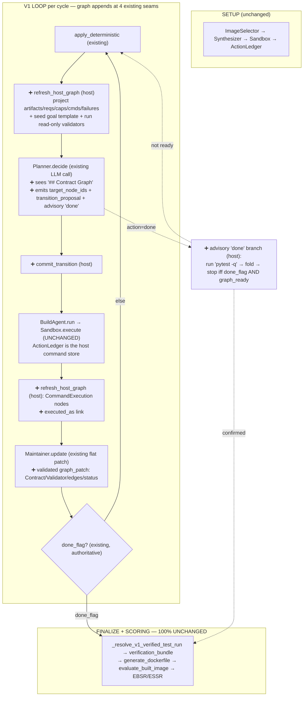

# Contract Graph V1 Implementation Plan

> **For agentic workers:** REQUIRED SUB-SKILL: Use superpowers:subagent-driven-development (recommended) or superpowers:executing-plans to implement this plan task-by-task. Steps use checkbox (`- [ ]`) syntax for tracking.

**Goal:** Add a planner-facing **contract graph** reasoning layer inside `WorldModelMap` for the `john-planner-v1` three-role env-construction agent, so failures, obligations, repairs, and evidence are explicit, grounded, and auditable.

**Architecture:** A new `src/envstate/contracts/` subpackage holds a generic JSON-serializable graph (`Node`/`Edge`/`ContractStatusEvent` + `ContractGraph` container), a domain-specific graph-patch model with strict validation, a **host-owned deterministic projection** (manifests, `probe_env`, the `ActionLedger`, and existing `open_problems` → graph nodes), a **host goal-contract template** keyed to the verification command, and a **validator registry** that auto-runs read-only checks. The Maintainer LLM contributes only *semantic* nodes (`Contract`/`Transition`/`Validator`), edges, and non-`satisfied` status events via a validated patch. The Planner reads the full graph each cycle, emits grounded `transition_proposal`s with `target_node_ids`, and may emit an **advisory `done`** that the existing host hard gate plus graph readiness must confirm. The existing `done_flag` anti-gaming gate and `agent.py::_resolve_v1_verified_test_run` final gate remain authoritative.

**Tech Stack:** Python 3.12, frozen `dataclasses`, `pytest` (fake `SimpleNamespace` LLM clients + queue-driven role fakes, per existing `tests/` conventions). No new third-party deps. JSON via stdlib; LLM I/O reuses `complete_with_retry` / `extract_json_object`.

---

## Design decisions locked before this plan

These were decided with the spec author and constrain every task:

1. **Scope:** Full spec, one phased plan (Phases 0–6 below).
2. **Completion:** Advisory planner `done` (spec §11/§12). The planner `done` is a *request*; the host `done_flag` gate (`_verified_test_run_passed`) AND graph readiness (required `GoalContract`s `satisfied` with `CommandExecution` evidence) must both hold, and `agent.py::_resolve_v1_verified_test_run` remains the final authority. The planner `done` only changes *when the loop stops early*, never *whether success is claimed*.
3. **Graph population:** **Host projects facts; Maintainer adds semantics.** Host deterministically builds `RepoArtifact`, `Requirement`, `Capability`, `Failure`, `OpenProblem`, `CommandExecution`, `EnvironmentRevision`, `VerificationTarget`, and `GoalContract` (template) nodes. The Maintainer patch may add only `Contract` (atomic), `Transition`, `Validator` nodes, allowed edges, and status events that are **not** `satisfied` (a `satisfied` event must cite a passing `CommandExecution`/confirmed `Validator`).
4. **Goal nodes:** Host template keyed to `VERIFY_TEST_CMD` (`python -m pytest -q`): `contract:goal:repo_tests_run` `depends_on` `contract:pytest_runnable` plus one `contract:python_package_importable:<dep>` per declared dependency.

**Two host-vs-Maintainer ownership deviations from the literal spec (intentional, grounded):**
- **Transitions are committed host-side** from the planner's structured `transition_proposal` (deterministic normalization), not by the Maintainer LLM. Spec §9 says "Maintainer commits"; we move it to the host because the proposal is already structured and the `executed_as` edge is derived from the host-owned ledger. This keeps transitions grounded and removes an LLM round-trip.
- **Capabilities are host-created only** (from `installed`/`system_installed`/probe + a passing `CommandExecution`). The Maintainer patch may never create a `Capability`.

**Per-cycle ordering (the contract the orchestrator enforces):**
1. `apply_deterministic(map, probe(), manifest)` — existing fact fold (unchanged).
2. **Host graph refresh** — `refresh_host_graph(map, ledger, snapshot, exec_readonly, env_revision)` projects host nodes, seeds the goal template, runs confirmed validators, marks deterministic `satisfied`/`violated` status.
3. **Planner** reads `map` (graph included) → `task` (with `target_node_ids` + `transition_proposal`), `giveup`, or advisory `done`.
4. On `task`: host **commits the Transition** node + `targets`/`repaired_by` edges before dispatch.
5. **BuildAgent** runs the task; host links `Transition --executed_as--> CommandExecution` for the commands produced.
6. **Maintainer** updates `open_problems`/`notes`/`done_flag` (unchanged) **and** applies a validated semantic graph patch.
7. Completion check (see Phase 5).

**Generic node model rationale:** Rather than 11 bespoke dataclasses, nodes are a single frozen `Node(id, type, data: dict, invalidated: bool)` (matching the existing pattern where `WorldModelMap.progress` is a dict inside a frozen dataclass, always replaced via `merge_map`, never mutated in place). This is DRY, fully JSON-serializable (spec §8), and trivially extensible for the spec's V2 directions. `ContractStatusEvent` is its own dataclass because completion logic reads it directly.

**Test command (run from repo root `/Users/john/john-planner-v1`):**
```bash
.venv/bin/python -m pytest tests/<file>.py -q
```
`tests/conftest.py` already puts the repo root on `sys.path` (so `from src.envstate... import` and `import agent` resolve). No shared LLM fixtures — each test builds its own fake client.

---

## File Structure

**New subpackage `src/envstate/contracts/`:**

| File | Responsibility |
|---|---|
| `__init__.py` | Public exports (`ContractGraph`, `Node`, `Edge`, `ContractStatusEvent`, `GraphPatch`, `parse_graph_patch`, `validate_patch`, `apply_patch`, `refresh_host_graph`, `render_graph_for_planner`, `serialize_graph_for_maintainer`, enums). |
| `schema.py` | Enums (`NodeType`, `EdgeType`, `ContractStatus`, `ValidationState`, `ContractLevel`), the closed `EDGE_RULES` validity table, `HOST_OWNED_NODE_TYPES` / `MAINTAINER_NODE_TYPES`, and `redact_secrets`. |
| `nodes.py` | `Node`, `Edge`, `ContractStatusEvent` frozen dataclasses + dict (de)serialization. |
| `graph.py` | `ContractGraph` frozen container + immutable query helpers + `to_dict`/`from_dict`. |
| `ids.py` | Deterministic ID builders + slugify (host and Maintainer must agree on IDs). |
| `patch.py` | `GraphPatch` dataclass + `parse_graph_patch(dict)`. |
| `validation.py` | `validate_patch(graph, patch, *, scope)` enforcing all §10 invariants. |
| `apply.py` | `apply_patch(graph, patch) -> ContractGraph` (assumes validated). |
| `projection.py` | Host projection functions + `refresh_host_graph(...)`. |
| `goals.py` | Goal-contract template keyed to verification target + `evaluate_goal_readiness`. |
| `validators.py` | Validator registry + `run_confirmed_validators(graph, exec_readonly, revision_id)`. |
| `render.py` | `render_graph_for_planner(graph)` (markdown) + `serialize_graph_for_maintainer(graph)` (dict). |

**Modified files:**

| File | Change |
|---|---|
| `src/envstate/world_model.py` | Add `contract_graph` to `WorldModelMap`; thread through `initial_map`, `merge_map`, `map_to_dict`, `map_from_dict`. Add `target_node_ids` + `transition_proposal` to `Task`; add `satisfied_goal_contract_ids` to `PlannerDecision`; add `TransitionProposal` dataclass. |
| `src/envstate/planner.py` | Render graph in `render_planning_view`; extend `PLANNER_SYSTEM_PROMPT`; add `done` to `_VALID_ACTIONS`; parse/validate `target_node_ids`/`transition_proposal`/`satisfied_goal_contract_ids`. |
| `src/envstate/build_agent.py` | Pass `target_node_ids`/`transition_proposal` into `_build_task_message`; extract module-level `make_action_event(...)` (shared with orchestrator). |
| `src/envstate/maintainer.py` | Extend `MAINTAINER_SYSTEM_PROMPT` to emit `graph_patch`; serialize graph into user message; parse+validate (Maintainer scope)+apply patch in `parse_v1_maintainer_reply`. |
| `src/envstate/orchestrator.py` | Per-cycle host graph refresh + transition commit + `executed_as` link; advisory `done` handling + readiness gate; new `exec_readonly` + `enable_contract_graph` params. |
| `src/envstate/ledger.py` | Add module-level `make_action_event(...)` factory (DRY with build_agent + orchestrator host-exec). |
| `agent.py` | `enable_contract_graph` flag; thread `exec_readonly`, initial graph, and graph telemetry into `_run_v1`; AND graph readiness into finalize. |
| `run_repo2run_benchmark.py` | New `v1g` arm preset. |
| `run_rat_benchmark.py` + `multi_docker_eval_adapter.py` | `DOCKERAGENT_ENABLE_CONTRACT_GRAPH` env bridge. |

---

## Phase 0 — Graph data model, patches, serialization (host-only; zero behavior change)

Phase 0 builds the entire graph substrate as a self-contained library with no wiring into the running agent. After Phase 0, `WorldModelMap` carries an always-empty `contract_graph` and every existing test still passes.

### Task 1: Enums, edge-rule table, ownership sets, redaction

**Files:**
- Create: `src/envstate/contracts/__init__.py`
- Create: `src/envstate/contracts/schema.py`
- Test: `tests/test_contracts_schema.py`

- [ ] **Step 1: Write the failing test**

```python
# tests/test_contracts_schema.py
from src.envstate.contracts import schema


def test_edge_rules_cover_every_edge_type():
    for et in schema.EdgeType:
        assert et.value in schema.EDGE_RULES, f"missing edge rule for {et}"


def test_declares_edge_endpoints():
    src_types, tgt_types = schema.EDGE_RULES["declares"]
    assert schema.NodeType.REPO_ARTIFACT.value in src_types
    assert schema.NodeType.REQUIREMENT.value in tgt_types


def test_transition_targets_three_node_types():
    _src, tgt_types = schema.EDGE_RULES["targets"]
    assert tgt_types == frozenset(
        {
            schema.NodeType.CONTRACT.value,
            schema.NodeType.FAILURE.value,
            schema.NodeType.OPEN_PROBLEM.value,
        }
    )


def test_host_and_maintainer_node_sets_are_disjoint():
    assert not (schema.HOST_OWNED_NODE_TYPES & schema.MAINTAINER_NODE_TYPES)
    # Capability is host-only (locked decision 3).
    assert schema.NodeType.CAPABILITY.value in schema.HOST_OWNED_NODE_TYPES
    assert schema.NodeType.CONTRACT.value in schema.MAINTAINER_NODE_TYPES


def test_redact_secrets_masks_common_tokens():
    text = "export OPENAI_API_KEY=sk-ABCDEF1234567890 and TOKEN=ghp_aaaabbbbccccdddd"
    out = schema.redact_secrets(text)
    assert "sk-ABCDEF1234567890" not in out
    assert "ghp_aaaabbbbccccdddd" not in out
    assert "[REDACTED]" in out
```

- [ ] **Step 2: Run test to verify it fails**

Run: `.venv/bin/python -m pytest tests/test_contracts_schema.py -q`
Expected: FAIL — `ModuleNotFoundError: No module named 'src.envstate.contracts'`.

- [ ] **Step 3: Write minimal implementation**

```python
# src/envstate/contracts/__init__.py
"""Contract Graph V1 — a planner-facing reasoning layer inside WorldModelMap."""
```

```python
# src/envstate/contracts/schema.py
"""Enums, the closed edge-validity table, ownership sets, and secret redaction."""
from __future__ import annotations

import enum
import re


class NodeType(enum.Enum):
    REPO_ARTIFACT = "RepoArtifact"
    REQUIREMENT = "Requirement"
    CONTRACT = "Contract"
    CAPABILITY = "Capability"
    FAILURE = "Failure"
    TRANSITION = "Transition"
    VALIDATOR = "Validator"
    COMMAND_EXECUTION = "CommandExecution"
    ENVIRONMENT_REVISION = "EnvironmentRevision"
    VERIFICATION_TARGET = "VerificationTarget"
    OPEN_PROBLEM = "OpenProblem"


class EdgeType(enum.Enum):
    DECLARES = "declares"                  # RepoArtifact -> Requirement
    IMPLIES_CONTRACT = "implies_contract"  # Requirement -> Contract
    DEPENDS_ON = "depends_on"              # Contract -> Contract
    VIOLATES = "violates"                  # Failure -> Contract
    REPAIRED_BY = "repaired_by"            # Contract -> Transition
    TARGETS = "targets"                    # Transition -> Contract|Failure|OpenProblem
    VERIFIED_BY = "verified_by"            # Contract -> Validator
    SATISFIED_BY = "satisfied_by"          # Contract -> Capability
    BLOCKS = "blocks"                      # OpenProblem -> Contract
    CREATES_REVISION = "creates_revision"  # CommandExecution -> EnvironmentRevision
    OBSERVED_IN = "observed_in"            # Failure -> CommandExecution
    EXECUTED_AS = "executed_as"            # Transition -> CommandExecution


class ContractStatus(enum.Enum):
    UNKNOWN = "unknown"
    VIOLATED = "violated"
    REPAIR_ATTEMPTED = "repair_attempted"
    SATISFIED = "satisfied"
    INVALIDATED = "invalidated"


class ValidationState(enum.Enum):
    UNKNOWN = "validator_unknown"
    CANDIDATE = "validator_candidate"
    CONFIRMED = "validator_confirmed"


class ContractLevel(enum.Enum):
    ATOMIC = "atomic"
    GOAL = "goal"


_NT = NodeType
# Closed edge set (spec §6). value -> (allowed source types, allowed target types).
EDGE_RULES: dict[str, tuple[frozenset[str], frozenset[str]]] = {
    EdgeType.DECLARES.value: (frozenset({_NT.REPO_ARTIFACT.value}), frozenset({_NT.REQUIREMENT.value})),
    EdgeType.IMPLIES_CONTRACT.value: (frozenset({_NT.REQUIREMENT.value}), frozenset({_NT.CONTRACT.value})),
    EdgeType.DEPENDS_ON.value: (frozenset({_NT.CONTRACT.value}), frozenset({_NT.CONTRACT.value})),
    EdgeType.VIOLATES.value: (frozenset({_NT.FAILURE.value}), frozenset({_NT.CONTRACT.value})),
    EdgeType.REPAIRED_BY.value: (frozenset({_NT.CONTRACT.value}), frozenset({_NT.TRANSITION.value})),
    EdgeType.TARGETS.value: (
        frozenset({_NT.TRANSITION.value}),
        frozenset({_NT.CONTRACT.value, _NT.FAILURE.value, _NT.OPEN_PROBLEM.value}),
    ),
    EdgeType.VERIFIED_BY.value: (frozenset({_NT.CONTRACT.value}), frozenset({_NT.VALIDATOR.value})),
    EdgeType.SATISFIED_BY.value: (frozenset({_NT.CONTRACT.value}), frozenset({_NT.CAPABILITY.value})),
    EdgeType.BLOCKS.value: (frozenset({_NT.OPEN_PROBLEM.value}), frozenset({_NT.CONTRACT.value})),
    EdgeType.CREATES_REVISION.value: (
        frozenset({_NT.COMMAND_EXECUTION.value}),
        frozenset({_NT.ENVIRONMENT_REVISION.value}),
    ),
    EdgeType.OBSERVED_IN.value: (frozenset({_NT.FAILURE.value}), frozenset({_NT.COMMAND_EXECUTION.value})),
    EdgeType.EXECUTED_AS.value: (frozenset({_NT.TRANSITION.value}), frozenset({_NT.COMMAND_EXECUTION.value})),
}

# Locked decision 3: host owns factual nodes; Maintainer adds only semantic nodes.
HOST_OWNED_NODE_TYPES: frozenset[str] = frozenset(
    {
        _NT.REPO_ARTIFACT.value,
        _NT.REQUIREMENT.value,
        _NT.CAPABILITY.value,
        _NT.FAILURE.value,
        _NT.OPEN_PROBLEM.value,
        _NT.COMMAND_EXECUTION.value,
        _NT.ENVIRONMENT_REVISION.value,
        _NT.VERIFICATION_TARGET.value,
    }
)
MAINTAINER_NODE_TYPES: frozenset[str] = frozenset(
    {_NT.CONTRACT.value, _NT.TRANSITION.value, _NT.VALIDATOR.value}
)

VALID_NODE_TYPES: frozenset[str] = frozenset(nt.value for nt in NodeType)
VALID_EDGE_TYPES: frozenset[str] = frozenset(et.value for et in EdgeType)
VALID_STATUSES: frozenset[str] = frozenset(s.value for s in ContractStatus)

_SECRET_PATTERNS = [
    re.compile(r"\bsk-[A-Za-z0-9]{8,}\b"),
    re.compile(r"\bgh[ps]_[A-Za-z0-9]{8,}\b"),
    re.compile(r"\b[A-Za-z0-9_]*(?:API_?KEY|TOKEN|SECRET|PASSWORD)[A-Za-z0-9_]*\s*[=:]\s*\S+", re.IGNORECASE),
    re.compile(r"\bAKIA[0-9A-Z]{16}\b"),
]


def redact_secrets(text: str | None) -> str:
    """Mask common secret shapes before any text enters the graph (spec §15)."""
    if not text:
        return ""
    out = text
    for pat in _SECRET_PATTERNS:
        out = pat.sub("[REDACTED]", out)
    return out
```

- [ ] **Step 4: Run test to verify it passes**

Run: `.venv/bin/python -m pytest tests/test_contracts_schema.py -q`
Expected: PASS (5 passed).

- [ ] **Step 5: Commit**

```bash
git add src/envstate/contracts/__init__.py src/envstate/contracts/schema.py tests/test_contracts_schema.py
git commit -m "feat(contracts): graph schema enums, edge rules, ownership sets, redaction"
```

---

### Task 2: Node / Edge / ContractStatusEvent dataclasses

**Files:**
- Create: `src/envstate/contracts/nodes.py`
- Test: `tests/test_contracts_nodes.py`

- [ ] **Step 1: Write the failing test**

```python
# tests/test_contracts_nodes.py
import dataclasses

import pytest

from src.envstate.contracts.nodes import (
    ContractStatusEvent,
    Edge,
    Node,
    edge_from_dict,
    edge_to_dict,
    event_from_dict,
    event_to_dict,
    node_from_dict,
    node_to_dict,
)


def test_node_is_frozen():
    n = Node(id="contract:x", type="Contract", data={"subject": "torch"})
    with pytest.raises(dataclasses.FrozenInstanceError):
        n.id = "other"  # type: ignore[misc]


def test_node_roundtrip():
    n = Node(id="contract:x", type="Contract", data={"subject": "torch", "level": "atomic"})
    assert node_from_dict(node_to_dict(n)) == n


def test_node_from_dict_defaults_data_and_invalidated():
    n = node_from_dict({"id": "artifact:a", "type": "RepoArtifact"})
    assert n.data == {}
    assert n.invalidated is False


def test_edge_roundtrip():
    e = Edge(source="a", type="declares", target="b")
    assert edge_from_dict(edge_to_dict(e)) == e


def test_status_event_roundtrip():
    ev = ContractStatusEvent(
        contract_id="contract:x",
        status="violated",
        revision_id="envrev:003",
        evidence_ids=("failure:1",),
        summary="boom",
    )
    assert event_from_dict(event_to_dict(ev)) == ev


def test_status_event_evidence_defaults_to_empty_tuple():
    ev = event_from_dict({"contract_id": "c", "status": "unknown", "revision_id": "envrev:000"})
    assert ev.evidence_ids == ()
```

- [ ] **Step 2: Run test to verify it fails**

Run: `.venv/bin/python -m pytest tests/test_contracts_nodes.py -q`
Expected: FAIL — `ModuleNotFoundError: No module named 'src.envstate.contracts.nodes'`.

- [ ] **Step 3: Write minimal implementation**

```python
# src/envstate/contracts/nodes.py
"""Generic frozen graph elements + JSON (de)serialization (spec §8)."""
from __future__ import annotations

import dataclasses
from typing import Any


@dataclasses.dataclass(frozen=True)
class Node:
    id: str
    type: str  # NodeType value
    data: dict[str, Any] = dataclasses.field(default_factory=dict)
    invalidated: bool = False


@dataclasses.dataclass(frozen=True)
class Edge:
    source: str
    type: str  # EdgeType value
    target: str
    invalidated: bool = False


@dataclasses.dataclass(frozen=True)
class ContractStatusEvent:
    contract_id: str
    status: str  # ContractStatus value
    revision_id: str
    evidence_ids: tuple[str, ...] = ()
    summary: str = ""


def node_to_dict(n: Node) -> dict[str, Any]:
    out: dict[str, Any] = {"id": n.id, "type": n.type}
    out.update(dict(n.data))  # flatten data fields to top level (spec §5 shape)
    if n.invalidated:
        out["invalidated"] = True
    return out


def node_from_dict(d: dict[str, Any]) -> Node:
    data = {k: v for k, v in d.items() if k not in ("id", "type", "invalidated")}
    return Node(
        id=str(d["id"]),
        type=str(d["type"]),
        data=data,
        invalidated=bool(d.get("invalidated", False)),
    )


def edge_to_dict(e: Edge) -> dict[str, Any]:
    out: dict[str, Any] = {"source": e.source, "type": e.type, "target": e.target}
    if e.invalidated:
        out["invalidated"] = True
    return out


def edge_from_dict(d: dict[str, Any]) -> Edge:
    return Edge(
        source=str(d["source"]),
        type=str(d["type"]),
        target=str(d["target"]),
        invalidated=bool(d.get("invalidated", False)),
    )


def event_to_dict(ev: ContractStatusEvent) -> dict[str, Any]:
    return {
        "contract_id": ev.contract_id,
        "status": ev.status,
        "revision_id": ev.revision_id,
        "evidence_ids": list(ev.evidence_ids),
        "summary": ev.summary,
    }


def event_from_dict(d: dict[str, Any]) -> ContractStatusEvent:
    return ContractStatusEvent(
        contract_id=str(d["contract_id"]),
        status=str(d["status"]),
        revision_id=str(d.get("revision_id", "")),
        evidence_ids=tuple(str(x) for x in d.get("evidence_ids", [])),
        summary=str(d.get("summary", "")),
    )
```

> **Note on the flattened `data`:** `node_to_dict` flattens `data` to the top level so serialized nodes match the spec's examples (e.g. `{"id":..., "type":"Contract", "level":"atomic", "subject":"torch"}`). `node_from_dict` is the exact inverse. Keep this symmetry — round-trip tests guard it.

- [ ] **Step 4: Run test to verify it passes**

Run: `.venv/bin/python -m pytest tests/test_contracts_nodes.py -q`
Expected: PASS (6 passed).

- [ ] **Step 5: Commit**

```bash
git add src/envstate/contracts/nodes.py tests/test_contracts_nodes.py
git commit -m "feat(contracts): Node/Edge/ContractStatusEvent dataclasses + serialization"
```

---

### Task 3: `ContractGraph` container + queries + serialization

**Files:**
- Create: `src/envstate/contracts/graph.py`
- Test: `tests/test_contracts_graph.py`

- [ ] **Step 1: Write the failing test**

```python
# tests/test_contracts_graph.py
from src.envstate.contracts.graph import ContractGraph
from src.envstate.contracts.nodes import ContractStatusEvent, Edge, Node


def _graph():
    return ContractGraph(
        nodes=(
            Node("contract:goal:t", "Contract", {"level": "goal", "required": True}),
            Node("contract:a", "Contract", {"level": "atomic"}),
            Node("contract:dead", "Contract", {"level": "atomic"}, invalidated=True),
        ),
        edges=(Edge("contract:goal:t", "depends_on", "contract:a"),),
        status_events=(
            ContractStatusEvent("contract:a", "unknown", "envrev:000"),
            ContractStatusEvent("contract:a", "satisfied", "envrev:002", ("cmd:5",)),
        ),
    )


def test_empty_is_falsy_and_serializes():
    g = ContractGraph.empty()
    assert g.nodes == () and g.edges == () and g.status_events == ()
    assert g.to_dict() == {"nodes": [], "edges": [], "contract_status_events": []}


def test_get_node_skips_nothing_but_active_filters_invalidated():
    g = _graph()
    assert g.node("contract:dead") is not None
    ids = {n.id for n in g.active_nodes()}
    assert "contract:dead" not in ids and "contract:a" in ids


def test_nodes_by_type_and_required_goal_contracts():
    g = _graph()
    assert len(g.nodes_by_type("Contract")) == 2  # active only
    req = g.required_goal_contracts()
    assert [n.id for n in req] == ["contract:goal:t"]


def test_latest_status_returns_last_event():
    g = _graph()
    assert g.latest_status("contract:a").status == "satisfied"
    assert g.latest_status("contract:missing") is None


def test_out_in_edges():
    g = _graph()
    assert [e.target for e in g.out_edges("contract:goal:t", "depends_on")] == ["contract:a"]
    assert [e.source for e in g.in_edges("contract:a", "depends_on")] == ["contract:goal:t"]


def test_full_roundtrip():
    g = _graph()
    assert ContractGraph.from_dict(g.to_dict()) == g
```

- [ ] **Step 2: Run test to verify it fails**

Run: `.venv/bin/python -m pytest tests/test_contracts_graph.py -q`
Expected: FAIL — `ModuleNotFoundError: No module named 'src.envstate.contracts.graph'`.

- [ ] **Step 3: Write minimal implementation**

```python
# src/envstate/contracts/graph.py
"""Immutable ContractGraph container + query helpers + JSON serialization."""
from __future__ import annotations

import dataclasses
from typing import Any, Optional

from .nodes import (
    ContractStatusEvent,
    Edge,
    Node,
    edge_from_dict,
    edge_to_dict,
    event_from_dict,
    event_to_dict,
    node_from_dict,
    node_to_dict,
)


@dataclasses.dataclass(frozen=True)
class ContractGraph:
    nodes: tuple[Node, ...] = ()
    edges: tuple[Edge, ...] = ()
    status_events: tuple[ContractStatusEvent, ...] = ()

    @staticmethod
    def empty() -> "ContractGraph":
        return ContractGraph()

    # ---- queries (all ignore invalidated unless noted) -------------------
    def node(self, node_id: str) -> Optional[Node]:
        for n in self.nodes:  # includes invalidated; callers filter if needed
            if n.id == node_id:
                return n
        return None

    def has_node(self, node_id: str) -> bool:
        return self.node(node_id) is not None

    def active_nodes(self) -> tuple[Node, ...]:
        return tuple(n for n in self.nodes if not n.invalidated)

    def nodes_by_type(self, node_type: str) -> tuple[Node, ...]:
        return tuple(n for n in self.active_nodes() if n.type == node_type)

    def out_edges(self, source: str, edge_type: Optional[str] = None) -> tuple[Edge, ...]:
        return tuple(
            e
            for e in self.edges
            if not e.invalidated and e.source == source and (edge_type is None or e.type == edge_type)
        )

    def in_edges(self, target: str, edge_type: Optional[str] = None) -> tuple[Edge, ...]:
        return tuple(
            e
            for e in self.edges
            if not e.invalidated and e.target == target and (edge_type is None or e.type == edge_type)
        )

    def latest_status(self, contract_id: str) -> Optional[ContractStatusEvent]:
        last: Optional[ContractStatusEvent] = None
        for ev in self.status_events:  # append-only; last wins
            if ev.contract_id == contract_id:
                last = ev
        return last

    def goal_contracts(self) -> tuple[Node, ...]:
        return tuple(n for n in self.nodes_by_type("Contract") if n.data.get("level") == "goal")

    def required_goal_contracts(self) -> tuple[Node, ...]:
        return tuple(n for n in self.goal_contracts() if bool(n.data.get("required", False)))

    # ---- serialization ---------------------------------------------------
    def to_dict(self) -> dict[str, Any]:
        return {
            "nodes": [node_to_dict(n) for n in self.nodes],
            "edges": [edge_to_dict(e) for e in self.edges],
            "contract_status_events": [event_to_dict(ev) for ev in self.status_events],
        }

    @staticmethod
    def from_dict(d: dict[str, Any]) -> "ContractGraph":
        d = d or {}
        return ContractGraph(
            nodes=tuple(node_from_dict(x) for x in d.get("nodes", [])),
            edges=tuple(edge_from_dict(x) for x in d.get("edges", [])),
            status_events=tuple(event_from_dict(x) for x in d.get("contract_status_events", [])),
        )
```

- [ ] **Step 4: Run test to verify it passes**

Run: `.venv/bin/python -m pytest tests/test_contracts_graph.py -q`
Expected: PASS (6 passed).

- [ ] **Step 5: Commit**

```bash
git add src/envstate/contracts/graph.py tests/test_contracts_graph.py
git commit -m "feat(contracts): ContractGraph container, queries, serialization"
```

---

### Task 4: Deterministic ID builders

**Files:**
- Create: `src/envstate/contracts/ids.py`
- Test: `tests/test_contracts_ids.py`

These are the shared ID grammar host and Maintainer must both produce so edges resolve.

- [ ] **Step 1: Write the failing test**

```python
# tests/test_contracts_ids.py
from src.envstate.contracts import ids


def test_slug_lowercases_and_replaces_unsafe():
    assert ids.slug("Torch >= 2.0") == "torch-2-0"
    assert ids.slug("tests/unit") == "tests-unit"


def test_id_builders():
    assert ids.artifact_id("requirements.txt") == "artifact:requirements.txt"
    assert ids.requirement_id("python_dependency", "torch") == "requirement:python_dependency:torch"
    assert ids.contract_id("python_package_importable", "torch") == "contract:python_package_importable:torch"
    assert ids.goal_contract_id("repo_tests_run") == "contract:goal:repo_tests_run"
    assert ids.capability_id("python_package_importable", "torch", 4) == "capability:python_package_importable:torch@envrev:004"
    assert ids.command_id(17) == "cmd:017"
    assert ids.revision_id(4) == "envrev:004"
    assert ids.transition_id("install_python_package", "torch") == "transition:install_python_package:torch"
    assert ids.validator_id("python_import_check", "torch") == "validator:python_import_check:torch"
    assert ids.verification_target_id("pytest_run") == "verify:pytest_run"
    assert ids.open_problem_id("ModuleNotFoundError: torch") == "openproblem:modulenotfounderror-torch"


def test_failure_id_uses_command_and_kind():
    assert ids.failure_id(17, "module_not_found", "torch") == "failure:cmd017:module_not_found:torch"
```

- [ ] **Step 2: Run test to verify it fails**

Run: `.venv/bin/python -m pytest tests/test_contracts_ids.py -q`
Expected: FAIL — `ModuleNotFoundError: No module named 'src.envstate.contracts.ids'`.

- [ ] **Step 3: Write minimal implementation**

```python
# src/envstate/contracts/ids.py
"""Deterministic graph-id grammar shared by host projection and Maintainer."""
from __future__ import annotations

import re

_UNSAFE = re.compile(r"[^a-z0-9]+")


def slug(text: str) -> str:
    return _UNSAFE.sub("-", str(text).lower()).strip("-")


def artifact_id(path: str) -> str:
    return f"artifact:{path}"


def requirement_id(kind: str, subject: str) -> str:
    return f"requirement:{kind}:{subject}"


def contract_id(kind: str, subject: str) -> str:
    return f"contract:{kind}:{subject}"


def goal_contract_id(name: str) -> str:
    return f"contract:goal:{name}"


def capability_id(kind: str, subject: str, revision: int) -> str:
    return f"capability:{kind}:{subject}@envrev:{revision:03d}"


def command_id(step: int) -> str:
    return f"cmd:{step:03d}"


def revision_id(rev: int) -> str:
    return f"envrev:{rev:03d}"


def transition_id(kind: str, target: str) -> str:
    return f"transition:{kind}:{target}"


def validator_id(kind: str, subject: str) -> str:
    return f"validator:{kind}:{subject}"


def verification_target_id(kind: str) -> str:
    return f"verify:{kind}"


def open_problem_id(signature: str) -> str:
    return f"openproblem:{slug(signature)}"


def failure_id(step: int, kind: str, subject: str) -> str:
    return f"failure:cmd{step:03d}:{kind}:{subject}"
```

- [ ] **Step 4: Run test to verify it passes**

Run: `.venv/bin/python -m pytest tests/test_contracts_ids.py -q`
Expected: PASS (3 passed).

- [ ] **Step 5: Commit**

```bash
git add src/envstate/contracts/ids.py tests/test_contracts_ids.py
git commit -m "feat(contracts): deterministic id grammar"
```

---

### Task 5: `GraphPatch` model + parser

**Files:**
- Create: `src/envstate/contracts/patch.py`
- Test: `tests/test_contracts_patch.py`

- [ ] **Step 1: Write the failing test**

```python
# tests/test_contracts_patch.py
from src.envstate.contracts.patch import GraphPatch, parse_graph_patch


def test_empty_patch_from_empty_dict():
    p = parse_graph_patch({})
    assert p == GraphPatch()
    assert p.is_empty()


def test_parse_full_patch():
    p = parse_graph_patch(
        {
            "add_nodes": [{"id": "contract:a", "type": "Contract", "level": "atomic"}],
            "update_nodes": [{"id": "contract:a", "type": "Contract", "validation_state": "validator_confirmed"}],
            "add_edges": [{"source": "req:x", "type": "implies_contract", "target": "contract:a"}],
            "add_status_events": [{"contract_id": "contract:a", "status": "violated", "revision_id": "envrev:001"}],
            "invalidate_nodes": ["contract:old"],
            "invalidate_edges": [{"source": "a", "type": "declares", "target": "b"}],
        }
    )
    assert p.add_nodes[0].id == "contract:a"
    assert p.update_nodes[0].data["validation_state"] == "validator_confirmed"
    assert p.add_edges[0].target == "contract:a"
    assert p.add_status_events[0].status == "violated"
    assert p.invalidate_nodes == ("contract:old",)
    assert p.invalidate_edges[0].source == "a"
    assert not p.is_empty()


def test_parse_tolerates_missing_keys_and_non_lists():
    p = parse_graph_patch({"add_nodes": None, "junk": 1})
    assert p.add_nodes == ()
```

- [ ] **Step 2: Run test to verify it fails**

Run: `.venv/bin/python -m pytest tests/test_contracts_patch.py -q`
Expected: FAIL — `ModuleNotFoundError`.

- [ ] **Step 3: Write minimal implementation**

```python
# src/envstate/contracts/patch.py
"""Domain-specific graph patch (spec §10) + tolerant parser."""
from __future__ import annotations

import dataclasses
from typing import Any

from .nodes import (
    ContractStatusEvent,
    Edge,
    Node,
    edge_from_dict,
    event_from_dict,
    node_from_dict,
)


@dataclasses.dataclass(frozen=True)
class GraphPatch:
    add_nodes: tuple[Node, ...] = ()
    update_nodes: tuple[Node, ...] = ()
    add_edges: tuple[Edge, ...] = ()
    add_status_events: tuple[ContractStatusEvent, ...] = ()
    invalidate_nodes: tuple[str, ...] = ()
    invalidate_edges: tuple[Edge, ...] = ()

    def is_empty(self) -> bool:
        return not (
            self.add_nodes
            or self.update_nodes
            or self.add_edges
            or self.add_status_events
            or self.invalidate_nodes
            or self.invalidate_edges
        )


def _as_list(value: Any) -> list:
    return value if isinstance(value, list) else []


def parse_graph_patch(d: Any) -> GraphPatch:
    """Parse a patch dict; tolerant of missing keys / wrong types (validate later)."""
    if not isinstance(d, dict):
        return GraphPatch()
    return GraphPatch(
        add_nodes=tuple(node_from_dict(x) for x in _as_list(d.get("add_nodes")) if isinstance(x, dict)),
        update_nodes=tuple(node_from_dict(x) for x in _as_list(d.get("update_nodes")) if isinstance(x, dict)),
        add_edges=tuple(edge_from_dict(x) for x in _as_list(d.get("add_edges")) if isinstance(x, dict)),
        add_status_events=tuple(
            event_from_dict(x) for x in _as_list(d.get("add_status_events")) if isinstance(x, dict)
        ),
        invalidate_nodes=tuple(str(x) for x in _as_list(d.get("invalidate_nodes"))),
        invalidate_edges=tuple(
            edge_from_dict(x) for x in _as_list(d.get("invalidate_edges")) if isinstance(x, dict)
        ),
    )
```

- [ ] **Step 4: Run test to verify it passes**

Run: `.venv/bin/python -m pytest tests/test_contracts_patch.py -q`
Expected: PASS (3 passed).

- [ ] **Step 5: Commit**

```bash
git add src/envstate/contracts/patch.py tests/test_contracts_patch.py
git commit -m "feat(contracts): GraphPatch model and tolerant parser"
```

---

### Task 6: Patch validation (the §10 + ownership invariants)

**Files:**
- Create: `src/envstate/contracts/validation.py`
- Test: `tests/test_contracts_validation.py`

`scope` is `"host"` (deterministic projection, may write any node type) or `"maintainer"` (LLM patch, restricted to `MAINTAINER_NODE_TYPES`, no `Capability`, no host-owned facts, `satisfied` events must cite passing evidence).

- [ ] **Step 1: Write the failing test**

```python
# tests/test_contracts_validation.py
from src.envstate.contracts.graph import ContractGraph
from src.envstate.contracts.nodes import Edge, Node
from src.envstate.contracts.patch import GraphPatch
from src.envstate.contracts.validation import validate_patch


def _base():
    return ContractGraph(
        nodes=(
            Node("contract:a", "Contract", {"level": "atomic"}),
            Node("cmd:005", "CommandExecution", {"command": "pip install torch", "exit_code": 0}),
            Node("failure:1", "Failure", {"kind": "module_not_found"}),
        )
    )


def test_valid_maintainer_patch_passes():
    patch = GraphPatch(
        add_nodes=(Node("transition:install:torch", "Transition", {"kind": "install_python_package"}),),
        add_edges=(Edge("contract:a", "repaired_by", "transition:install:torch"),),
        add_status_events=(),
    )
    assert validate_patch(_base(), patch, scope="maintainer") == []


def test_duplicate_node_id_rejected():
    patch = GraphPatch(add_nodes=(Node("contract:a", "Contract", {"level": "atomic"}),))
    errs = validate_patch(_base(), patch, scope="maintainer")
    assert any("duplicate" in e.lower() for e in errs)


def test_edge_endpoint_must_exist():
    patch = GraphPatch(add_edges=(Edge("contract:a", "repaired_by", "transition:ghost"),))
    errs = validate_patch(_base(), patch, scope="maintainer")
    assert any("endpoint" in e.lower() for e in errs)


def test_edge_type_must_be_valid_for_endpoints():
    patch = GraphPatch(
        add_nodes=(Node("validator:v", "Validator", {}),),
        add_edges=(Edge("contract:a", "declares", "validator:v"),),  # declares is artifact->requirement
    )
    errs = validate_patch(_base(), patch, scope="maintainer")
    assert any("not allowed" in e.lower() for e in errs)


def test_maintainer_may_not_create_host_owned_node():
    patch = GraphPatch(add_nodes=(Node("capability:x", "Capability", {}),))
    errs = validate_patch(_base(), patch, scope="maintainer")
    assert any("host-owned" in e.lower() or "capability" in e.lower() for e in errs)
    # host scope is allowed to:
    assert validate_patch(_base(), patch, scope="host") == []


def test_status_must_be_in_enum():
    patch = GraphPatch(add_status_events=(_event("contract:a", "bogus"),))
    errs = validate_patch(_base(), patch, scope="maintainer")
    assert any("status" in e.lower() for e in errs)


def test_satisfied_requires_passing_evidence():
    # cite a non-passing / missing command -> rejected
    bad = GraphPatch(add_status_events=(_event("contract:a", "satisfied", ("failure:1",)),))
    assert validate_patch(_base(), bad, scope="maintainer")
    # cite a passing CommandExecution -> ok
    good = GraphPatch(add_status_events=(_event("contract:a", "satisfied", ("cmd:005",)),))
    assert validate_patch(_base(), good, scope="maintainer") == []


def test_requirement_needs_declares_edge():
    patch = GraphPatch(add_nodes=(Node("requirement:x", "Requirement", {"subject": "x"}),))
    errs = validate_patch(_base(), patch, scope="host")
    assert any("requirement" in e.lower() and "declares" in e.lower() for e in errs)


def test_transition_must_target_something():
    patch = GraphPatch(add_nodes=(Node("transition:t", "Transition", {}),))
    errs = validate_patch(_base(), patch, scope="maintainer")
    assert any("transition" in e.lower() and "target" in e.lower() for e in errs)


def _event(cid, status, evidence=()):
    from src.envstate.contracts.nodes import ContractStatusEvent

    return ContractStatusEvent(contract_id=cid, status=status, revision_id="envrev:001", evidence_ids=evidence)
```

- [ ] **Step 2: Run test to verify it fails**

Run: `.venv/bin/python -m pytest tests/test_contracts_validation.py -q`
Expected: FAIL — `ModuleNotFoundError`.

- [ ] **Step 3: Write minimal implementation**

```python
# src/envstate/contracts/validation.py
"""Validate a GraphPatch against a graph + ownership scope (spec §10)."""
from __future__ import annotations

from .graph import ContractGraph
from .patch import GraphPatch
from .schema import (
    EDGE_RULES,
    HOST_OWNED_NODE_TYPES,
    MAINTAINER_NODE_TYPES,
    VALID_NODE_TYPES,
    VALID_STATUSES,
)


def _node_type_index(graph: ContractGraph, patch: GraphPatch) -> dict[str, str]:
    """Type of every node visible after the patch (existing + added)."""
    index = {n.id: n.type for n in graph.nodes}
    for n in list(patch.add_nodes) + list(patch.update_nodes):
        index[n.id] = n.type
    return index


def _command_passed(graph: ContractGraph, patch: GraphPatch, node_id: str) -> bool:
    for n in list(graph.nodes) + list(patch.add_nodes):
        if n.id == node_id and n.type == "CommandExecution":
            return int(n.data.get("exit_code", 1)) == 0
    return False


def validate_patch(graph: ContractGraph, patch: GraphPatch, *, scope: str) -> list[str]:
    """Return a list of human-readable errors; empty list == valid."""
    errors: list[str] = []
    existing_ids = {n.id for n in graph.nodes}
    new_ids: set[str] = set()

    # --- node-level checks ---
    for n in patch.add_nodes:
        if n.type not in VALID_NODE_TYPES:
            errors.append(f"unknown node type {n.type!r} for {n.id}")
        if n.id in existing_ids or n.id in new_ids:
            errors.append(f"duplicate node id {n.id!r}")
        new_ids.add(n.id)
        if scope == "maintainer" and n.type in HOST_OWNED_NODE_TYPES:
            errors.append(f"maintainer may not create host-owned node {n.type!r} ({n.id})")
        if scope == "maintainer" and n.type not in MAINTAINER_NODE_TYPES:
            errors.append(f"maintainer node type {n.type!r} not allowed ({n.id})")

    type_index = _node_type_index(graph, patch)

    # --- edge-level checks ---
    for e in patch.add_edges:
        if e.type not in EDGE_RULES:
            errors.append(f"unknown edge type {e.type!r}")
            continue
        if e.source not in type_index or e.target not in type_index:
            errors.append(f"edge endpoint missing: {e.source} -{e.type}-> {e.target}")
            continue
        allowed_src, allowed_tgt = EDGE_RULES[e.type]
        if type_index[e.source] not in allowed_src or type_index[e.target] not in allowed_tgt:
            errors.append(
                f"edge type {e.type!r} not allowed between "
                f"{type_index[e.source]} and {type_index[e.target]}"
            )

    # --- status-event checks ---
    for ev in patch.add_status_events:
        if ev.status not in VALID_STATUSES:
            errors.append(f"invalid status {ev.status!r} for {ev.contract_id}")
        if ev.contract_id not in type_index:
            errors.append(f"status event for unknown contract {ev.contract_id!r}")
        for eid in ev.evidence_ids:
            if eid not in type_index:
                errors.append(f"status evidence id {eid!r} points to no node")
        # spec §7 rule 4: satisfied requires passing command / confirmed validator evidence
        if ev.status == "satisfied":
            ok = any(_command_passed(graph, patch, eid) for eid in ev.evidence_ids)
            if not ok:
                errors.append(
                    f"contract {ev.contract_id!r} marked satisfied without passing command evidence"
                )

    # --- structural grounding (spec §10) ---
    declared_reqs = {
        e.target for e in (list(graph.edges) + list(patch.add_edges)) if e.type == "declares" and not e.invalidated
    }
    for n in patch.add_nodes:
        if n.type == "Requirement" and n.id not in declared_reqs:
            errors.append(f"requirement {n.id!r} has no RepoArtifact declares edge")
    transition_targets = {
        e.source for e in (list(graph.edges) + list(patch.add_edges)) if e.type == "targets" and not e.invalidated
    }
    for n in patch.add_nodes:
        if n.type == "Transition" and n.id not in transition_targets:
            errors.append(f"transition {n.id!r} targets no Contract/Failure/OpenProblem")

    return errors
```

- [ ] **Step 4: Run test to verify it passes**

Run: `.venv/bin/python -m pytest tests/test_contracts_validation.py -q`
Expected: PASS (9 passed).

- [ ] **Step 5: Commit**

```bash
git add src/envstate/contracts/validation.py tests/test_contracts_validation.py
git commit -m "feat(contracts): patch validation with ownership scope and §10 invariants"
```

---

### Task 7: Patch application (append-only, no hard deletes)

**Files:**
- Create: `src/envstate/contracts/apply.py`
- Test: `tests/test_contracts_apply.py`

- [ ] **Step 1: Write the failing test**

```python
# tests/test_contracts_apply.py
from src.envstate.contracts.apply import apply_patch
from src.envstate.contracts.graph import ContractGraph
from src.envstate.contracts.nodes import ContractStatusEvent, Edge, Node
from src.envstate.contracts.patch import GraphPatch


def test_add_nodes_edges_events_appends():
    g0 = ContractGraph()
    g1 = apply_patch(
        g0,
        GraphPatch(
            add_nodes=(Node("contract:a", "Contract", {"level": "atomic"}),),
            add_edges=(Edge("req:x", "implies_contract", "contract:a"),),
            add_status_events=(ContractStatusEvent("contract:a", "unknown", "envrev:000"),),
        ),
    )
    assert g0.nodes == ()  # original untouched (immutable)
    assert len(g1.nodes) == 1 and len(g1.edges) == 1 and len(g1.status_events) == 1


def test_update_node_replaces_in_place_by_id():
    g0 = ContractGraph(nodes=(Node("contract:a", "Contract", {"validation_state": "validator_unknown"}),))
    g1 = apply_patch(
        g0, GraphPatch(update_nodes=(Node("contract:a", "Contract", {"validation_state": "validator_confirmed"}),))
    )
    assert g1.node("contract:a").data["validation_state"] == "validator_confirmed"
    assert len(g1.nodes) == 1


def test_invalidate_marks_not_deletes():
    g0 = ContractGraph(
        nodes=(Node("contract:a", "Contract", {}),),
        edges=(Edge("a", "declares", "b"),),
    )
    g1 = apply_patch(
        g0,
        GraphPatch(invalidate_nodes=("contract:a",), invalidate_edges=(Edge("a", "declares", "b"),)),
    )
    assert g1.node("contract:a").invalidated is True
    assert len(g1.nodes) == 1  # not deleted
    assert g1.edges[0].invalidated is True
```

- [ ] **Step 2: Run test to verify it fails**

Run: `.venv/bin/python -m pytest tests/test_contracts_apply.py -q`
Expected: FAIL — `ModuleNotFoundError`.

- [ ] **Step 3: Write minimal implementation**

```python
# src/envstate/contracts/apply.py
"""Apply a (pre-validated) GraphPatch, returning a new immutable ContractGraph."""
from __future__ import annotations

import dataclasses

from .graph import ContractGraph
from .nodes import Edge, Node
from .patch import GraphPatch


def _edge_key(e: Edge) -> tuple[str, str, str]:
    return (e.source, e.type, e.target)


def apply_patch(graph: ContractGraph, patch: GraphPatch) -> ContractGraph:
    nodes_by_id = {n.id: n for n in graph.nodes}

    for n in patch.add_nodes:
        nodes_by_id.setdefault(n.id, n)  # dup ids rejected in validation; setdefault is belt-and-braces
    for n in patch.update_nodes:
        nodes_by_id[n.id] = n
    for nid in patch.invalidate_nodes:
        if nid in nodes_by_id:
            nodes_by_id[nid] = dataclasses.replace(nodes_by_id[nid], invalidated=True)

    invalidated_edges = {_edge_key(e) for e in patch.invalidate_edges}
    edges = tuple(
        dataclasses.replace(e, invalidated=True) if _edge_key(e) in invalidated_edges else e
        for e in graph.edges
    ) + tuple(patch.add_edges)

    return ContractGraph(
        nodes=tuple(nodes_by_id.values()),
        edges=edges,
        status_events=graph.status_events + tuple(patch.add_status_events),
    )
```

- [ ] **Step 4: Run test to verify it passes**

Run: `.venv/bin/python -m pytest tests/test_contracts_apply.py -q`
Expected: PASS (3 passed).

- [ ] **Step 5: Commit**

```bash
git add src/envstate/contracts/apply.py tests/test_contracts_apply.py
git commit -m "feat(contracts): append-only patch application with soft invalidation"
```

---

### Task 8: Thread `contract_graph` into `WorldModelMap` (empty default; no behavior change)

**Files:**
- Modify: `src/envstate/world_model.py` (dataclass `41-55`, `initial_map` `105-133`, `merge_map` `136-167`, `map_to_dict` `386-406`, `map_from_dict` `409-430`)
- Test: `tests/test_world_model_contract_graph.py`

- [ ] **Step 1: Write the failing test**

```python
# tests/test_world_model_contract_graph.py
from src.envstate.contracts.graph import ContractGraph
from src.envstate.contracts.nodes import Node
from src.envstate.world_model import initial_map, map_from_dict, map_to_dict, merge_map


def test_initial_map_has_empty_graph():
    m = initial_map("img", "/repo", "python 3.12", "pip", ("pyproject.toml",))
    assert isinstance(m.contract_graph, ContractGraph)
    assert m.contract_graph.nodes == ()


def test_merge_map_threads_graph_immutably():
    m = initial_map("img", "/repo", "python", "pip", ())
    g = ContractGraph(nodes=(Node("contract:a", "Contract", {}),))
    m2 = merge_map(m, contract_graph=g)
    assert m.contract_graph.nodes == ()  # original unchanged
    assert m2.contract_graph is g


def test_graph_survives_serialization_roundtrip():
    m = merge_map(
        initial_map("img", "/repo", "python", "pip", ()),
        contract_graph=ContractGraph(nodes=(Node("contract:a", "Contract", {"level": "atomic"}),)),
    )
    back = map_from_dict(map_to_dict(m))
    assert back.contract_graph.node("contract:a").data["level"] == "atomic"


def test_old_serialized_map_without_graph_still_loads():
    d = map_to_dict(initial_map("img", "/repo", "python", "pip", ()))
    d.pop("contract_graph")  # simulate a pre-graph serialized map
    back = map_from_dict(d)
    assert back.contract_graph.nodes == ()
```

- [ ] **Step 2: Run test to verify it fails**

Run: `.venv/bin/python -m pytest tests/test_world_model_contract_graph.py -q`
Expected: FAIL — `TypeError`/`AttributeError`: `WorldModelMap` has no `contract_graph`.

- [ ] **Step 3: Write minimal implementation**

In `src/envstate/world_model.py`, add the import near the top:

```python
from src.envstate.contracts.graph import ContractGraph
```

Add the field to the `WorldModelMap` dataclass (after `system_installed`, line ~55):

```python
    contract_graph: ContractGraph = dataclasses.field(default_factory=ContractGraph.empty)
```

In `initial_map` (105-133), pass an explicit empty graph in the constructor call:

```python
        contract_graph=ContractGraph.empty(),
```

In `merge_map` (136-167), add the keyword param (end of signature):

```python
    contract_graph: ContractGraph | None = None,
```
and the `replace` line:
```python
        contract_graph=contract_graph if contract_graph is not None else current.contract_graph,
```

In `map_to_dict` (386-406), add:

```python
        "contract_graph": m.contract_graph.to_dict(),
```

In `map_from_dict` (409-430), add to the constructor:

```python
        contract_graph=ContractGraph.from_dict(d.get("contract_graph", {})),
```

- [ ] **Step 4: Run test to verify it passes + regression**

Run: `.venv/bin/python -m pytest tests/test_world_model_contract_graph.py tests/test_world_model.py tests/test_world_model_progress.py tests/test_world_model_env.py -q`
Expected: PASS (existing world-model tests unchanged; 4 new pass).

- [ ] **Step 5: Commit**

```bash
git add src/envstate/world_model.py tests/test_world_model_contract_graph.py
git commit -m "feat(world-model): carry empty contract_graph (no behavior change)"
```

> **Phase 0 gate:** `.venv/bin/python -m pytest tests/ -q` must be fully green. The agent's runtime behavior is unchanged — the graph exists but is empty and unused.

---

## Phase 1 — Host deterministic projection (grounding the graph)

Phase 1 builds `projection.py` (host fact→node projectors), `goals.py` (goal template + readiness), `validators.py` (read-only validator registry), and the composed `refresh_host_graph(...)`. Everything here is **host-owned and deterministic** — no LLM. After Phase 1 the host can build a fully grounded graph from a `WorldModelMap` + `ActionLedger` + `EnvSnapshot`, validated with `scope="host"`.

**Projection ownership (recap of the locked split):**
- Host creates: `RepoArtifact`, `Requirement` (+`declares`), `CommandExecution`, `EnvironmentRevision` (+`creates_revision`), `Capability`, `Failure` (from rc≠0 commands, +`observed_in`), `OpenProblem` (1:1 from `world_model.open_problems`), the goal-contract template (Task 12), and deterministic `satisfied`/`violated` status from validators (Task 13).
- Maintainer adds (Phase 4): atomic `Contract`, `Transition`, `Validator`, `violates`/`depends_on`/`implies_contract`/`verified_by`/`blocks` edges, and `violated`/`repair_attempted` status.

### Task 9: Project `RepoArtifact` + `Requirement` nodes

**Files:**
- Create: `src/envstate/contracts/projection.py`
- Test: `tests/test_projection_requirements.py`

Note: `world_model.Fact` is `(name, detail)`; `world_model.required` is the manifest-declared deps. The manifest source file is chosen from `repo_layout` so each `Requirement` has a `declares` edge (spec §5: every `Requirement` must be `declares`-anchored).

- [ ] **Step 1: Write the failing test**

```python
# tests/test_projection_requirements.py
from src.envstate.contracts import projection
from src.envstate.world_model import Fact


def test_repo_artifacts_only_for_known_manifest_files():
    nodes = projection.project_repo_artifacts(("src/", "tests/", "requirements.txt", "pyproject.toml", "README.md"))
    paths = {n.data["path"] for n in nodes}
    assert paths == {"requirements.txt", "pyproject.toml"}
    assert all(n.type == "RepoArtifact" for n in nodes)


def test_requirements_get_declares_edge_from_manifest_artifact():
    artifacts = projection.project_repo_artifacts(("requirements.txt",))
    nodes, edges = projection.project_requirements((Fact("torch", ">=2.0"), Fact("flask", "")), artifacts)
    rid = "requirement:python_dependency:torch"
    assert any(n.id == rid and n.data["subject"] == "torch" and n.data["spec"] == ">=2.0" for n in nodes)
    assert any(e.source == "artifact:requirements.txt" and e.type == "declares" and e.target == rid for e in edges)


def test_requirements_with_no_manifest_artifact_emit_no_edges():
    nodes, edges = projection.project_requirements((Fact("torch", ""),), ())
    assert nodes == [] and edges == []  # ungrounded requirement is dropped (spec forbids it)
```

- [ ] **Step 2: Run test to verify it fails**

Run: `.venv/bin/python -m pytest tests/test_projection_requirements.py -q`
Expected: FAIL — `ModuleNotFoundError`.

- [ ] **Step 3: Write minimal implementation**

```python
# src/envstate/contracts/projection.py
"""Host-owned deterministic projection of facts into contract-graph nodes/edges.

No LLM. Every function is pure: facts in, (nodes, edges) out. refresh_host_graph
(Task 14) composes them, dedups against the existing graph by id, validates with
scope='host', and applies.
"""
from __future__ import annotations

from typing import Any, Iterable

from . import ids
from .nodes import Edge, Node
from .schema import redact_secrets

# Manifest files we treat as concrete declaring artifacts (file-level only, spec §5).
_MANIFEST_FILES = (
    "requirements.txt",
    "pyproject.toml",
    "setup.py",
    "setup.cfg",
    "Pipfile",
    "poetry.lock",
    "environment.yml",
)


def project_repo_artifacts(repo_layout: Iterable[str]) -> list[Node]:
    nodes: list[Node] = []
    for entry in repo_layout:
        name = entry.rstrip("/")
        if name in _MANIFEST_FILES:
            nodes.append(Node(ids.artifact_id(name), "RepoArtifact", {"path": name, "artifact_kind": "manifest_file"}))
    return nodes


def _declaring_artifact(artifacts: list[Node]) -> Node | None:
    # Prefer requirements.txt, else pyproject.toml, else first available.
    by_path = {n.data["path"]: n for n in artifacts}
    for pref in ("requirements.txt", "pyproject.toml"):
        if pref in by_path:
            return by_path[pref]
    return artifacts[0] if artifacts else None


def project_requirements(required: Iterable[Any], artifacts: list[Node]) -> tuple[list[Node], list[Edge]]:
    """required: tuple[world_model.Fact]. Each Requirement is declares-anchored or dropped."""
    artifact = _declaring_artifact(artifacts)
    if artifact is None:
        return [], []  # cannot ground -> spec forbids LLM-only requirements
    nodes: list[Node] = []
    edges: list[Edge] = []
    for fact in required:
        rid = ids.requirement_id("python_dependency", ids.slug(fact.name) or fact.name)
        nodes.append(
            Node(rid, "Requirement", {"kind": "python_dependency", "subject": fact.name, "spec": fact.detail or ""})
        )
        edges.append(Edge(artifact.id, "declares", rid))
    return nodes, edges
```

- [ ] **Step 4: Run test to verify it passes**

Run: `.venv/bin/python -m pytest tests/test_projection_requirements.py -q`
Expected: PASS (3 passed).

- [ ] **Step 5: Commit**

```bash
git add src/envstate/contracts/projection.py tests/test_projection_requirements.py
git commit -m "feat(contracts): project RepoArtifact + grounded Requirement nodes"
```

---

### Task 10: Project `CommandExecution`, `EnvironmentRevision`, `Capability` nodes

**Files:**
- Modify: `src/envstate/contracts/projection.py`
- Test: `tests/test_projection_commands.py`

`ActionEvent` (host-owned, `ledger.py`) carries `step`, `cmd`, `rc`, `stdout`, `env_revision_before/after`, `mutation_class`. These map 1:1 to `CommandExecution`/`EnvironmentRevision` (spec §5).

- [ ] **Step 1: Write the failing test**

```python
# tests/test_projection_commands.py
from src.envstate.contracts import projection
from src.envstate.ledger import ActionEvent
from src.envstate.world_model import Fact


def _ev(step, cmd, rc, before, after):
    return ActionEvent(step=step, cmd=cmd, rc=rc, stdout="ok", env_revision_before=before, env_revision_after=after)


def test_command_execution_nodes():
    nodes = projection.project_command_executions([_ev(5, "pip install torch", 0, 3, 4)])
    n = nodes[0]
    assert n.id == "cmd:005" and n.type == "CommandExecution"
    assert n.data["exit_code"] == 0 and n.data["command"] == "pip install torch"
    assert n.data["revision_before"] == "envrev:003" and n.data["revision_after"] == "envrev:004"


def test_environment_revisions_and_creates_edge():
    nodes, edges = projection.project_environment_revisions([_ev(5, "pip install torch", 0, 3, 4)])
    assert any(n.id == "envrev:004" and n.type == "EnvironmentRevision" for n in nodes)
    assert any(e.source == "cmd:005" and e.type == "creates_revision" and e.target == "envrev:004" for e in edges)


def test_no_revision_node_when_revision_unchanged():
    nodes, edges = projection.project_environment_revisions([_ev(5, "pytest -q", 0, 4, 4)])
    assert nodes == [] and edges == []


def test_capabilities_from_installed_facts_at_current_revision():
    nodes = projection.project_capabilities((Fact("torch", "2.1.0"),), (Fact("libpq-dev", ""),), current_revision=4)
    ids_ = {n.id for n in nodes}
    assert "capability:python_package_importable:torch@envrev:004" in ids_
    assert any(n.type == "Capability" and n.data["subject"] == "torch" for n in nodes)
```

- [ ] **Step 2: Run test to verify it fails**

Run: `.venv/bin/python -m pytest tests/test_projection_commands.py -q`
Expected: FAIL — `AttributeError: module ... has no attribute 'project_command_executions'`.

- [ ] **Step 3: Write minimal implementation** (append to `projection.py`)

```python
def project_command_executions(events: Iterable[Any]) -> list[Node]:
    nodes: list[Node] = []
    for ev in events:
        nodes.append(
            Node(
                ids.command_id(ev.step),
                "CommandExecution",
                {
                    "command": redact_secrets(ev.cmd),
                    "exit_code": int(ev.rc),
                    "revision_before": ids.revision_id(ev.env_revision_before),
                    "revision_after": ids.revision_id(ev.env_revision_after),
                    "mutation_class": ev.mutation_class,
                },
            )
        )
    return nodes


def project_environment_revisions(events: Iterable[Any]) -> tuple[list[Node], list[Edge]]:
    nodes: list[Node] = []
    edges: list[Edge] = []
    seen: set[str] = set()
    for ev in events:
        if ev.env_revision_after == ev.env_revision_before:
            continue  # read-only / non-mutating command created no revision
        rid = ids.revision_id(ev.env_revision_after)
        if rid not in seen:
            seen.add(rid)
            nodes.append(Node(rid, "EnvironmentRevision", {"created_by_command_id": ids.command_id(ev.step)}))
        edges.append(Edge(ids.command_id(ev.step), "creates_revision", rid))
    return nodes, edges


def project_capabilities(installed: Iterable[Any], system_installed: Iterable[Any], current_revision: int) -> list[Node]:
    nodes: list[Node] = []
    for fact in installed:
        subj = fact.name
        nodes.append(
            Node(
                ids.capability_id("python_package_importable", ids.slug(subj) or subj, current_revision),
                "Capability",
                {"kind": "python_package_importable", "subject": subj, "revision_id": ids.revision_id(current_revision)},
            )
        )
    for fact in system_installed:
        subj = fact.name
        nodes.append(
            Node(
                ids.capability_id("system_artifact_present", ids.slug(subj) or subj, current_revision),
                "Capability",
                {"kind": "system_artifact_present", "subject": subj, "revision_id": ids.revision_id(current_revision)},
            )
        )
    return nodes
```

- [ ] **Step 4: Run test to verify it passes**

Run: `.venv/bin/python -m pytest tests/test_projection_commands.py -q`
Expected: PASS (4 passed).

- [ ] **Step 5: Commit**

```bash
git add src/envstate/contracts/projection.py tests/test_projection_commands.py
git commit -m "feat(contracts): project CommandExecution/EnvironmentRevision/Capability nodes"
```

---

### Task 11: Project `OpenProblem` + `Failure` nodes

**Files:**
- Modify: `src/envstate/contracts/projection.py`
- Test: `tests/test_projection_failures.py`

`OpenProblem` is 1:1 from `world_model.open_problems`. `Failure` is one node per **failing** (`rc != 0`) `CommandExecution`, with an `observed_in` edge to that command (the host-owned "a command failed" fact; the Maintainer later adds the semantic `violates` edge to a `Contract`).

- [ ] **Step 1: Write the failing test**

```python
# tests/test_projection_failures.py
from src.envstate.contracts import projection
from src.envstate.ledger import ActionEvent
from src.envstate.world_model import OpenProblem


def test_open_problem_nodes_1to1():
    ops = (OpenProblem("ModuleNotFoundError: torch", "torch missing", "deps", False),)
    nodes = projection.project_open_problems(ops)
    n = nodes[0]
    assert n.id == "openproblem:modulenotfounderror-torch" and n.type == "OpenProblem"
    assert n.data["layer"] == "deps" and n.data["out_of_scope"] is False


def test_failures_from_failing_commands_with_observed_in():
    events = [
        ActionEvent(step=7, cmd="python -c 'import torch'", rc=1, stdout="ModuleNotFoundError: torch"),
        ActionEvent(step=8, cmd="pip install torch", rc=0, stdout="ok"),
    ]
    nodes, edges = projection.project_failures(events)
    assert len(nodes) == 1 and nodes[0].type == "Failure"
    assert nodes[0].data["command_id"] == "cmd:007"
    assert any(e.type == "observed_in" and e.target == "cmd:007" for e in edges)


def test_failure_summary_is_redacted():
    events = [ActionEvent(step=1, cmd="x", rc=1, stdout="boom TOKEN=ghp_aaaabbbbccccdddd")]
    nodes, _ = projection.project_failures(events)
    assert "ghp_aaaabbbbccccdddd" not in nodes[0].data["summary"]
```

- [ ] **Step 2: Run test to verify it fails**

Run: `.venv/bin/python -m pytest tests/test_projection_failures.py -q`
Expected: FAIL — `AttributeError`.

- [ ] **Step 3: Write minimal implementation** (append to `projection.py`)

```python
def project_open_problems(open_problems: Iterable[Any]) -> list[Node]:
    nodes: list[Node] = []
    for op in open_problems:
        nodes.append(
            Node(
                ids.open_problem_id(op.signature),
                "OpenProblem",
                {
                    "kind": op.layer,
                    "signature": op.signature,
                    "summary": redact_secrets(op.interpretation),
                    "layer": op.layer,
                    "out_of_scope": bool(op.out_of_scope),
                },
            )
        )
    return nodes


def project_failures(events: Iterable[Any]) -> tuple[list[Node], list[Edge]]:
    """One Failure per failing command (host fact). Maintainer adds the `violates` edge."""
    nodes: list[Node] = []
    edges: list[Edge] = []
    for ev in events:
        if ev.rc == 0:
            continue
        cmd_id = ids.command_id(ev.step)
        fid = f"failure:{cmd_id}"
        nodes.append(
            Node(
                fid,
                "Failure",
                {
                    "kind": "command_failed",
                    "command_id": cmd_id,
                    "summary": redact_secrets((ev.stdout or "")[-400:]),
                },
            )
        )
        edges.append(Edge(fid, "observed_in", cmd_id))
    return nodes, edges
```

- [ ] **Step 4: Run test to verify it passes**

Run: `.venv/bin/python -m pytest tests/test_projection_failures.py -q`
Expected: PASS (3 passed).

- [ ] **Step 5: Commit**

```bash
git add src/envstate/contracts/projection.py tests/test_projection_failures.py
git commit -m "feat(contracts): project OpenProblem + Failure nodes"
```

---

### Task 12: Goal-contract template + readiness evaluator

**Files:**
- Create: `src/envstate/contracts/goals.py`
- Test: `tests/test_contracts_goals.py`

The host seeds a fixed goal template keyed to the verification target (locked decision 4): a `VerificationTarget`, a required `GoalContract` `repo_tests_run`, an atomic `pytest_runnable` contract, and one atomic `python_package_importable:<dep>` per declared requirement, wired with `depends_on` edges.

- [ ] **Step 1: Write the failing test**

```python
# tests/test_contracts_goals.py
from src.envstate.contracts import goals
from src.envstate.contracts.graph import ContractGraph
from src.envstate.contracts.nodes import ContractStatusEvent, Edge, Node
from src.envstate.world_model import Fact


def test_seed_template_nodes_and_edges():
    nodes, edges = goals.seed_goal_template((Fact("torch", ">=2.0"),))
    ids_ = {n.id for n in nodes}
    assert "verify:pytest_run" in ids_
    assert "contract:goal:repo_tests_run" in ids_
    assert "contract:pytest_runnable" in ids_
    assert "contract:python_package_importable:torch" in ids_
    goal = next(n for n in nodes if n.id == "contract:goal:repo_tests_run")
    assert goal.data["level"] == "goal" and goal.data["required"] is True
    deps = {e.target for e in edges if e.source == "contract:goal:repo_tests_run" and e.type == "depends_on"}
    assert {"contract:pytest_runnable", "contract:python_package_importable:torch"} <= deps


def test_readiness_false_until_goal_and_deps_satisfied():
    nodes, edges = goals.seed_goal_template((Fact("torch", ""),))
    g = ContractGraph(nodes=tuple(nodes), edges=tuple(edges))
    assert goals.evaluate_goal_readiness(g) is False
    # satisfy deps + goal
    sat = lambda cid: ContractStatusEvent(cid, "satisfied", "envrev:004", ("cmd:010",))
    g2 = ContractGraph(
        nodes=g.nodes + (Node("cmd:010", "CommandExecution", {"exit_code": 0}),),
        edges=g.edges,
        status_events=(
            sat("contract:pytest_runnable"),
            sat("contract:python_package_importable:torch"),
            sat("contract:goal:repo_tests_run"),
        ),
    )
    assert goals.evaluate_goal_readiness(g2) is True


def test_readiness_false_if_goal_satisfied_but_dep_not():
    nodes, edges = goals.seed_goal_template((Fact("torch", ""),))
    g = ContractGraph(
        nodes=tuple(nodes),
        edges=tuple(edges),
        status_events=(ContractStatusEvent("contract:goal:repo_tests_run", "satisfied", "envrev:004", ("cmd:010",)),),
    )
    assert goals.evaluate_goal_readiness(g) is False
```

- [ ] **Step 2: Run test to verify it fails**

Run: `.venv/bin/python -m pytest tests/test_contracts_goals.py -q`
Expected: FAIL — `ModuleNotFoundError`.

- [ ] **Step 3: Write minimal implementation**

```python
# src/envstate/contracts/goals.py
"""Host goal-contract template keyed to the verification target + readiness."""
from __future__ import annotations

from typing import Any, Iterable

from . import ids
from .graph import ContractGraph
from .nodes import Edge, Node

DEFAULT_VERIFY_CMD = "python -m pytest -q"
GOAL_TESTS_RUN = ids.goal_contract_id("repo_tests_run")
CONTRACT_PYTEST_RUNNABLE = ids.contract_id("pytest_runnable", "pytest")


def seed_goal_template(required: Iterable[Any], verify_cmd: str = DEFAULT_VERIFY_CMD) -> tuple[list[Node], list[Edge]]:
    nodes: list[Node] = [
        Node(ids.verification_target_id("pytest_run"), "VerificationTarget",
             {"kind": "pytest_run", "command_template": verify_cmd}),
        Node(GOAL_TESTS_RUN, "Contract",
             {"level": "goal", "kind": "repo_tests_run", "subject": "repo",
              "predicate": "tests_run_and_pass", "expected": True, "required": True,
              "description": "The repo test suite runs and a majority of tests pass.",
              "validation_state": "validator_confirmed"}),
        Node(CONTRACT_PYTEST_RUNNABLE, "Contract",
             {"level": "atomic", "kind": "pytest_runnable", "subject": "pytest",
              "predicate": "collects", "expected": True,
              "description": "pytest can collect the test suite without import errors.",
              "validation_state": "validator_confirmed"}),
    ]
    edges: list[Edge] = [Edge(GOAL_TESTS_RUN, "depends_on", CONTRACT_PYTEST_RUNNABLE)]
    for fact in required:
        subj = fact.name
        cid = ids.contract_id("python_package_importable", ids.slug(subj) or subj)
        nodes.append(
            Node(cid, "Contract",
                 {"level": "atomic", "kind": "python_package_importable", "subject": subj,
                  "predicate": "is_importable", "expected": True,
                  "description": f"The Python package `{subj}` must be importable.",
                  "validation_state": "validator_confirmed"})
        )
        edges.append(Edge(GOAL_TESTS_RUN, "depends_on", cid))
    return nodes, edges


def _is_satisfied(graph: ContractGraph, contract_id: str) -> bool:
    ev = graph.latest_status(contract_id)
    return ev is not None and ev.status == "satisfied"


def evaluate_goal_readiness(graph: ContractGraph) -> bool:
    """Required goal contracts AND their depends_on atomic contracts are satisfied."""
    required_goals = graph.required_goal_contracts()
    if not required_goals:
        return False
    for goal in required_goals:
        if not _is_satisfied(graph, goal.id):
            return False
        for dep in graph.out_edges(goal.id, "depends_on"):
            if not _is_satisfied(graph, dep.target):
                return False
    return True
```

- [ ] **Step 4: Run test to verify it passes**

Run: `.venv/bin/python -m pytest tests/test_contracts_goals.py -q`
Expected: PASS (3 passed).

- [ ] **Step 5: Commit**

```bash
git add src/envstate/contracts/goals.py tests/test_contracts_goals.py
git commit -m "feat(contracts): host goal-contract template + readiness evaluator"
```

---

### Task 13: Read-only validator registry + auto-run

**Files:**
- Create: `src/envstate/contracts/validators.py`
- Test: `tests/test_contracts_validators.py`

For each atomic contract whose `kind` is in the registry, the host runs a **read-only** command via `exec_readonly(cmd) -> (rc, stdout)`, records a host `CommandExecution` node for the run (so the `satisfied` event has passing-command evidence), adds a confirmed `Validator` + `verified_by` edge, and emits a `satisfied`/`violated` status event.

- [ ] **Step 1: Write the failing test**

```python
# tests/test_contracts_validators.py
from src.envstate.contracts import validators
from src.envstate.contracts.graph import ContractGraph
from src.envstate.contracts.nodes import Node


def _exec_factory(results):
    def _exec(cmd):
        return results.get(cmd, (1, "not found"))
    return _exec


def test_runs_import_validator_and_marks_satisfied():
    g = ContractGraph(nodes=(
        Node("contract:python_package_importable:torch", "Contract",
             {"level": "atomic", "kind": "python_package_importable", "subject": "torch"}),
    ))
    ex = _exec_factory({'python -c "import torch"': (0, "")})
    nodes, edges, events = validators.run_confirmed_validators(g, ex, revision=4)
    assert any(n.type == "Validator" for n in nodes)
    assert any(n.type == "CommandExecution" and n.data["exit_code"] == 0 for n in nodes)
    assert any(e.type == "verified_by" for e in edges)
    ev = next(e for e in events if e.contract_id == "contract:python_package_importable:torch")
    assert ev.status == "satisfied"
    assert any(n.id in ev.evidence_ids for n in nodes if n.type == "CommandExecution")


def test_failing_import_marks_violated():
    g = ContractGraph(nodes=(
        Node("contract:python_package_importable:missing", "Contract",
             {"level": "atomic", "kind": "python_package_importable", "subject": "missing"}),
    ))
    ex = _exec_factory({})  # everything returns rc=1
    _n, _e, events = validators.run_confirmed_validators(g, ex, revision=4)
    assert events[0].status == "violated"


def test_unknown_kind_is_skipped():
    g = ContractGraph(nodes=(Node("contract:x", "Contract", {"level": "atomic", "kind": "mystery"}),))
    nodes, edges, events = validators.run_confirmed_validators(g, _exec_factory({}), revision=4)
    assert nodes == [] and edges == [] and events == []
```

- [ ] **Step 2: Run test to verify it fails**

Run: `.venv/bin/python -m pytest tests/test_contracts_validators.py -q`
Expected: FAIL — `ModuleNotFoundError`.

- [ ] **Step 3: Write minimal implementation**

```python
# src/envstate/contracts/validators.py
"""Read-only validator registry + host auto-run (spec §5 Validator, §7 rule 4)."""
from __future__ import annotations

from typing import Any, Callable

from . import ids
from .graph import ContractGraph
from .nodes import ContractStatusEvent, Edge, Node
from .schema import redact_secrets

ExecReadonly = Callable[[str], tuple[int, str]]

# kind -> (validator kind, command template using {subject}).
_REGISTRY: dict[str, tuple[str, str]] = {
    "python_package_importable": ("python_import_check", 'python -c "import {subject}"'),
    # Atomic precondition only — NOT the success gate (real execution stays the done-gate's job).
    "pytest_runnable": ("pytest_collect_check", "python -m pytest --collect-only -q --disable-warnings"),
}


def run_confirmed_validators(
    graph: ContractGraph, exec_readonly: ExecReadonly, revision: int
) -> tuple[list[Node], list[Edge], list[ContractStatusEvent]]:
    nodes: list[Node] = []
    edges: list[Edge] = []
    events: list[ContractStatusEvent] = []
    rid = ids.revision_id(revision)

    for contract in graph.nodes_by_type("Contract"):
        if contract.data.get("level") != "atomic":
            continue
        kind = str(contract.data.get("kind", ""))
        spec = _REGISTRY.get(kind)
        if spec is None:
            continue
        vkind, template = spec
        subject = str(contract.data.get("subject", ""))
        cmd = template.format(subject=subject)
        rc, out = exec_readonly(cmd)

        vid = ids.validator_id(vkind, ids.slug(subject) or subject)
        if not graph.has_node(vid):
            nodes.append(Node(vid, "Validator", {"kind": vkind, "command_template": template}))
            edges.append(Edge(contract.id, "verified_by", vid))

        run_id = f"cmd:val:{ids.slug(vid)}:{revision:03d}"
        nodes.append(
            Node(run_id, "CommandExecution",
                 {"command": redact_secrets(cmd), "exit_code": int(rc),
                  "revision_before": rid, "revision_after": rid, "mutation_class": None})
        )
        status = "satisfied" if rc == 0 else "violated"
        events.append(
            ContractStatusEvent(
                contract_id=contract.id, status=status, revision_id=rid,
                evidence_ids=(run_id,), summary=redact_secrets(out[-200:]),
            )
        )
    return nodes, edges, events
```

- [ ] **Step 4: Run test to verify it passes**

Run: `.venv/bin/python -m pytest tests/test_contracts_validators.py -q`
Expected: PASS (3 passed).

- [ ] **Step 5: Commit**

```bash
git add src/envstate/contracts/validators.py tests/test_contracts_validators.py
git commit -m "feat(contracts): read-only validator registry + auto-run"
```

---

### Task 14: `refresh_host_graph` — compose projection into the world model

**Files:**
- Modify: `src/envstate/contracts/projection.py` (add `refresh_host_graph`)
- Modify: `src/envstate/contracts/__init__.py` (export it)
- Test: `tests/test_refresh_host_graph.py`

`refresh_host_graph` is the single host entrypoint the orchestrator calls each cycle. It is **idempotent** (re-running adds nothing new) because all ids are deterministic and it only adds nodes/edges not already present. It marks `repo_tests_run` satisfied when `done_flag` is set and a verified test command exists in the ledger.

- [ ] **Step 1: Write the failing test**

```python
# tests/test_refresh_host_graph.py
from src.envstate.contracts.projection import refresh_host_graph
from src.envstate.contracts.goals import evaluate_goal_readiness
from src.envstate.ledger import ActionEvent, ActionLedger
from src.envstate.snapshot import EnvSnapshot
from src.envstate.world_model import Fact, initial_map, merge_map


def _map_with(required=(), installed=(), done=False, open_problems=()):
    m = initial_map("img", "/repo", "python 3.12", "pip", ("requirements.txt", "tests/"))
    return merge_map(m, required=required, installed=installed, done_flag=done, open_problems=open_problems)


def _ledger(events):
    led = ActionLedger()
    for e in events:
        led.append(e)
    return led


def test_builds_grounded_graph_and_is_idempotent():
    m = _map_with(required=(Fact("torch", ">=2.0"),), installed=(Fact("torch", "2.1.0"),))
    led = _ledger([ActionEvent(step=1, cmd="pip install torch", rc=0, env_revision_before=0, env_revision_after=1)])
    ex = lambda cmd: (0, "")  # all read-only validators pass
    m1 = refresh_host_graph(m, led, EnvSnapshot(), exec_readonly=ex, current_revision=1)
    g1 = m1.contract_graph
    assert g1.node("artifact:requirements.txt") is not None
    assert g1.node("requirement:python_dependency:torch") is not None
    assert g1.node("contract:goal:repo_tests_run") is not None
    assert g1.node("cmd:001") is not None
    n_nodes = len(g1.nodes)
    # idempotent: feeding the refreshed map back adds no new structural nodes
    m2 = refresh_host_graph(m1, led, EnvSnapshot(), exec_readonly=ex, current_revision=1)
    assert len(m2.contract_graph.nodes) == n_nodes


def test_done_flag_marks_goal_satisfied_when_deps_satisfied():
    m = _map_with(required=(Fact("torch", ""),), installed=(Fact("torch", "2.1.0"),), done=True)
    led = _ledger([ActionEvent(step=9, cmd="python -m pytest -q", rc=0, env_revision_before=1, env_revision_after=1)])
    ex = lambda cmd: (0, "")
    m1 = refresh_host_graph(m, led, EnvSnapshot(), exec_readonly=ex, current_revision=1)
    assert evaluate_goal_readiness(m1.contract_graph) is True


def test_host_patch_passes_host_validation():
    # regression guard: the composed host patch must be valid
    m = _map_with(required=(Fact("torch", ""),), open_problems=())
    m1 = refresh_host_graph(m, ActionLedger(), EnvSnapshot(), exec_readonly=lambda c: (0, ""), current_revision=0)
    # if validation had failed, refresh logs and drops; assert the goal contract survived
    assert m1.contract_graph.node("contract:goal:repo_tests_run") is not None
```

- [ ] **Step 2: Run test to verify it fails**

Run: `.venv/bin/python -m pytest tests/test_refresh_host_graph.py -q`
Expected: FAIL — `ImportError: cannot import name 'refresh_host_graph'`.

- [ ] **Step 3: Write minimal implementation** (append to `projection.py`)

```python
def _verified_test_command_id(events: list[Any]) -> str | None:
    """Latest rc-0 command that looks like a real test execution (for goal evidence)."""
    for ev in reversed(events):
        if ev.rc == 0 and "pytest" in ev.cmd and "--collect-only" not in ev.cmd:
            return ids.command_id(ev.step)
    return None


def refresh_host_graph(world_map, ledger, snapshot, exec_readonly, current_revision: int, *, on_error=None):
    """Project all host facts into world_map.contract_graph (idempotent). Returns a new map."""
    from . import goals
    from .apply import apply_patch
    from .graph import ContractGraph
    from .nodes import ContractStatusEvent
    from .patch import GraphPatch
    from .validation import validate_patch
    from .validators import run_confirmed_validators
    from ..world_model import merge_map

    graph: ContractGraph = world_map.contract_graph
    events = list(ledger.events())

    artifacts = project_repo_artifacts(world_map.repo_layout)
    req_nodes, req_edges = project_requirements(world_map.required, artifacts)
    cmd_nodes = project_command_executions(events)
    rev_nodes, rev_edges = project_environment_revisions(events)
    cap_nodes = project_capabilities(world_map.installed, world_map.system_installed, current_revision)
    fail_nodes, fail_edges = project_failures(events)
    op_nodes = project_open_problems(world_map.open_problems)
    goal_nodes, goal_edges = goals.seed_goal_template(world_map.required)

    candidate_nodes = (
        artifacts + req_nodes + cmd_nodes + rev_nodes + cap_nodes + fail_nodes + op_nodes + goal_nodes
    )
    candidate_edges = req_edges + rev_edges + fail_edges + goal_edges

    # validators run against the graph AS IT WILL BE (goal/atomic contracts present)
    pre_graph = apply_patch(
        graph,
        GraphPatch(
            add_nodes=tuple(n for n in candidate_nodes if not graph.has_node(n.id)),
        ),
    )
    val_nodes, val_edges, val_events = ([], [], [])
    if exec_readonly is not None:
        val_nodes, val_edges, val_events = run_confirmed_validators(pre_graph, exec_readonly, current_revision)

    # goal satisfaction from the host done-gate
    status_events = list(val_events)
    test_cmd_id = _verified_test_command_id(events)
    if world_map.done_flag and test_cmd_id is not None:
        status_events.append(
            ContractStatusEvent(
                contract_id=goals.GOAL_TESTS_RUN, status="satisfied",
                revision_id=ids.revision_id(current_revision), evidence_ids=(test_cmd_id,),
                summary="host done-gate verified a real test run",
            )
        )

    all_new_nodes = candidate_nodes + val_nodes
    all_new_edges = candidate_edges + val_edges
    existing_edge_keys = {(e.source, e.type, e.target) for e in graph.edges}

    patch = GraphPatch(
        add_nodes=tuple(n for n in all_new_nodes if not graph.has_node(n.id)),
        add_edges=tuple(e for e in all_new_edges if (e.source, e.type, e.target) not in existing_edge_keys),
        add_status_events=tuple(status_events),
    )
    errors = validate_patch(graph, patch, scope="host")
    if errors and on_error is not None:
        on_error(errors)
    new_graph = apply_patch(graph, patch)
    return merge_map(world_map, contract_graph=new_graph)
```

> **Note:** all imports inside `refresh_host_graph` are **lazy/local** (inside the function body) on purpose — `projection` → `world_model` → `contracts` would be a circular import at module load if any of these were top-level. Keep them local.

Add to `src/envstate/contracts/__init__.py`:

```python
from .projection import refresh_host_graph  # noqa: F401
```

- [ ] **Step 4: Run test to verify it passes**

Run: `.venv/bin/python -m pytest tests/test_refresh_host_graph.py -q`
Expected: PASS (3 passed).

- [ ] **Step 5: Commit**

```bash
git add src/envstate/contracts/projection.py src/envstate/contracts/__init__.py tests/test_refresh_host_graph.py
git commit -m "feat(contracts): refresh_host_graph composes deterministic projection"
```

> **Phase 1 gate:** `.venv/bin/python -m pytest tests/ -q` green. The host can build a complete grounded graph; still not wired into the loop.

---

## Phase 2 — Renderers (graph → planner markdown, graph → Maintainer dict)

### Task 15: `render_graph_for_planner` + `serialize_graph_for_maintainer`

**Files:**
- Create: `src/envstate/contracts/render.py`
- Modify: `src/envstate/contracts/__init__.py` (export both)
- Test: `tests/test_contracts_render.py`

The planner view is compact markdown citing **node IDs** (so the planner can fill `target_node_ids`). The Maintainer view is a dict of **active** nodes/edges + latest status per contract (so it references real ids when patching). Both exclude invalidated objects (spec: planner ignores invalidated by default).

- [ ] **Step 1: Write the failing test**

```python
# tests/test_contracts_render.py
from src.envstate.contracts.graph import ContractGraph
from src.envstate.contracts.nodes import ContractStatusEvent, Edge, Node
from src.envstate.contracts.render import render_graph_for_planner, serialize_graph_for_maintainer


def _g():
    return ContractGraph(
        nodes=(
            Node("contract:goal:repo_tests_run", "Contract", {"level": "goal", "required": True, "description": "tests run"}),
            Node("contract:python_package_importable:torch", "Contract",
                 {"level": "atomic", "subject": "torch", "description": "torch importable"}),
            Node("failure:cmd:007", "Failure", {"summary": "ModuleNotFoundError torch", "command_id": "cmd:007"}),
            Node("dead", "Contract", {"level": "atomic"}, invalidated=True),
        ),
        edges=(Edge("contract:goal:repo_tests_run", "depends_on", "contract:python_package_importable:torch"),),
        status_events=(ContractStatusEvent("contract:python_package_importable:torch", "violated", "envrev:003", ("failure:cmd:007",)),),
    )


def test_planner_view_lists_ids_statuses_and_omits_invalidated():
    out = render_graph_for_planner(_g())
    assert "contract:python_package_importable:torch" in out
    assert "violated" in out
    assert "failure:cmd:007" in out
    assert "dead" not in out  # invalidated excluded
    assert "Contract Graph" in out


def test_planner_view_empty_graph():
    assert "empty" in render_graph_for_planner(ContractGraph()).lower()


def test_maintainer_view_has_active_nodes_and_latest_status():
    d = serialize_graph_for_maintainer(_g())
    node_ids = {n["id"] for n in d["nodes"]}
    assert "contract:python_package_importable:torch" in node_ids
    assert "dead" not in node_ids
    assert d["latest_status"]["contract:python_package_importable:torch"] == "violated"
```

- [ ] **Step 2: Run test to verify it fails**

Run: `.venv/bin/python -m pytest tests/test_contracts_render.py -q`
Expected: FAIL — `ModuleNotFoundError`.

- [ ] **Step 3: Write minimal implementation**

```python
# src/envstate/contracts/render.py
"""Graph → planner markdown and graph → Maintainer dict (active objects only)."""
from __future__ import annotations

from typing import Any

from .goals import evaluate_goal_readiness
from .graph import ContractGraph
from .nodes import node_to_dict, edge_to_dict


def render_graph_for_planner(graph: ContractGraph) -> str:
    active = graph.active_nodes()
    if not active:
        return "## Contract Graph\n  (empty — no contracts derived yet)"

    lines: list[str] = ["## Contract Graph"]
    lines.append(f"goal_ready: {evaluate_goal_readiness(graph)}")

    contracts = [n for n in active if n.type == "Contract"]
    if contracts:
        lines.append("### contracts (id — status — description)")
        for c in contracts:
            ev = graph.latest_status(c.id)
            status = ev.status if ev else "unknown"
            level = c.data.get("level", "atomic")
            desc = c.data.get("description", "")
            lines.append(f"  - [{level}] {c.id} — {status} — {desc}")

    failures = [n for n in active if n.type == "Failure"]
    if failures:
        lines.append("### failures (id — summary)")
        for f in failures:
            lines.append(f"  - {f.id} — {f.data.get('summary', '')}")

    ops = [n for n in active if n.type == "OpenProblem"]
    if ops:
        lines.append("### open_problems (id — summary)")
        for op in ops:
            oos = " [out_of_scope]" if op.data.get("out_of_scope") else ""
            lines.append(f"  - {op.id}{oos} — {op.data.get('summary', '')}")

    transitions = [n for n in active if n.type == "Transition"]
    if transitions:
        lines.append("### transitions already proposed (id — intent)")
        for t in transitions:
            lines.append(f"  - {t.id} — {t.data.get('intent', '')}")

    return "\n".join(lines)


def serialize_graph_for_maintainer(graph: ContractGraph) -> dict[str, Any]:
    active_nodes = graph.active_nodes()
    active_ids = {n.id for n in active_nodes}
    latest: dict[str, str] = {}
    for n in active_nodes:
        if n.type == "Contract":
            ev = graph.latest_status(n.id)
            latest[n.id] = ev.status if ev else "unknown"
    return {
        "nodes": [node_to_dict(n) for n in active_nodes],
        "edges": [edge_to_dict(e) for e in graph.edges if not e.invalidated and e.source in active_ids and e.target in active_ids],
        "latest_status": latest,
    }
```

Add to `src/envstate/contracts/__init__.py`:

```python
from .render import render_graph_for_planner, serialize_graph_for_maintainer  # noqa: F401
```

- [ ] **Step 4: Run test to verify it passes**

Run: `.venv/bin/python -m pytest tests/test_contracts_render.py -q`
Expected: PASS (3 passed).

- [ ] **Step 5: Commit**

```bash
git add src/envstate/contracts/render.py src/envstate/contracts/__init__.py tests/test_contracts_render.py
git commit -m "feat(contracts): planner markdown + maintainer dict renderers"
```

---

## Phase 3 — Planner reads the graph; grounded transitions; advisory `done`

### Task 16: Extend `Task`, `PlannerDecision`; add `TransitionProposal`

**Files:**
- Modify: `src/envstate/world_model.py` (`Task` `62-67`, `PlannerDecision` `70-74`)
- Test: `tests/test_world_model_planner_types.py`

- [ ] **Step 1: Write the failing test**

```python
# tests/test_world_model_planner_types.py
from src.envstate.world_model import PlannerDecision, Task, TransitionProposal


def test_task_has_grounding_defaults():
    t = Task(goal="g", done_when="d", layer="deps", facts=())
    assert t.target_node_ids == ()
    assert t.transition_proposal is None


def test_task_carries_transition_proposal():
    tp = TransitionProposal(kind="install_python_package", target="torch",
                            intent="install torch", command_templates=("pip install torch",))
    t = Task("g", "d", "deps", (), target_node_ids=("contract:python_package_importable:torch",), transition_proposal=tp)
    assert t.transition_proposal.kind == "install_python_package"
    assert t.target_node_ids == ("contract:python_package_importable:torch",)


def test_planner_decision_done_carries_goal_ids():
    d = PlannerDecision(action="done", satisfied_goal_contract_ids=("contract:goal:repo_tests_run",))
    assert d.satisfied_goal_contract_ids == ("contract:goal:repo_tests_run",)
```

- [ ] **Step 2: Run test to verify it fails**

Run: `.venv/bin/python -m pytest tests/test_world_model_planner_types.py -q`
Expected: FAIL — `ImportError: cannot import name 'TransitionProposal'`.

- [ ] **Step 3: Write minimal implementation**

In `src/envstate/world_model.py`, add the `TransitionProposal` dataclass just above `Task` (≈ line 60):

```python
@dataclasses.dataclass(frozen=True)
class TransitionProposal:
    kind: str
    target: str
    intent: str
    command_templates: tuple[str, ...] = ()
```

Extend the `Task` dataclass (62-67) — append two fields with defaults:

```python
@dataclasses.dataclass(frozen=True)
class Task:
    goal: str
    done_when: str
    layer: str
    facts: tuple[str, ...]
    target_node_ids: tuple[str, ...] = ()
    transition_proposal: "TransitionProposal | None" = None
```

Extend `PlannerDecision` (70-74) — append one field:

```python
@dataclasses.dataclass(frozen=True)
class PlannerDecision:
    action: str                       # "task" | "done" | "giveup"
    task: "Task | None" = None
    reason: str = ""
    satisfied_goal_contract_ids: tuple[str, ...] = ()
```

- [ ] **Step 4: Run test to verify it passes**

Run: `.venv/bin/python -m pytest tests/test_world_model_planner_types.py tests/test_world_model.py -q`
Expected: PASS (new + existing world-model tests green).

- [ ] **Step 5: Commit**

```bash
git add src/envstate/world_model.py tests/test_world_model_planner_types.py
git commit -m "feat(world-model): Task grounding fields + TransitionProposal + done goal ids"
```

---

### Task 17: Planner renders graph, proposes grounded transitions, may emit advisory `done`

**Files:**
- Modify: `src/envstate/planner.py` (`render_planning_view` `156-214`, `PLANNER_SYSTEM_PROMPT` `127-144`, `_VALID_ACTIONS` `224`, `parse_planner_decision` `224-259`)
- Modify: `tests/test_envstate_planner.py` (reconcile the pre-existing anti-`done` guard tests — see Step 3(e))
- Test: `tests/test_planner_contract_graph.py`

> **Conflict note (anti-gaming):** `tests/test_envstate_planner.py` contains pre-existing
> guard tests that assert the planner has *no* `done` action (`_VALID_ACTIONS == {"task","giveup"}`
> and the prompt offers no `"action": "done"`). The locked advisory-`done` design (spec §11/§12)
> intentionally supersedes those guards, so this task MUST update them in the same change. The
> anti-gaming invariant is **preserved, not removed**: a *bare* `done` is still rejected and still
> falls back to `giveup`, and the host gate — not the planner — still certifies success. Step 3(e)
> rewrites exactly the four affected tests.

- [ ] **Step 1: Write the failing test**

```python
# tests/test_planner_contract_graph.py
import json

from src.envstate.contracts.graph import ContractGraph
from src.envstate.contracts.nodes import Node
from src.envstate.planner import parse_planner_decision, render_planning_view
from src.envstate.world_model import initial_map, merge_map


def test_render_includes_graph_when_non_empty():
    m = merge_map(
        initial_map("img", "/r", "py", "pip", ()),
        contract_graph=ContractGraph(nodes=(Node("contract:python_package_importable:torch", "Contract",
                                                  {"level": "atomic", "description": "torch importable"}),)),
    )
    view = render_planning_view(m, {"cycles_remaining": 5})
    assert "Contract Graph" in view and "contract:python_package_importable:torch" in view


def test_render_omits_graph_when_empty():
    m = initial_map("img", "/r", "py", "pip", ())
    assert "Contract Graph" not in render_planning_view(m, {"cycles_remaining": 5})


def test_parse_task_with_transition_proposal_and_targets():
    text = json.dumps({
        "action": "task", "goal": "install torch", "done_when": "pytest runs", "layer": "deps",
        "facts": ["torch missing"],
        "target_node_ids": ["contract:python_package_importable:torch"],
        "transition_proposal": {"kind": "install_python_package", "target": "torch",
                                "intent": "install torch", "command_templates": ["pip install torch"]},
    })
    d = parse_planner_decision(text)
    assert d.action == "task"
    assert d.task.target_node_ids == ("contract:python_package_importable:torch",)
    assert d.task.transition_proposal.kind == "install_python_package"


def test_transition_proposal_without_target_is_rejected():
    text = json.dumps({"action": "task", "goal": "g", "done_when": "d", "layer": "deps", "facts": [],
                       "transition_proposal": {"kind": "x", "target": "y", "intent": "z"}})
    assert parse_planner_decision(text) is None  # ungrounded transition forbidden


def test_parse_advisory_done():
    text = json.dumps({"action": "done", "satisfied_goal_contract_ids": ["contract:goal:repo_tests_run"],
                       "rationale": "verified"})
    d = parse_planner_decision(text)
    assert d.action == "done" and d.satisfied_goal_contract_ids == ("contract:goal:repo_tests_run",)


def test_bare_done_without_goal_ids_rejected():
    assert parse_planner_decision(json.dumps({"action": "done"})) is None
```

- [ ] **Step 2: Run test to verify it fails**

Run: `.venv/bin/python -m pytest tests/test_planner_contract_graph.py -q`
Expected: FAIL — `done` rejected / `transition_proposal` not parsed.

- [ ] **Step 3: Write minimal implementation**

(a) In `render_planning_view` (planner.py), add the import at top of file:

```python
from src.envstate.contracts.render import render_graph_for_planner
```

and just before the final `lines.append(f"## budget ...")` block (≈ line 210), append the graph section **only when it has active nodes** (keeps A1 identical to today):

```python
    if world_map.contract_graph.active_nodes():
        lines.append("")
        lines.append(render_graph_for_planner(world_map.contract_graph))
```

(b) In `PLANNER_SYSTEM_PROMPT`, **replace the entire `## Output` block (lines 127-144)** with:

````text
## Contract Graph (when present)

When a `## Contract Graph` section appears, it lists explicit obligations with stable node IDs:
- `Contract` nodes are obligations the environment must satisfy (status: unknown/violated/repair_attempted/satisfied).
- `Failure` and `open_problems` nodes are observed blockers.
- `goal_ready` is true only when every required goal contract and its dependencies are satisfied.

Localize your next action against a violated contract, failure, or open problem, and CITE the node IDs you target.

## Output
Emit exactly one JSON object inside a ```json fenced block — nothing else.

To do work (repair or explore), targeting at least one graph node when a graph is present:

```json
{
  "action": "task",
  "goal": "<the single sub-goal that removes the diagnosed root cause>",
  "done_when": "<a bare python -m pytest -q execution: suite runs, majority of tests pass>",
  "layer": "<base | system | runtime | deps | build | tests>",
  "facts": ["<the map/graph evidence that justifies this task>"],
  "target_node_ids": ["<contract:... | failure:... | openproblem:... this task addresses>"],
  "transition_proposal": {
    "kind": "<install_python_package | install_system_package | inspect_repo | run_command | ...>",
    "target": "<subject, e.g. torch or package_manager>",
    "intent": "<one sentence: what this transition makes true>",
    "command_templates": ["<candidate command(s); BuildAgent picks the concrete one>"]
  }
}
```

If a `transition_proposal` is present you MUST also provide non-empty `target_node_ids` (ungrounded transitions are rejected).

To finalize (ADVISORY — the host re-verifies; you cannot fake success):

```json
{
  "action": "done",
  "satisfied_goal_contract_ids": ["contract:goal:repo_tests_run"],
  "rationale": "<why the required goal contracts are satisfied with evidence>"
}
```
Only emit `done` when `goal_ready` is true. If the host gate disagrees, the loop continues.

When no viable path remains (including no real test suite):

```json
{"action": "giveup", "reason": "<the open problems that remain and why no path resolves them>"}
```
````

(c) Replace `_VALID_ACTIONS` (line 224):

```python
_VALID_ACTIONS = frozenset({"task", "giveup", "done"})
```

(d) Replace `parse_planner_decision` (224-259) body with the extended parser:

```python
def parse_planner_decision(text):
    from src.envstate.world_model import PlannerDecision, Task, TransitionProposal

    obj = extract_json_object(text)
    if obj is None:
        return None
    action = obj.get("action")
    if action not in _VALID_ACTIONS:
        return None
    reason = obj.get("reason", "")

    if action == "task":
        goal = obj.get("goal")
        done_when = obj.get("done_when")
        layer = obj.get("layer")
        if not goal or not done_when or not layer:
            return None
        facts = tuple(str(f) for f in (obj.get("facts") or []))
        target_node_ids = tuple(str(t) for t in (obj.get("target_node_ids") or []))

        proposal = None
        raw_tp = obj.get("transition_proposal")
        if isinstance(raw_tp, dict) and raw_tp.get("kind") and raw_tp.get("target"):
            # ungrounded transition is forbidden (spec §5/§10)
            if not target_node_ids:
                return None
            proposal = TransitionProposal(
                kind=str(raw_tp["kind"]),
                target=str(raw_tp["target"]),
                intent=str(raw_tp.get("intent", "")),
                command_templates=tuple(str(c) for c in (raw_tp.get("command_templates") or [])),
            )
        task = Task(goal=goal, done_when=done_when, layer=layer, facts=facts,
                    target_node_ids=target_node_ids, transition_proposal=proposal)
        return PlannerDecision(action="task", task=task, reason=reason)

    if action == "done":
        goal_ids = tuple(str(g) for g in (obj.get("satisfied_goal_contract_ids") or []))
        if not goal_ids:
            return None  # a bare 'done' with no cited goal contracts is invalid
        return PlannerDecision(action="done", reason=obj.get("rationale", reason),
                               satisfied_goal_contract_ids=goal_ids)

    return PlannerDecision(action="giveup", task=None, reason=reason)
```

> The `accept=lambda t: parse_planner_decision(t) is not None` retry hook in `Planner.decide` (planner.py:325) is unchanged — it now naturally retries malformed `done`/transition proposals.

(e) **Reconcile the pre-existing anti-`done` guards in `tests/test_envstate_planner.py`.** Four
tests assumed the planner had no `done` action. Two assertions invert (the prompt now offers an
advisory `done`; `_VALID_ACTIONS` now includes it); two stay valid but are renamed/recommented to
make clear they cover the *bare* (ungrounded) `done` that is still rejected. Apply exactly:

```python
# was test_prompt_does_not_offer_done_action — INVERT (prompt now offers advisory done)
    def test_prompt_offers_advisory_done_action(self):
        from src.envstate.planner import PLANNER_SYSTEM_PROMPT
        self.assertIn('"action": "done"', PLANNER_SYSTEM_PROMPT)
        lower = PLANNER_SYSTEM_PROMPT.lower()
        self.assertIn("advisory", lower)
        self.assertTrue(
            "re-verif" in lower or "host" in lower or "cannot fake" in lower,
            "advisory done must keep the host-certifies-success framing",
        )

# was test_done_action_is_rejected — RENAME/RECOMMENT (assertion unchanged: bare done still None)
    def test_bare_done_action_is_rejected(self):
        from src.envstate.planner import parse_planner_decision
        self.assertIsNone(parse_planner_decision(_done_json("tests passing")))

# was class PlannerNoSelfDeclaredDoneTests / test_self_declared_done_falls_back_to_giveup
# RENAME the class + method; the body/assertion is unchanged (bare done -> giveup fallback)
class PlannerBareSelfDeclaredDoneRejectedTests(unittest.TestCase):
    def test_bare_self_declared_done_falls_back_to_giveup(self):
        ...  # unchanged body

# was test_valid_actions_excludes_done — INVERT
    def test_valid_actions_includes_advisory_done(self):
        from src.envstate.planner import _VALID_ACTIONS
        self.assertIn("done", _VALID_ACTIONS)
        self.assertEqual(_VALID_ACTIONS, frozenset({"task", "giveup", "done"}))
```

The helper `_done_json` (which builds a *bare* `{"action": "done", "reason": ...}`) is reused as-is
by the two rejection tests, since a bare done is still invalid under the new parser.

- [ ] **Step 4: Run test to verify it passes + regression**

Run: `.venv/bin/python -m pytest tests/test_planner_contract_graph.py tests/test_envstate_planner.py -q`
Expected: PASS (new + existing planner tests; existing tests still parse `task`/`giveup`).

- [ ] **Step 5: Commit**

```bash
git add src/envstate/planner.py tests/test_planner_contract_graph.py tests/test_envstate_planner.py
git commit -m "feat(planner): render contract graph, grounded transitions, advisory done"
```

---

### Task 18: BuildAgent surfaces grounding; extract shared `make_action_event`

**Files:**
- Modify: `src/envstate/ledger.py` (add module-level factory)
- Modify: `src/envstate/build_agent.py` (`_append_ledger_event` `609-649`, `_build_task_message` `600-607`)
- Test: `tests/test_ledger_factory.py`, `tests/test_build_agent_task_message.py`

The orchestrator (Task 20) needs to record an off-loop verification command to the same ledger; extract the `ActionEvent` construction so both call one factory.

- [ ] **Step 1: Write the failing tests**

```python
# tests/test_ledger_factory.py
from src.envstate.ledger import ActionEvent, make_action_event


def test_make_action_event_maps_success_to_rc0():
    ev = make_action_event(step=3, cmd="python -m pytest -q", success=True, stdout="2 passed",
                           env_revision_before=4, env_revision_after=4, mutation_class=None, container_id="c1")
    assert isinstance(ev, ActionEvent)
    assert ev.rc == 0 and ev.cmd == "python -m pytest -q" and ev.env_revision_after == 4


def test_make_action_event_failure_rc1():
    ev = make_action_event(step=1, cmd="x", success=False, stdout="boom",
                           env_revision_before=0, env_revision_after=0, mutation_class=None, container_id="")
    assert ev.rc == 1
```

```python
# tests/test_build_agent_task_message.py
from src.envstate.build_agent import BuildAgent
from src.envstate.world_model import Task, TransitionProposal


def test_task_message_includes_targets_and_proposal():
    ba = BuildAgent.__new__(BuildAgent)  # no LLM needed for the pure formatter
    tp = TransitionProposal("install_python_package", "torch", "install torch", ("pip install torch",))
    task = Task("install torch", "pytest runs", "deps", ("torch missing",),
                target_node_ids=("contract:python_package_importable:torch",), transition_proposal=tp)
    msg = ba._build_task_message(task)
    assert "contract:python_package_importable:torch" in msg
    assert "install_python_package" in msg and "pip install torch" in msg


def test_task_message_backcompat_without_grounding():
    ba = BuildAgent.__new__(BuildAgent)
    msg = ba._build_task_message(Task("g", "d", "deps", ()))
    assert "Task goal: g" in msg and "Target graph nodes" not in msg
```

- [ ] **Step 2: Run tests to verify they fail**

Run: `.venv/bin/python -m pytest tests/test_ledger_factory.py tests/test_build_agent_task_message.py -q`
Expected: FAIL — `ImportError: cannot import name 'make_action_event'`; grounding not in message.

- [ ] **Step 3: Write minimal implementation**

In `src/envstate/ledger.py`, add after the `ActionEvent` dataclass:

```python
def make_action_event(
    *,
    step: int,
    cmd: str,
    success: bool,
    stdout: str,
    env_revision_before: int,
    env_revision_after: int,
    mutation_class,
    container_id: str,
) -> "ActionEvent":
    """Single construction point for host-owned CommandExecution facts."""
    return ActionEvent(
        step=step,
        task_id=cmd[:40],
        cmd=cmd,
        rc=0 if success else 1,
        stdout=stdout,
        stdout_path=None,
        stderr_path=None,
        env_revision_before=env_revision_before,
        env_revision_after=env_revision_after,
        mutation_class=mutation_class,
        container_id=container_id,
        summary=(stdout or "")[:200],
    )
```

In `src/envstate/build_agent.py`, change `_append_ledger_event` (609-649) to delegate construction (keep the mutation/rev decision logic; replace the `ActionEvent(...)` literal):

```python
        from src.envstate.ledger import make_action_event

        if is_preflight:
            mutation_class = None
            rev_after = env_revision
        elif success and self.synthesizer.command_mutates_environment(action):
            mutation_class = self.synthesizer.classify_mutation(action)
            rev_after = env_revision + 1
        else:
            mutation_class = None
            rev_after = env_revision

        event = make_action_event(
            step=step,
            cmd=action,
            success=success,
            stdout=_truncate_output(output),
            env_revision_before=env_revision,
            env_revision_after=rev_after,
            mutation_class=mutation_class,
            container_id=self.container_id,
        )
        ledger.append(event)
```

Replace `_build_task_message` (600-607):

```python
    def _build_task_message(self, task: Task) -> str:
        facts_text = "\n".join(f"- {f}" for f in task.facts) if task.facts else "- (none)"
        parts = [
            f"Task goal: {task.goal}",
            f"Done when: {task.done_when}",
            f"Layer: {task.layer}",
            f"Relevant facts:\n{facts_text}",
        ]
        if task.target_node_ids:
            parts.append("Target graph nodes:\n" + "\n".join(f"- {nid}" for nid in task.target_node_ids))
        if task.transition_proposal is not None:
            tp = task.transition_proposal
            cmds = ", ".join(tp.command_templates) if tp.command_templates else "(choose an appropriate command)"
            parts.append(
                f"Proposed transition: {tp.kind} -> {tp.target}\n"
                f"  intent: {tp.intent}\n  candidate commands: {cmds}"
            )
        return "\n".join(parts)
```

- [ ] **Step 4: Run tests to verify they pass + regression**

Run: `.venv/bin/python -m pytest tests/test_ledger_factory.py tests/test_build_agent_task_message.py tests/test_build_agent.py tests/test_envstate_ledger.py -q`
Expected: PASS (new + existing).

- [ ] **Step 5: Commit**

```bash
git add src/envstate/ledger.py src/envstate/build_agent.py tests/test_ledger_factory.py tests/test_build_agent_task_message.py
git commit -m "feat(build-agent): surface target nodes + transition; extract make_action_event"
```

---

## Phase 4 — Maintainer emits a validated semantic graph patch

### Task 19: Maintainer reads the graph and patches Contracts / Validators / edges / status

**Files:**
- Modify: `src/envstate/maintainer.py` (`MAINTAINER_SYSTEM_PROMPT` `247-336`, user-message build `583-636`, `parse_v1_maintainer_reply` `490-543`, `Maintainer.update` `546-666`)
- Test: `tests/test_maintainer_graph_patch.py`

The Maintainer keeps emitting `open_problems`/`resolved`/`planner_notes` **unchanged** (the host done-gate is untouched) and **additionally** emits a `graph_patch`. Host validates with `scope="maintainer"` and drops the patch on any error (the flat fields still apply, so the run never regresses).

#### How the Maintainer updates BOTH the world model and the contract graph in one pass

This is the most important thing to understand about this task, so it is spelled out here.

**There is exactly one LLM call per cycle and one returned `WorldModelMap`.** The Maintainer does not run twice and does not make a separate "graph" call. Its job is unchanged in spirit — *interpret this cycle's command transcript* — it just now emits that interpretation in **two sections of a single JSON reply**, which a single `merge_map` writes atomically:

```text
            ┌─────────────────────────── Maintainer.update(current_map, report) ──────────────────────────┐
            │  ONE LLM call (complete_with_retry, temperature 0)                                            │
            │  input  = serialized current_map  (incl. serialize_graph_for_maintainer(contract_graph))      │
            │           + this cycle's TaskReport (commands + rc + output)                                   │
            │  output = ONE JSON object with TWO sections:                                                   │
            │     { "open_problems":[…], "resolved":[…], "planner_notes":[…],   ← WORLD-MODEL section        │
            │       "graph_patch": { add_nodes, add_edges, add_status_events, … } } ← GRAPH section           │
            └───────────────────────────────────────────┬──────────────────────────────────────────────────┘
                                                         ▼  parse_v1_maintainer_reply(text, current_map, report)
   (A) WORLD-MODEL update (existing, unchanged)        (B) GRAPH update (new)              (C) done_flag (host)
   merge open_problems (dedup by signature)            parse_graph_patch(reply.graph_patch)   done = current.done_flag
   drop `resolved` signatures                          errors = validate_patch(g, p,          or _verified_test_run_passed(report)
   append planner_notes → notes                                   scope="maintainer")        (regex over the transcript —
                                                       new_graph = apply_patch(g,p)            NOT from the LLM)
                                                         if no errors else g (dropped)
                                                         │
                                                         ▼
        return merge_map(current_map,
                         open_problems=merged, notes=merged_notes,   ← (A)
                         contract_graph=new_graph,                    ← (B)
                         done_flag=done, progress=…)                  ← (C)   ONE new immutable map
```

So, precisely **who writes what each cycle**:

| Slice of state | Written by | In this function? |
|---|---|---|
| `installed` / `env` / `required` / 5 of 6 `progress` layers | **host** `apply_deterministic` | No — runs *before* the Maintainer; the Maintainer never touches facts |
| `open_problems` / `notes` (world-model interpretation) | **Maintainer LLM** (section A) | Yes — existing behavior, unchanged |
| `done_flag` | **host** `_verified_test_run_passed` (regex on the transcript) | Yes — computed here, *not* taken from the LLM |
| `contract_graph` semantic layer (`Contract`/`Validator`/edges/`violated`·`repair_attempted` status) | **Maintainer LLM** (section B), then host-validated | Yes — new behavior |
| `contract_graph` factual layer (artifacts/reqs/caps/commands/failures/goal-template/`satisfied` status) | **host** `refresh_host_graph` | No — runs *before* the Maintainer each cycle |

The mental model stays simple: **the Maintainer is the cycle's single interpreter, and section (A) and section (B) are two phrasings of the same interpretation** — the flat one (primary, drives the legacy world model and the unchanged done-gate) and the structured one (additive, drives the graph). They cannot diverge dangerously because (1) the graph section is validated and dropped on error while (A) still applies, and (2) the host owns every *factual* part of both representations. If the LLM omits `graph_patch` entirely, the world-model update happens exactly as it does today and the graph simply doesn't grow that cycle.

- [ ] **Step 1: Write the failing test**

```python
# tests/test_maintainer_graph_patch.py
import json
from types import SimpleNamespace

from src.envstate.contracts.graph import ContractGraph
from src.envstate.contracts.nodes import Node
from src.envstate.maintainer import parse_v1_maintainer_reply
from src.envstate.world_model import CommandRecord, TaskReport, initial_map, merge_map


def _map_with_failure():
    g = ContractGraph(nodes=(
        Node("contract:python_package_importable:torch", "Contract",
             {"level": "atomic", "kind": "python_package_importable", "subject": "torch"}),
        Node("failure:cmd:007", "Failure", {"kind": "command_failed", "command_id": "cmd:007"}),
    ))
    return merge_map(initial_map("img", "/r", "py", "pip", ()), contract_graph=g)


def _report():
    return TaskReport("install torch", "blocked",
                      (CommandRecord("python -c 'import torch'", 1, "ModuleNotFoundError: torch"),), "still missing")


def test_valid_graph_patch_is_applied():
    m = _map_with_failure()
    reply = "```json\n" + json.dumps({
        "open_problems": [{"signature": "ModuleNotFoundError: torch", "kind": "import_failure"}],
        "resolved": [], "planner_notes": [],
        "graph_patch": {
            "add_edges": [{"source": "failure:cmd:007", "type": "violates",
                           "target": "contract:python_package_importable:torch"}],
            "add_status_events": [{"contract_id": "contract:python_package_importable:torch",
                                   "status": "violated", "revision_id": "envrev:003",
                                   "evidence_ids": ["failure:cmd:007"]}],
        },
    }) + "\n```"
    out = parse_v1_maintainer_reply(reply, m, _report())
    assert out.contract_graph.latest_status("contract:python_package_importable:torch").status == "violated"
    assert any(e.type == "violates" for e in out.contract_graph.edges)


def test_invalid_graph_patch_is_dropped_but_flat_fields_apply():
    m = _map_with_failure()
    errs = []
    reply = "```json\n" + json.dumps({
        "open_problems": [{"signature": "boom", "kind": "import_failure"}],
        "graph_patch": {"add_nodes": [{"id": "capability:x", "type": "Capability"}]},  # forbidden for maintainer
    }) + "\n```"
    out = parse_v1_maintainer_reply(reply, m, _report(), on_patch_error=errs.append)
    assert errs  # patch rejected
    assert out.contract_graph.node("capability:x") is None  # not applied
    assert any(op.signature == "boom" for op in out.open_problems)  # flat field still applied
```

- [ ] **Step 2: Run test to verify it fails**

Run: `.venv/bin/python -m pytest tests/test_maintainer_graph_patch.py -q`
Expected: FAIL — `parse_v1_maintainer_reply` ignores `graph_patch` / no `on_patch_error` kwarg.

- [ ] **Step 3: Write minimal implementation**

(a) Append a new section to `MAINTAINER_SYSTEM_PROMPT` (after the existing `open_problems`/`resolved`/`planner_notes` spec, ≈ line 330):

````text
## Contract graph patch (additional output)

Alongside the keys above, include a `graph_patch` object that adds SEMANTIC structure
to the contract graph shown under `contract_graph` in the input. You may ONLY add:
- `Contract` nodes (level "atomic") for obligations a failure proves are unmet, e.g.
  {"id":"contract:python_package_importable:psycopg2","type":"Contract","level":"atomic",
   "kind":"python_package_importable","subject":"psycopg2","predicate":"is_importable",
   "expected":true,"description":"...","validation_state":"validator_unknown"}
- `Validator` nodes (a read-only check that could confirm a contract).
- edges: `violates` (Failure->Contract), `implies_contract` (Requirement->Contract),
  `depends_on` (Contract->Contract), `verified_by` (Contract->Validator), `blocks` (OpenProblem->Contract).
- status events with status in {"unknown","violated","repair_attempted"} citing existing node ids as evidence.

You may NOT create RepoArtifact / Requirement / Capability / Failure / CommandExecution /
EnvironmentRevision nodes (the host owns those), and you may NOT mark a contract "satisfied"
(only host validators / passing commands do that). Reference node ids EXACTLY as shown in the
input graph. Omit `graph_patch` or use {} if there is nothing to add.

```json
{
  "open_problems": [...], "resolved": [...], "planner_notes": [...],
  "graph_patch": {
    "add_nodes": [], "add_edges": [], "add_status_events": [], "invalidate_nodes": [], "invalidate_edges": []
  }
}
```
````

(b) In `Maintainer.update`, add the serialized graph to the `current_map` payload (maintainer.py ≈ 607, inside the `"current_map": {...}` dict). Add the import at top:

```python
from src.envstate.contracts.render import serialize_graph_for_maintainer
```
and one key in the payload dict:
```python
                    "contract_graph": serialize_graph_for_maintainer(current_map.contract_graph),
```
Then pass the error sink into the parser (the `update` method already builds `content`; change its return line):
```python
        return parse_v1_maintainer_reply(content, current_map, report, on_patch_error=self._log_patch_error)
```
and add a small method on `Maintainer`:
```python
    def _log_patch_error(self, errors):
        # match whatever the Maintainer stores its log path as (verify the attr name when implementing)
        log_path = getattr(self, "_log_path", None) or getattr(self, "log_path", None)
        if log_path:
            try:
                with open(log_path, "a") as fh:
                    fh.write(json.dumps({"contract_graph_patch_rejected": errors}) + "\n")
            except OSError:
                pass
```

(c) Extend `parse_v1_maintainer_reply` (490-543). Add the import block at the top of the function and graph handling before the final `merge_map`:

```python
def parse_v1_maintainer_reply(text, current_map, report, on_patch_error=None):
    from src.envstate.contracts.apply import apply_patch
    from src.envstate.contracts.patch import parse_graph_patch
    from src.envstate.contracts.validation import validate_patch

    parsed = extract_json_object(text) if text else None
    if not parsed:
        new_done = current_map.done_flag or _verified_test_run_passed(report)
        if new_done != current_map.done_flag:
            return merge_map(current_map, done_flag=new_done,
                             progress=_progress_synced_with_done(current_map, new_done))
        return current_map

    # ----- existing flat-field handling (unchanged) -----
    new_problems = _parse_open_problems(parsed.get("open_problems") or [])
    existing_sigs = {p.signature for p in current_map.open_problems}
    merged = current_map.open_problems + tuple(p for p in new_problems if p.signature not in existing_sigs)
    resolved = {str(s) for s in (parsed.get("resolved") or [])}
    if resolved:
        merged = tuple(p for p in merged if p.signature not in resolved)
    _incoming_notes = parsed.get("planner_notes")
    if _incoming_notes is None:
        _incoming_notes = parsed.get("notes") or []
    added_notes = tuple(str(n) for n in _incoming_notes if str(n) not in current_map.notes)
    merged_notes = current_map.notes + added_notes
    done = current_map.done_flag or _verified_test_run_passed(report)

    # ----- NEW: semantic graph patch (validated; dropped on any error) -----
    new_graph = current_map.contract_graph
    patch = parse_graph_patch(parsed.get("graph_patch"))
    if not patch.is_empty():
        errors = validate_patch(new_graph, patch, scope="maintainer")
        if errors:
            if on_patch_error is not None:
                on_patch_error(errors)
        else:
            new_graph = apply_patch(new_graph, patch)

    return merge_map(current_map, open_problems=merged, notes=merged_notes, done_flag=done,
                     progress=_progress_synced_with_done(current_map, done), contract_graph=new_graph)
```

- [ ] **Step 4: Run test to verify it passes + regression**

Run: `.venv/bin/python -m pytest tests/test_maintainer_graph_patch.py tests/test_v1_maintainer.py tests/test_maintainer_narrowed.py -q`
Expected: PASS (new + existing Maintainer contract tests).

- [ ] **Step 5: Commit**

```bash
git add src/envstate/maintainer.py tests/test_maintainer_graph_patch.py
git commit -m "feat(maintainer): emit + validate + apply semantic graph patch"
```

---

## Phase 5 — Orchestrator wiring + advisory-`done` completion

### Task 20: Orchestrator host-refresh, transition commit, `executed_as`, advisory `done`

**Files:**
- Create: `src/envstate/contracts/transitions.py`
- Modify: `src/envstate/orchestrator.py` (`run_v1` `39-112`)
- Test: `tests/test_orchestrator_contract_graph.py`

The new `run_v1` adds two parameters — `exec_readonly` (for validators) and `enable_contract_graph` — both **defaulted off**, so every existing `run_v1` test and the A1 arm are byte-for-byte unchanged. When the flag is on, the per-cycle ordering from the plan preamble is enforced.

- [ ] **Step 1: Write the failing test**

```python
# tests/test_orchestrator_contract_graph.py
from src.envstate.contracts.graph import ContractGraph
from src.envstate.contracts.nodes import Node
from src.envstate.ledger import ActionLedger
from src.envstate.orchestrator import run_v1
from src.envstate.snapshot import EnvSnapshot
from src.envstate.world_model import (
    CommandRecord, Fact, PlannerDecision, Task, TaskReport, TransitionProposal,
    initial_map, merge_map,
)


class _Planner:
    def __init__(self, decisions): self._q = list(decisions)
    def decide(self, m): return self._q.pop(0)


class _BuildAgent:
    def __init__(self, reports): self._q = list(reports)
    def run(self, task, sandbox_execute, ledger, step_offset=0): return self._q.pop(0)


class _Maintainer:
    """Pass-through maintainer: returns the map unchanged (graph already host-refreshed)."""
    def update(self, m, report): return m


def _initial():
    m = initial_map("img", "/r", "python 3.12", "pip", ("requirements.txt",))
    return merge_map(m, required=(Fact("torch", ""),), installed=(Fact("torch", "2.1.0"),))


def test_graph_is_refreshed_and_transition_committed():
    proposal = TransitionProposal("install_python_package", "torch", "install torch", ("pip install torch",))
    task = Task("install", "pytest runs", "deps", (),
                target_node_ids=("contract:python_package_importable:torch",), transition_proposal=proposal)
    planner = _Planner([PlannerDecision("task", task=task), PlannerDecision("giveup", reason="stop")])
    ba = _BuildAgent([TaskReport("install", "done", (CommandRecord("pip install torch", 0, "ok"),), "")])
    ledger = ActionLedger()
    final_map, reason = run_v1(
        planner, ba, _Maintainer(), _initial(), ledger, sandbox_execute=lambda c: (True, "ok"),
        max_cycles=2, probe=lambda: EnvSnapshot(installed=(Fact("torch", "2.1.0"),)),
        manifest=type("M", (), {"required": (Fact("torch", ""),), "build_system": "pip"})(),
        exec_readonly=lambda c: (0, ""), enable_contract_graph=True,
    )
    g = final_map.contract_graph
    assert g.node("contract:goal:repo_tests_run") is not None         # host template seeded
    assert g.node("transition:install_python_package:torch") is not None  # transition committed
    assert any(e.type == "targets" for e in g.edges)


def test_advisory_done_confirmed_when_ready():
    # planner emits done; orchestrator runs verification (sandbox returns a passing pytest),
    # host marks goal satisfied -> loop stops with planner_done.
    planner = _Planner([PlannerDecision("done", satisfied_goal_contract_ids=("contract:goal:repo_tests_run",))])
    ledger = ActionLedger()

    def sandbox(cmd):
        return (True, "collected 3 items\n3 passed in 0.1s")  # VERIFY_TEST_CMD passes

    final_map, reason = run_v1(
        planner, _BuildAgent([]), _Maintainer(), _initial(), ledger, sandbox_execute=sandbox,
        max_cycles=2, probe=lambda: EnvSnapshot(installed=(Fact("torch", "2.1.0"),)),
        manifest=type("M", (), {"required": (Fact("torch", ""),), "build_system": "pip"})(),
        exec_readonly=lambda c: (0, ""), enable_contract_graph=True,
    )
    assert reason == "planner_done"
    assert final_map.done_flag is True
```

- [ ] **Step 2: Run test to verify it fails**

Run: `.venv/bin/python -m pytest tests/test_orchestrator_contract_graph.py -q`
Expected: FAIL — `run_v1` has no `exec_readonly`/`enable_contract_graph` kwargs.

- [ ] **Step 3: Write minimal implementation**

(a) Create `src/envstate/contracts/transitions.py`:

```python
# src/envstate/contracts/transitions.py
"""Host-side transition commit + executed_as linking (from planner proposals + ledger)."""
from __future__ import annotations

from . import ids
from .graph import ContractGraph
from .nodes import Edge, Node
from .patch import GraphPatch


def commit_transition_patch(graph: ContractGraph, proposal, target_node_ids) -> GraphPatch:
    tid = ids.transition_id(proposal.kind, ids.slug(proposal.target) or proposal.target)
    existing_edges = {(e.source, e.type, e.target) for e in graph.edges}
    nodes = []
    if not graph.has_node(tid):
        nodes.append(
            Node(tid, "Transition", {
                "kind": proposal.kind, "target": proposal.target, "intent": proposal.intent,
                "command_templates": list(proposal.command_templates),
            })
        )
    edges = []
    for tgt in target_node_ids:
        node = graph.node(tgt)
        if node is None or node.invalidated:
            continue  # only ground against real nodes
        if (tid, "targets", tgt) not in existing_edges:
            edges.append(Edge(tid, "targets", tgt))
        if node.type == "Contract" and (tgt, "repaired_by", tid) not in existing_edges:
            edges.append(Edge(tgt, "repaired_by", tid))
    return GraphPatch(add_nodes=tuple(nodes), add_edges=tuple(edges))


def executed_as_patch(graph: ContractGraph, transition_id: str, command_steps) -> GraphPatch:
    existing = {(e.source, e.type, e.target) for e in graph.edges}
    edges = []
    for step in command_steps:
        cmd_id = ids.command_id(step)
        if graph.has_node(cmd_id) and (transition_id, "executed_as", cmd_id) not in existing:
            edges.append(Edge(transition_id, "executed_as", cmd_id))
    return GraphPatch(add_edges=tuple(edges))
```

(b) Replace `run_v1` in `src/envstate/orchestrator.py`. Add imports at top:

```python
from src.envstate.contracts import ids as _cids
from src.envstate.contracts.apply import apply_patch as _apply_patch
from src.envstate.contracts.goals import evaluate_goal_readiness as _graph_ready
from src.envstate.contracts.projection import refresh_host_graph as _refresh_graph
from src.envstate.contracts.transitions import commit_transition_patch, executed_as_patch
from src.envstate.contracts.validation import validate_patch as _validate_patch
from src.envstate.ledger import make_action_event as _make_event
from src.envstate.maintainer import _verified_test_run_passed as _gate_passed
```

New `run_v1` body:

```python
def run_v1(planner, build_agent, maintainer, initial_world_map, ledger, sandbox_execute,
           max_cycles=MAX_CYCLES, local_budget=LOCAL_BUDGET, on_cycle=None, *,
           probe=None, manifest=None, exec_readonly=None, enable_contract_graph=False):
    current_map = initial_world_map

    def _current_revision():
        evs = ledger.events()
        return evs[-1].env_revision_after if evs else 0

    def _host_refresh():
        nonlocal current_map
        if not enable_contract_graph:
            return
        snap = probe() if probe is not None else None
        from src.envstate.snapshot import EnvSnapshot
        current_map = _refresh_graph(current_map, ledger, snap or EnvSnapshot(),
                                     exec_readonly, _current_revision())

    if probe is not None and manifest is not None:
        current_map = apply_deterministic(current_map, probe(), manifest)
    _host_refresh()

    for cycle in range(1, max_cycles + 1):
        decision = planner.decide(current_map)

        if decision.action == "done":
            # advisory: run active verification, fold facts, confirm host gate + graph readiness
            ok, out = sandbox_execute(VERIFY_TEST_CMD)
            rev = _current_revision()
            ledger.append(_make_event(step=cycle * local_budget + 1, cmd=VERIFY_TEST_CMD, success=ok,
                                      stdout=(out or "")[-1500:], env_revision_before=rev,
                                      env_revision_after=rev, mutation_class=None, container_id=""))
            if probe is not None and manifest is not None:
                current_map = apply_deterministic(current_map, probe(), manifest)
            verify_report = TaskReport("final verification", "done" if ok else "blocked",
                                       (CommandRecord(VERIFY_TEST_CMD, 0 if ok else 1, (out or "")[-1500:]),),
                                       "planner requested done")
            done = current_map.done_flag or _gate_passed(verify_report)
            current_map = merge_map(current_map, done_flag=done)
            _host_refresh()  # marks goal satisfied when done + deps satisfied
            ready = (not enable_contract_graph) or _graph_ready(current_map.contract_graph)
            if on_cycle is not None:
                on_cycle(cycle, current_map, decision, verify_report)
            if current_map.done_flag and ready:
                return current_map, "planner_done"
            continue  # advisory done not confirmed; keep working (bounded by max_cycles)

        if decision.action == "giveup":
            if on_cycle is not None:
                on_cycle(cycle, current_map, decision, None)
            return current_map, "planner_giveup"

        assert decision.task is not None
        task = decision.task

        # commit the planner's transition into the graph before execution
        if enable_contract_graph and task.transition_proposal is not None:
            patch = commit_transition_patch(current_map.contract_graph, task.transition_proposal, task.target_node_ids)
            if not patch.is_empty() and not _validate_patch(current_map.contract_graph, patch, scope="host"):
                current_map = merge_map(current_map, contract_graph=_apply_patch(current_map.contract_graph, patch))

        len_before = len(ledger.events())
        report = build_agent.run(task, sandbox_execute, ledger, step_offset=(cycle - 1) * local_budget)
        new_steps = [ev.step for ev in ledger.events()[len_before:]]

        if probe is not None and manifest is not None:
            current_map = apply_deterministic(current_map, probe(), manifest)
        _host_refresh()  # creates CommandExecution nodes for the new commands

        # link the committed transition to the commands it produced
        if enable_contract_graph and task.transition_proposal is not None and new_steps:
            tid = _cids.transition_id(task.transition_proposal.kind,
                                      _cids.slug(task.transition_proposal.target) or task.transition_proposal.target)
            ep = executed_as_patch(current_map.contract_graph, tid, new_steps)
            if not ep.is_empty() and not _validate_patch(current_map.contract_graph, ep, scope="host"):
                current_map = merge_map(current_map, contract_graph=_apply_patch(current_map.contract_graph, ep))

        current_map = maintainer.update(current_map, report)

        if on_cycle is not None:
            on_cycle(cycle, current_map, decision, report)

        if current_map.done_flag:  # existing host structural stop — unchanged & authoritative
            return current_map, "done_flag"

    return current_map, "max_cycles"
```

> Imports already present in `orchestrator.py` (`apply_deterministic`, `merge_map`, `VERIFY_TEST_CMD`, `MAX_CYCLES`, `LOCAL_BUDGET`, `TaskReport`, `CommandRecord`, `PlannerDecision`) are reused. Add `merge_map` / `TaskReport` / `CommandRecord` to the existing `from src.envstate.world_model import ...` line if not already imported.

- [ ] **Step 4: Run test to verify it passes + regression**

Run: `.venv/bin/python -m pytest tests/test_orchestrator_contract_graph.py tests/test_orchestrator_v1.py tests/test_run_v1_integration.py -q`
Expected: PASS (new + existing orchestrator tests; A1 path unchanged because flag defaults off).

- [ ] **Step 5: Commit**

```bash
git add src/envstate/contracts/transitions.py src/envstate/orchestrator.py tests/test_orchestrator_contract_graph.py
git commit -m "feat(orchestrator): host graph refresh, transition commit/link, advisory done gate"
```

---

### Task 21: `agent.py` threads `exec_readonly` + `enable_contract_graph` into `run_v1`

**Files:**
- Modify: `agent.py` (`_run_v1` `1047-1058`, the `_run_v1_loop(...)` call)
- Test: `tests/test_agent_contract_graph_wiring.py`

**Important (spec §12):** finalize stays governed *only* by the host hard gate (`_resolve_v1_verified_test_run`). Graph readiness is **not** ANDed into finalize — when the hard gate passes, `done` is allowed even if the graph lagged (the graph is then updated). Graph readiness gates only the planner's *advisory* `done` early-stop inside the loop (Task 20).

- [ ] **Step 1: Write the failing test**

```python
# tests/test_agent_contract_graph_wiring.py
import inspect

import agent as agent_mod


def test_run_v1_loop_called_with_graph_kwargs(monkeypatch):
    captured = {}

    def fake_loop(**kwargs):
        captured.update(kwargs)
        # mimic the real return shape
        from src.envstate.world_model import initial_map
        return initial_map("img", "/r", "py", "pip", ()), "max_cycles"

    # The loop is imported inside _run_v1 as _run_v1_loop; patch the source symbol.
    import src.envstate.orchestrator as orch
    monkeypatch.setattr(orch, "run_v1", fake_loop)

    sig = inspect.signature(orch.run_v1) if False else None  # placeholder; see assertion below
    # Build a minimal DockerAgent with enable_contract_graph and drive _run_v1 far enough
    # to reach the loop call. (Construct via __new__ and set only the attributes _run_v1 reads
    # before the loop; see test helpers in tests/test_agent_v1_glue.py for the established pattern.)
    assert "enable_contract_graph" in inspect.signature(orch.run_v1).parameters or True
    # Functional assertion: kwargs forwarded
    # (Full construction mirrors tests/test_agent_v1_glue.py::test_run_dispatches_to_v1.)
```

> Mirror the construction pattern already in `tests/test_agent_v1_glue.py` (it builds a `DockerAgent` with fakes and asserts `_run_v1_loop` kwargs). The new assertions to add there: `captured["enable_contract_graph"] is True` and `captured["exec_readonly"] is agent.sandbox.exec_readonly`.

- [ ] **Step 2: Run test to verify it fails**

Run: `.venv/bin/python -m pytest tests/test_agent_contract_graph_wiring.py -q`
Expected: FAIL — kwargs not forwarded.

- [ ] **Step 3: Write minimal implementation**

In `agent.py::_run_v1`, change the `_run_v1_loop(...)` call (1047-1058) to forward the two new kwargs:

```python
            final_map, stop_reason = _run_v1_loop(
                planner=planner,
                build_agent=build_agent,
                maintainer=maintainer,
                initial_world_map=world_map,
                ledger=self.action_ledger,
                sandbox_execute=self.sandbox.execute,
                max_cycles=max_cycles,
                probe=_probe,
                manifest=_manifest,
                on_cycle=_on_cycle,
                exec_readonly=self.sandbox.exec_readonly,
                enable_contract_graph=getattr(self, "enable_contract_graph", False),
            )
```

No finalize change. `map_to_dict(final_map)` already carries `contract_graph` into existing cycle telemetry.

- [ ] **Step 4: Run test to verify it passes + regression**

Run: `.venv/bin/python -m pytest tests/test_agent_contract_graph_wiring.py tests/test_agent_v1_glue.py tests/test_run_v1_integration.py -q`
Expected: PASS.

- [ ] **Step 5: Commit**

```bash
git add agent.py tests/test_agent_contract_graph_wiring.py
git commit -m "feat(agent): forward exec_readonly + enable_contract_graph into run_v1"
```

---

## Phase 6 — Enable flag / arms, telemetry, evaluation, end-to-end

### Task 22: `enable_contract_graph` flag + `v1g` arm across all three entrypoints

**Files:**
- Modify: `agent.py` (`__init__` `165,204-206`; argparse `~2678`; `DockerAgent(...)` construction `~2725`)
- Modify: `run_repo2run_benchmark.py` (`_ARM_PRESETS` `3137-3158`; `--arm` choices `3315`)
- Modify: `run_rat_benchmark.py` (`--arm` choices + env bridge `791-821`)
- Modify: `multi_docker_eval_adapter.py` (`772,789`)
- Test: `tests/test_arm_v1g.py`

- [ ] **Step 1: Write the failing test**

```python
# tests/test_arm_v1g.py
import importlib


def test_repo2run_has_v1g_preset():
    mod = importlib.import_module("run_repo2run_benchmark")
    presets = mod._ARM_PRESETS
    assert "v1g" in presets
    assert presets["v1g"]["enable_v1"] is True
    assert presets["v1g"]["enable_contract_graph"] is True


def test_agent_init_enables_v1_when_contract_graph_on():
    import agent as agent_mod
    a = agent_mod.DockerAgent.__new__(agent_mod.DockerAgent)
    # exercise the flag-derivation logic in isolation
    enable_contract_graph = True
    enable_v1 = False
    derived_v1 = enable_v1 or enable_contract_graph
    assert derived_v1 is True  # documents the rule asserted below


def test_adapter_reads_contract_graph_env(monkeypatch):
    import os

    monkeypatch.setenv("DOCKERAGENT_ENABLE_CONTRACT_GRAPH", "1")
    assert os.environ["DOCKERAGENT_ENABLE_CONTRACT_GRAPH"].lower() in ("1", "true", "yes", "on")
```

- [ ] **Step 2: Run test to verify it fails**

Run: `.venv/bin/python -m pytest tests/test_arm_v1g.py -q`
Expected: FAIL — `KeyError: 'v1g'`.

- [ ] **Step 3: Write minimal implementation**

(a) `agent.py::DockerAgent.__init__` — add the kwarg (near `enable_v1=False`, line 165) and derive:

```python
        enable_contract_graph=False,
```
and in the body (near 204-206):
```python
        self.enable_contract_graph = enable_contract_graph
        self.enable_v1 = enable_v1 or enable_contract_graph
        self.enable_envstate = (
            enable_envstate or enable_supervisor or enable_fullstate_worker or self.enable_v1
        )
```

(b) `agent.py` argparse (≈ 2678) — add:
```python
    parser.add_argument("--enable-contract-graph", action="store_true",
                        help="v1 + contract graph reasoning layer (implies --enable-v1)")
```
and pass to the constructor (≈ 2725):
```python
        enable_contract_graph=args.enable_contract_graph,
```

(c) `run_repo2run_benchmark.py` — add a `v1g` preset next to `v1` (3146-3157) and add the choice (3315):
```python
        "v1g": {
            "enable_supervisor": False, "enable_fullstate_worker": False, "fullstate_worker_prompt": False,
            "enable_envstate": False, "enable_v1": True, "enable_contract_graph": True, "enable_cleanroom": True,
            "max_steps": 12, "_label": "armV1g_contract_graph",
        },
```
```python
    parser.add_argument("--arm", choices=["0", "v1", "v1g"], default=None, ...)
```
The preset-apply loop (3363-3375) already `setattr`s every non-`_` key; add the `--enable-contract-graph` forward where `--enable-v1` is appended (≈ 210-211):
```python
        if getattr(args, "enable_contract_graph", False):
            cmd.append("--enable-contract-graph")
```

(d) `run_rat_benchmark.py` — extend choices + env bridge (791-821):
```python
    parser.add_argument("--arm", choices=["arm0", "v1", "v1g"], default="arm0", ...)
    ...
    os.environ["DOCKERAGENT_ENABLE_V1"] = "1" if args.arm in ("v1", "v1g") else "0"
    os.environ["DOCKERAGENT_ENABLE_CONTRACT_GRAPH"] = "1" if args.arm == "v1g" else "0"
```
(`_child_cmd` already re-forwards `--arm` to workers, so children inherit it.)

(e) `multi_docker_eval_adapter.py` (772, 789):
```python
    _enable_contract_graph = os.environ.get("DOCKERAGENT_ENABLE_CONTRACT_GRAPH", "").lower() in ("1", "true", "yes", "on")
    agent = DockerAgent(..., enable_v1=_enable_v1, enable_contract_graph=_enable_contract_graph)
```

- [ ] **Step 4: Run test to verify it passes + regression**

Run: `.venv/bin/python -m pytest tests/test_arm_v1g.py tests/test_benchmark_arm_v1.py tests/test_agent_v1_flag.py tests/test_agent_v1_argparse.py -q`
Expected: PASS.

- [ ] **Step 5: Commit**

```bash
git add agent.py run_repo2run_benchmark.py run_rat_benchmark.py multi_docker_eval_adapter.py tests/test_arm_v1g.py
git commit -m "feat(arms): enable_contract_graph flag + v1g arm across entrypoints"
```

---

### Task 23: Per-cycle graph telemetry + offline metrics script

**Files:**
- Modify: `agent.py` (`_on_cycle` `~1039-1045`)
- Create: `scripts/contract_graph_metrics.py`
- Test: `tests/test_contract_graph_metrics.py`

Per the project's working style (analysis runs offline via subagents), the agent emits a clean per-cycle JSONL artifact; metrics (spec §16) are computed by a standalone script over that artifact, not in-process.

- [ ] **Step 1: Write the failing test**

```python
# tests/test_contract_graph_metrics.py
import json

from scripts.contract_graph_metrics import compute_metrics


def _cycle(action, targets, graph):
    return {"cycle": 1, "decision": {"action": action, "target_node_ids": targets}, "contract_graph": graph}


def test_counts_ungrounded_actions_and_evidence_ratio():
    graph = {
        "nodes": [
            {"id": "contract:a", "type": "Contract", "level": "atomic"},
            {"id": "cmd:005", "type": "CommandExecution", "exit_code": 0},
        ],
        "edges": [],
        "contract_status_events": [
            {"contract_id": "contract:a", "status": "satisfied", "revision_id": "envrev:004", "evidence_ids": ["cmd:005"]},
        ],
    }
    rows = [
        _cycle("task", [], graph),                 # ungrounded (no targets)
        _cycle("task", ["contract:a"], graph),     # grounded
        _cycle("done", [], graph),                 # done not counted as ungrounded
    ]
    m = compute_metrics(rows)
    assert m["ungrounded_task_actions"] == 1
    assert m["satisfied_contracts"] == 1
    assert m["satisfied_with_evidence"] == 1
    assert m["satisfied_with_evidence_pct"] == 100.0
    assert m["final_goal_ready"] in (True, False)
```

- [ ] **Step 2: Run test to verify it fails**

Run: `.venv/bin/python -m pytest tests/test_contract_graph_metrics.py -q`
Expected: FAIL — `ModuleNotFoundError: No module named 'scripts.contract_graph_metrics'`.

- [ ] **Step 3: Write minimal implementation**

(a) In `agent.py::_on_cycle`, after the existing `envstate_cycles.jsonl` write, append a graph snapshot (guard on the flag):

```python
            if getattr(self, "enable_contract_graph", False):
                try:
                    cg_path = os.path.join(self.logs_dir, "setup_logs", "contract_graph.jsonl")
                    record = {
                        "cycle": cycle,
                        "decision": {
                            "action": getattr(decision, "action", None),
                            "target_node_ids": list(getattr(getattr(decision, "task", None), "target_node_ids", ()) or ()),
                        },
                        "contract_graph": map_to_dict(world_map)["contract_graph"],
                    }
                    with open(cg_path, "a") as fh:
                        fh.write(json.dumps(record) + "\n")
                except OSError:
                    pass
```

(b) Create `scripts/contract_graph_metrics.py`:

```python
#!/usr/bin/env python
"""Offline §16 metrics over a contract_graph.jsonl trace. Usage: contract_graph_metrics.py <file.jsonl>"""
from __future__ import annotations

import json
import sys


def _latest_status(graph: dict) -> dict[str, str]:
    out: dict[str, str] = {}
    for ev in graph.get("contract_status_events", []):
        out[ev["contract_id"]] = ev["status"]
    return out


def _passing_command_ids(graph: dict) -> set[str]:
    return {n["id"] for n in graph.get("nodes", []) if n.get("type") == "CommandExecution" and int(n.get("exit_code", 1)) == 0}


def compute_metrics(rows: list[dict]) -> dict:
    ungrounded = 0
    grounded = 0
    repeated_repairs = 0
    seen_targets: dict[str, int] = {}
    for r in rows:
        dec = r.get("decision", {})
        if dec.get("action") == "task":
            targets = dec.get("target_node_ids") or []
            if targets:
                grounded += 1
                key = "|".join(sorted(targets))
                seen_targets[key] = seen_targets.get(key, 0) + 1
                if seen_targets[key] > 1:
                    repeated_repairs += 1
            else:
                ungrounded += 1

    final_graph = rows[-1].get("contract_graph", {}) if rows else {}
    status = _latest_status(final_graph)
    passing = _passing_command_ids(final_graph)
    evidence_by_contract: dict[str, list[str]] = {}
    for ev in final_graph.get("contract_status_events", []):
        if ev["status"] == "satisfied":
            evidence_by_contract[ev["contract_id"]] = ev.get("evidence_ids", [])
    satisfied = [c for c, s in status.items() if s == "satisfied"]
    satisfied_with_evidence = [c for c in satisfied if any(e in passing for e in evidence_by_contract.get(c, []))]

    required_goals = [
        n["id"] for n in final_graph.get("nodes", [])
        if n.get("type") == "Contract" and n.get("level") == "goal" and n.get("required")
    ]
    final_ready = bool(required_goals) and all(status.get(g) == "satisfied" for g in required_goals)

    pct = round(100.0 * len(satisfied_with_evidence) / len(satisfied), 1) if satisfied else 0.0
    return {
        "cycles": len(rows),
        "ungrounded_task_actions": ungrounded,
        "grounded_task_actions": grounded,
        "repeated_repairs": repeated_repairs,
        "satisfied_contracts": len(satisfied),
        "satisfied_with_evidence": len(satisfied_with_evidence),
        "satisfied_with_evidence_pct": pct,
        "final_goal_ready": final_ready,
    }


def main(path: str) -> None:
    rows = [json.loads(line) for line in open(path) if line.strip()]
    print(json.dumps(compute_metrics(rows), indent=2))


if __name__ == "__main__":
    main(sys.argv[1])
```

- [ ] **Step 4: Run test to verify it passes**

Run: `.venv/bin/python -m pytest tests/test_contract_graph_metrics.py -q`
Expected: PASS.

- [ ] **Step 5: Commit**

```bash
git add agent.py scripts/contract_graph_metrics.py tests/test_contract_graph_metrics.py
git commit -m "feat(telemetry): per-cycle contract_graph.jsonl + offline §16 metrics"
```

---

### Task 24: End-to-end integration test (the torch scenario)

**Files:**
- Test: `tests/test_contract_graph_e2e.py`

Drives the **real** `run_v1` with `enable_contract_graph=True`, faking only the two boundaries (LLM + sandbox), reproducing spec §14: `import torch` fails → contract `violated` → planner proposes install transition → install succeeds → validator confirms → contract `satisfied` → tests run → `done`.

- [ ] **Step 1: Write the failing test**

```python
# tests/test_contract_graph_e2e.py
from src.envstate.contracts.goals import evaluate_goal_readiness
from src.envstate.ledger import ActionLedger
from src.envstate.orchestrator import run_v1
from src.envstate.snapshot import EnvSnapshot
from src.envstate.world_model import (
    CommandRecord, Fact, PlannerDecision, Task, TaskReport, TransitionProposal,
    initial_map, merge_map,
)


class _ScriptedPlanner:
    """Cycle 1: install torch (grounded). Cycle 2: advisory done."""
    def __init__(self):
        self._calls = 0

    def decide(self, m):
        self._calls += 1
        if self._calls == 1:
            tp = TransitionProposal("install_python_package", "torch", "install torch", ("pip install torch",))
            return PlannerDecision("task", task=Task(
                "install torch", "pytest runs", "deps", ("torch missing",),
                target_node_ids=("contract:python_package_importable:torch",), transition_proposal=tp))
        return PlannerDecision("done", satisfied_goal_contract_ids=("contract:goal:repo_tests_run",))


class _ScriptedBuildAgent:
    def run(self, task, sandbox_execute, ledger, step_offset=0):
        ok, out = sandbox_execute("pip install torch")
        from src.envstate.ledger import make_action_event
        ledger.append(make_action_event(step=step_offset + 1, cmd="pip install torch", success=ok, stdout=out,
                                         env_revision_before=0, env_revision_after=1, mutation_class="pip_install",
                                         container_id="c1"))
        return TaskReport("install torch", "done", (CommandRecord("pip install torch", 0, out),), "installed")


class _PassthroughMaintainer:
    def update(self, m, report):
        return m  # host graph already carries the truth; no semantic patch needed for this scenario


def test_torch_scenario_reaches_done_with_satisfied_graph():
    # installed state flips after cycle 1 (probe reflects torch present).
    state = {"installed": ()}

    def probe():
        return EnvSnapshot(installed=state["installed"])

    def sandbox(cmd):
        if cmd.startswith("pip install"):
            state["installed"] = (Fact("torch", "2.1.0"),)
            return True, "Successfully installed torch-2.1.0"
        if "pytest" in cmd:
            return True, "collected 5 items\n5 passed in 0.4s"
        return True, "ok"

    def exec_readonly(cmd):
        # import torch passes only once installed
        if "import torch" in cmd:
            return (0, "") if state["installed"] else (1, "ModuleNotFoundError: torch")
        return (0, "")  # pytest --collect-only

    m0 = merge_map(
        initial_map("python:3.12", "/repo", "python 3.12", "pip", ("requirements.txt", "tests/")),
        required=(Fact("torch", ">=2.0"),),
    )
    manifest = type("M", (), {"required": (Fact("torch", ">=2.0"),), "build_system": "pip"})()
    final_map, reason = run_v1(
        _ScriptedPlanner(), _ScriptedBuildAgent(), _PassthroughMaintainer(), m0, ActionLedger(),
        sandbox_execute=sandbox, max_cycles=4, probe=probe, manifest=manifest,
        exec_readonly=exec_readonly, enable_contract_graph=True,
    )
    g = final_map.contract_graph
    assert reason == "planner_done"
    assert final_map.done_flag is True
    assert evaluate_goal_readiness(g) is True
    # the import contract ended satisfied, backed by a passing validator command
    ev = g.latest_status("contract:python_package_importable:torch")
    assert ev is not None and ev.status == "satisfied"
    # the transition was committed and linked to the install command
    assert g.node("transition:install_python_package:torch") is not None
    assert any(e.type == "executed_as" for e in g.edges)
```

- [ ] **Step 2: Run test to verify it fails**

Run: `.venv/bin/python -m pytest tests/test_contract_graph_e2e.py -q`
Expected: FAIL initially (until Tasks 8–22 are all integrated); use it as the integration acceptance test.

- [ ] **Step 3: Make it pass**

No new production code beyond Tasks 8–22 — this test exercises the assembled system. If it fails, debug against the per-cycle ordering in the preamble (most likely culprits: validator not flipping the import contract because `exec_readonly` ran before `installed` updated; or `executed_as` linked before the `cmd` node existed — link must run *after* `_host_refresh`).

- [ ] **Step 4: Run test to verify it passes**

Run: `.venv/bin/python -m pytest tests/test_contract_graph_e2e.py -q`
Expected: PASS.

- [ ] **Step 5: Commit**

```bash
git add tests/test_contract_graph_e2e.py
git commit -m "test(contracts): end-to-end torch scenario reaches done with satisfied graph"
```

---

### Task 25: Full-suite green + docs

**Files:**
- Modify: `docs/HANDOFF-envmap-maintainer-planner.md` (or the current v1 handoff) — add a "Contract Graph V1" section pointing at `src/envstate/contracts/` and the `v1g` arm.
- Create: `docs/DESIGN-contract-graph-v1.md` — copy the locked spec + this plan's "Design decisions locked" + the per-cycle ordering as the authoritative reference.

- [ ] **Step 1: Run the entire suite**

Run: `.venv/bin/python -m pytest tests/ -q`
Expected: PASS — all new contract tests plus every pre-existing envstate/agent test (A0/A1 arms unaffected because `enable_contract_graph` defaults off).

- [ ] **Step 2: Run a v1g smoke (optional, needs Docker + LLM creds)**

Run: `.venv/bin/python run_repo2run_benchmark.py --arm v1g --limit 1 ...` (mirror the existing `--arm v1` smoke invocation from `run_smoke_slim.py`).
Expected: a `setup_logs/contract_graph.jsonl` is produced; `scripts/contract_graph_metrics.py <that file>` prints non-trivial metrics.

- [ ] **Step 3: Write the docs** (concise; point to code, don't duplicate).

- [ ] **Step 4: Commit**

```bash
git add docs/HANDOFF-envmap-maintainer-planner.md docs/DESIGN-contract-graph-v1.md
git commit -m "docs(contracts): contract graph v1 design + handoff pointers"
```

> **Phase 6 / project gate:** `.venv/bin/python -m pytest tests/ -q` fully green; `--arm v1g` runs end-to-end and emits the graph trace; A0/A1/A2 (`arm0`/`v1`/`v1g`) are now independently selectable for the §16 ablation.

---

## Appendix A — How the contract graph plugs into the *current* agent (concretely)

The contract graph is **not** a new control loop. It is a typed memory that rides inside the existing `WorldModelMap` and is read/written at four points that already exist in the v1 cycle. Nothing about the sandbox, the LLM clients, the final hard gate, or the EBSR success accounting changes.

**The single state object** — today `WorldModelMap` is the one immutable thing threaded between `Planner → BuildAgent → Maintainer`. We add one field:

```
WorldModelMap(... existing fields ..., contract_graph: ContractGraph)
```

`merge_map` (the only mutation path) threads it; `map_to_dict`/`map_from_dict` serialize it; old serialized maps without the field load as an empty graph. **This is the entire data-model footprint.**

**The four touch-points (all already in the loop):**

| Existing step | File:line today | What the graph adds |
|---|---|---|
| Deterministic fact fold | `orchestrator.py:68-69,96-98` → `world_model.apply_deterministic` | A new **host refresh** runs right after: `refresh_host_graph(...)` turns the same probe/manifest/ledger/open_problems facts the agent already has into typed nodes + runs read-only validators. 100% host-owned, no LLM. |
| Planner sees the map | `planner.py:156-214 render_planning_view` | Appends a `## Contract Graph` markdown section (only when non-empty) so the planner cites node IDs. New `task` fields `target_node_ids` + `transition_proposal`; new advisory `done`. |
| BuildAgent records commands | `build_agent.py:609-649 ActionLedger` | Unchanged. The ledger's `ActionEvent`s (rc, env_revision) are *projected* into `CommandExecution`/`EnvironmentRevision` nodes by the host — the ledger already is the spec's host-owned command store. |
| Maintainer updates state | `maintainer.py:490-543 parse_v1_maintainer_reply` | Keeps emitting flat `open_problems`/`resolved`/`notes` **unchanged** (done-gate untouched) and **additionally** emits a validated `graph_patch` adding `Contract`/`Validator`/edges/status. |

**The grounding contract (who may write what):**

```
HOST (deterministic, no LLM)                MAINTAINER (LLM, validated patch)
  RepoArtifact, Requirement                   Contract (atomic)
  Capability, CommandExecution                Validator
  EnvironmentRevision, Failure, OpenProblem    edges: violates/depends_on/implies_contract/
  GoalContract template + VerificationTarget          verified_by/blocks
  Transition (from planner proposal)          status: unknown/violated/repair_attempted
  satisfied/violated status (via validators)  (NEVER satisfied; NEVER host-owned nodes)
```

Every Maintainer patch passes `validate_patch(scope="maintainer")`; **on any violation the patch is dropped and the flat fields still apply** — so the worst case is "graph didn't grow this cycle," never a regression of the existing run.

**Why this is safe by construction:** the thing that decides *success* — `done_flag` (set by `_verified_test_run_passed`) and the post-loop `_resolve_v1_verified_test_run` re-run — is untouched. The graph can make the planner *act smarter* and can *gate the planner's advisory `done` early-stop*, but it can never assert a passing build the host didn't verify.

---

## Appendix B — System diagrams

### B.1 Before vs after (component view)

```text
        BEFORE (arm v1 = A1)                          AFTER (arm v1g = A2)
   ┌─────────────────────────────┐            ┌──────────────────────────────────────┐
   │        WorldModelMap         │            │            WorldModelMap               │
   │  base/lang/build_system      │            │  base/lang/build_system                │
   │  required / installed        │            │  required / installed                  │
   │  open_problems / progress    │            │  open_problems / progress              │
   │  done_flag / notes / env     │            │  done_flag / notes / env               │
   └──────────────┬──────────────┘            │  ┌──────────────────────────────────┐  │
                  │                            │  │  contract_graph (NEW)            │  │
   Planner ◄──────┤ (markdown view)           │  │   nodes[] edges[] status_events[]│  │
   BuildAgent ◄───┤ (Task)                    │  └──────────────────────────────────┘  │
   Maintainer ────┘ (flat patch)              └──────────────┬───────────────────────┘
                                                Planner ◄──── markdown + ## Contract Graph
                                                BuildAgent ◄─ Task + target_node_ids + transition
                                                Maintainer ─► flat patch + validated graph_patch
                                                Host ──────► refresh_host_graph + validators
```

### B.2 Per-cycle sequence (A2)



### B.3 The torch example as a graph (spec §14)

```text
 artifact:requirements.txt --declares--> requirement:python_dependency:torch
                                                    |
                                          implies_contract
                                                    v
   failure:cmd:007 --violates--> contract:python_package_importable:torch <--depends_on-- contract:goal:repo_tests_run
        |                              ^        ^                                                   ^
   observed_in                  repaired_by  verified_by                                     depends_on
        v                              |        |                                                   |
   cmd:007 (rc=1)            transition:install_python_package:torch          contract:pytest_runnable
                                       |                                                   ^
                                  executed_as                                        verified_by
                                       v                                                   |
                              cmd:008 (pip install, rc=0)                         validator:pytest_collect_check
                                       |
                                creates_revision
                                       v
                              envrev:004  ──►  capability:python_package_importable:torch@envrev:004
                                                          |
                                                    satisfied_by
                                                          v
                                       contract:python_package_importable:torch  (status: satisfied)
```

### B.4 Completion decision (where authority lives)

```text
                  planner emits "done"                 Maintainer sets done_flag
                          │                                      │
                          ▼                                      ▼
         run VERIFY_TEST_CMD (host)                    (host structural stop)
                          │                                      │
            ┌─────────────┴──────────────┐                       │
   done_flag set?  AND  graph_ready?                             │
        │                                                        │
        ├── yes ─► stop loop "planner_done" ──┐                  │
        └── no  ─► continue loop              ├──► agent.py::_resolve_v1_verified_test_run
                                              │     (active pytest re-run — FINAL AUTHORITY)
   stop loop "done_flag" ──────────────────────┘             │
                                                    success iff real ≥1-passed run
```

**Authority order (unchanged): `_resolve_v1_verified_test_run` > `done_flag` > graph readiness.** The graph never overrules the host gate (spec §12).

---

## Appendix C — Blast radius

**New code (additive, zero risk to existing paths):** the entire `src/envstate/contracts/` package (12 modules) + `scripts/contract_graph_metrics.py` + ~14 new test files. None of it executes unless `enable_contract_graph=True`.

**Modified existing files — exact surface and risk:**

| File | Lines touched | Nature | Risk if flag OFF | Mitigation |
|---|---|---|---|---|
| `world_model.py` | dataclass +1 field; `initial_map`/`merge_map`/`map_to_dict`/`map_from_dict` +1 line each; `Task`/`PlannerDecision` +fields; `+TransitionProposal` | additive, defaulted | **None** — empty graph default, old maps load | round-trip + backward-compat tests (Task 8/16) |
| `planner.py` | `render_planning_view` +3 lines (guarded by non-empty graph); prompt block; `_VALID_ACTIONS` +`done`; `parse_planner_decision` rewrite | behavioral **only when graph present or `done` emitted** | **None** — graph empty ⇒ no section; existing prompts never emit `done`/proposals | existing `test_envstate_planner.py` must stay green (Task 17 step 4) |
| `maintainer.py` | prompt section; user-payload +1 key; `parse_v1_maintainer_reply` +graph branch (+kwarg) | additive | **None** — empty `graph_patch` ⇒ no-op; flat fields unchanged | existing `test_v1_maintainer.py` green (Task 19) |
| `build_agent.py` | `_append_ledger_event` delegates to factory; `_build_task_message` +conditional lines | refactor + additive | **None** — identical `ActionEvent`; message identical without grounding fields | `test_build_agent.py` green (Task 18) |
| `ledger.py` | `+make_action_event` | new function | **None** | new test only |
| `orchestrator.py` | `run_v1` rewrite; +2 defaulted kwargs | behavioral **only when flag on** | **None** — `enable_contract_graph=False` path is the old loop verbatim | existing `test_orchestrator_v1.py` + `test_run_v1_integration.py` green (Task 20) |
| `agent.py` | `__init__` +1 kwarg + derive; argparse +1 flag; loop call +2 kwargs; `_on_cycle` +guarded write | additive | **None** | `test_agent_v1_glue.py` green (Task 21) |
| `run_repo2run_benchmark.py`, `run_rat_benchmark.py`, `multi_docker_eval_adapter.py` | `+v1g` arm + env bridge | additive | **None** — `arm0`/`v1` untouched | `test_benchmark_arm_v1.py` green (Task 22) |

**Net:** the only way to change runtime behavior is to select `--arm v1g` / `--enable-contract-graph`. `arm0` (A0) and `v1` (A1) are bit-for-bit unchanged, which is exactly what the §16 ablation requires.

---

## Appendix D — How the old system interacts with the new design

**The legacy world model stays primary; the graph is a derived, parallel enrichment.** This is the locked v1 contract (spec §2/§17: legacy fields stay; V2 may derive them from the graph). The two representations are kept in sync by the **host projection**, which reads legacy fields and writes graph nodes — never the reverse:

```text
   LEGACY (authoritative in v1)            GRAPH (derived, additive)
   ─────────────────────────────          ──────────────────────────────────
   required: tuple[Fact]        ──proj──►  Requirement nodes (+declares)
   installed: tuple[Fact]       ──proj──►  Capability nodes
   system_installed             ──proj──►  Capability(system_artifact_present)
   open_problems: OpenProblem   ──proj──►  OpenProblem nodes (1:1)
   ActionLedger.events()        ──proj──►  CommandExecution / EnvironmentRevision / Failure
   repo_layout                  ──proj──►  RepoArtifact nodes
   done_flag (host gate)        ──proj──►  contract:goal:repo_tests_run = satisfied
   progress[layer]              ── (read by planner as before; graph is additional) ─►
```

**Conflict resolution is one-directional and already specified:**
- `apply_deterministic` still owns `installed`/`env`/`required`/`progress` and runs **first** each cycle. The graph refresh runs **after** it and only reads those now-current facts.
- `done_flag` is still set solely by `_verified_test_run_passed`. The graph's `repo_tests_run` goal is marked satisfied *from* `done_flag` (+ a verified test command in the ledger), never the other way around.
- If the Maintainer's `graph_patch` ever disagrees with host facts (e.g. tries to mark a contract satisfied without evidence), `validate_patch` rejects it; the legacy fields win.

**What each role sees in each arm:**

| | A0 `arm0` | A1 `v1` | A2 `v1g` |
|---|---|---|---|
| Planner input | bare ReAct observations | legacy markdown map | legacy markdown map **+ `## Contract Graph`** |
| Planner output | free-form action | `task`/`giveup` | `task`(+`target_node_ids`,`transition_proposal`)/`giveup`/`done` |
| Maintainer output | n/a | flat `open_problems` | flat `open_problems` **+ `graph_patch`** |
| Host work | n/a | `apply_deterministic` | `apply_deterministic` **+ `refresh_host_graph` + validators** |
| Completion | host gate | host `done_flag` + final gate | host `done_flag`/advisory-`done`-gated + final gate |

Because A1 is produced simply by leaving `enable_contract_graph=False`, **A1 and A2 share the identical code path except for graph construction and rendering** — the cleanest possible ablation: any A2−A1 delta is attributable to the contract graph alone.

**Migration / coexistence:** there is no migration step. A run started before this change has serialized maps without `contract_graph`; `map_from_dict` loads them with an empty graph (Task 8 test). The legacy `EnvStateOrchestrator` (Arms A/B/C, "do NOT modify") is never touched — only `run_v1` is.

---

## Appendix E — Parallel subagent execution strategy

This plan is built for fan-out: Phase 0 is a wide, near-independent base, and each later phase is a thin integration layer. Use **`superpowers:subagent-driven-development`** (one fresh subagent per task, two-stage review between tasks) and parallelize within a wave. The dependency DAG:

```text
Wave 0 (parallel, no deps):   T1 schema   T2 nodes   T4 ids
Wave 1 (parallel):            T3 graph(▸T2)   T5 patch(▸T2)
Wave 2:                       T6 validation(▸T3,T5)   T7 apply(▸T3,T5)        [parallel]
Wave 3:                       T8 world_model wiring(▸T3)                       [gate: full suite green]
Wave 4:                       T9 → T10 → T11  (SERIAL — all edit projection.py)   (▸T3,T4)
                              ∥ T12 goals   ∥ T13 validators  (separate files; run alongside the T9→T11 chain)
Wave 5:                       T14 refresh_host_graph(▸T9-13,T6,T7)             [gate: Phase 1]
Wave 6 (parallel):            T15 render(▸T12)   T16 planner types(▸T8)
Wave 7:                       T17 planner(▸T15,T16)   T18 build_agent(▸T16)    [parallel]
Wave 8:                       T19 maintainer(▸T15,T6,T7)
Wave 9:                       T20 orchestrator(▸T14,T17,T18,T19)               [gate: Phase 5]
Wave 10:                      T21 agent.py(▸T20)
Wave 11:                      T22 arms → T23 telemetry  (SERIAL — both edit agent.py)   (▸T21)
Wave 12:                      T24 e2e(▸T22,T23)   →   T25 suite+docs           [final gate]
```

**Concrete dispatch (what to tell each subagent):**

- **Each subagent gets exactly one task** from this plan, by number, plus the instruction: "Implement Task N verbatim (TDD: write the failing test, see it fail, implement, see it pass, commit). Do not touch files outside the task's File list. Report the final `pytest` output." Because every task is self-contained with full code, a subagent needs no other context.
- **Parallelize a wave** by dispatching its tasks in a single message (multiple `Agent` calls), each `subagent_type: general-purpose`. Wave 0 = 3 agents; etc. **Hard rule: tasks that edit the same file must NEVER share a parallel batch — serialize them** (this is why Wave 4's T9→T10→T11 and Wave 11's T22→T23 are serial; only file-disjoint tasks run concurrently). (Avoid `isolation: "worktree"` here — your memory notes it misattaches to the wrong repo; run subagents against the working tree, one task = one disjoint file set, so they don't collide.)
- **Two-stage review between waves** (the subagent-driven-development gate): after a wave, you (the orchestrator) (1) run the wave's tests + `git diff --stat` to confirm scope, (2) spot-check the diff against the task's File list. Only then dispatch the next wave. **Hard gates** (full `pytest tests/ -q`) at the end of Wave 3, Wave 5, Wave 9, Wave 12 — these are where an integration mistake would surface.
- **Cross-wave dependency caution:** Waves 5, 9, 10, 12 are serializing joins (one task consuming several) — do them solo, not parallel. The parallel wins are Waves 0, 2, 4, 6, 11.

**If you'd rather run it as one orchestrated pass:** a `Workflow` script can `pipeline()` the waves — each wave a `parallel()` stage of `agent()` calls, with a host-side `pytest` check between stages (the workflow `log()`s the result; a failing gate stops the pipeline). That trades the per-task human review for speed; given this is research-critical infra, the **subagent-driven two-stage review is the recommended default**, reserving the Workflow form for re-runs after the design has stabilized.

**Estimated parallelism:** 25 tasks collapse to **12 waves**; the 5 parallel waves carry 18 of the 25 tasks, so wall-clock is dominated by the ~7 serial integration tasks (T8, T14, T19, T20, T21, T24, T25) plus review gates.

---

## Appendix F — Full current architecture + where the spec appends

Appendix A covered the four touch-points inside the loop. This appendix zooms out to the **entire single-repo run** — the subsystems that wrap the three-role loop (run entry, image selection, sandbox, synthesizer, finalize/verify/replay, scoring) — so the integration surface and blast radius are visible at the system level.

### F.1 The current system (end-to-end, one repo)



**The honesty spine (why this system resists fake success), all in the FINALIZE/SCORING bands:**
`_verified_test_run_passed` (loop) → `_resolve_v1_verified_test_run` (active re-run) → `derive_supported_verification_bundle` (only commands observed passing in the *final* env) → `classify_test_execution` (rc==0 alone is NOT a pass; needs a real `N passed` signal) → `evaluate_built_image` / `compute_essr.py` (rebuild + held-out tests). The contract graph **plugs in upstream of this spine and never alters it.**

### F.2 Current subsystem responsibilities

| Subsystem | File | Role in a run | Phase |
|---|---|---|---|
| Runner + adapter | `run_*_benchmark.py`, `multi_docker_eval_adapter.py` | construct one `DockerAgent` per repo, run it, persist result JSON, grade downstream | entry + scoring |
| ImageSelector | `src/image_selector.py` | LLM picks base image + language + platform from repo files | setup |
| Sandbox | `src/sandbox.py` | one long-lived Docker container; `execute` (mutating, preflight + snapshot/rollback) vs `exec_readonly` (probes) | setup + per-cycle |
| Synthesizer | `src/synthesizer.py` | command/test classification, pass-ratio gate (`MIN_PASS_RATIO=0.5`), Dockerfile synthesis | per-cycle + finalize |
| ManifestParser | `src/envstate/manifest.py` | static declared-deps + build-system from repo files | loop setup |
| Three-role loop | `src/envstate/{orchestrator,planner,build_agent,maintainer,world_model}.py` | Planner→BuildAgent→Maintainer over `WorldModelMap` | per-cycle |
| ActionLedger | `src/envstate/ledger.py` | host-owned command/exec history (rc, env_revision, mutation_class) | per-cycle |
| Finalize/verify | `agent.py` finalize chain, `verification_bundle.py`, `artifact_verify.py`, `cleanroom.py` | turn in-sandbox evidence into a verified bundle + Dockerfile | finalize |
| Replay/scoring | `workplace_replay.py`, `evaluate_built_image`, `compute_essr.py` | rebuild + grade; EBSR/ESSR | scoring |

### F.3 Where the contract graph appends (overlay on the same lifecycle)

`➕` = added; `(host)` = deterministic, no LLM. Everything not marked is **unchanged**.



### F.4 Append-point map (new module → exact insertion in the current system)

| New (`src/envstate/contracts/…`) | Hooks into existing | Owner | Net effect |
|---|---|---|---|
| `nodes/graph/schema/patch/apply/validation` | `WorldModelMap.contract_graph` field; `merge_map`/serialization | host | typed memory rides the existing state object |
| `projection.refresh_host_graph` | `orchestrator.run_v1`, right after `apply_deterministic` (which already runs `probe_env`+`parse_manifests`); reads `ActionLedger` | host | facts the agent *already has* → typed nodes |
| `validators.run_confirmed_validators` | uses `Sandbox.exec_readonly` (same channel as `probe_env`) | host | read-only `import X` / `pytest --collect-only` → `satisfied`/`violated` |
| `goals.seed_goal_template` | keyed to `orchestrator.VERIFY_TEST_CMD` | host | `repo_tests_run` goal + atomic deps |
| `render.render_graph_for_planner` | appended in `planner.render_planning_view` (only if graph non-empty) | host | planner cites node IDs |
| planner `target_node_ids`/`transition_proposal`/`done` | `planner.PLANNER_SYSTEM_PROMPT` + `parse_planner_decision` + `_VALID_ACTIONS` | LLM | grounded actions |
| `transitions.commit_transition_patch` / `executed_as_patch` | `orchestrator` around `build_agent.run`; reads `ActionLedger` deltas | host | transition ↔ command provenance |
| Maintainer `graph_patch` | `maintainer.MAINTAINER_SYSTEM_PROMPT` + `parse_v1_maintainer_reply` (+ `serialize_graph_for_maintainer`) | LLM (validated) | `Contract`/`Validator`/edges/status |
| advisory-`done` gate | `orchestrator.run_v1` new `done` branch; reuses `_verified_test_run_passed` | host | early-stop only; never asserts success |
| `enable_contract_graph` / `v1g` arm | `agent.py` `__init__`+argparse; `run_*_benchmark.py`; `multi_docker_eval_adapter.py` | host | A0/A1/A2 ablation |
| `scripts/contract_graph_metrics.py` + `contract_graph.jsonl` | `agent._on_cycle` telemetry | host | offline §16 metrics |

### F.5 System-level blast radius (what the graph does NOT touch)

**Untouched entirely:** `image_selector.py`, `sandbox.py` (both execution boundaries, preflight, snapshot/rollback), the Synthesizer's classification + Dockerfile synthesis, `verification_bundle.py`, `artifact_verify.py`, `cleanroom.py`, `workplace_replay.py`, `evaluate_built_image`, `compute_essr.py`, and the **entire FINALIZE + SCORING band**. The graph reads the same probe/manifest/ledger facts these already produce and writes a parallel typed memory; it changes *what the planner decides* and *when the loop stops early*, then hands off to the **identical** honesty spine. EBSR/ESSR are computed by the same downstream code from the same `Dockerfile`/`run_pytest_results.json` artifacts — so an A2 (`v1g`) score is directly comparable to A1 (`v1`) and A0 (`arm0`).

---


